# ARCHITECTURE.md — Spring Manufacturing Inventory Management System

**Version:** 1.0  **Date:** 2026-10-01  **Derived from:** REQUIREMENTS.md v1.0

---

## Table of Contents
1. Architectural Goals and Principles
2. System Context
3. Architecture Style and Layering
4. Backend Architecture
5. Core Design: Inventory Engine
6. Workflows and State Machines
7. Key Sequence Flows
8. Database Architecture
9. Traceability Design
10. Security Architecture
11. Audit Architecture
12. API Architecture
13. Frontend Architecture
14. Reporting, Dashboards and Alerts
15. Cross-Cutting Concerns
16. Deployment Architecture
17. Testing Architecture
18. Extensibility Roadmap
19. Implementation Phasing
20. Architecture Decision Records
21. Requirements Traceability Matrix

---

## 1. Architectural Goals and Principles

| # | Principle | Consequence |
|---|---|---|
| P1 | **Ledger is the source of truth** | Stock is derived from an append-only transaction ledger; a balance table is only a transactionally-maintained projection |
| P2 | **Every stock change has a business document** | No stock mutation without a `reference_type` + `reference_id` |
| P3 | **State machines guard documents** | Status transitions are explicit, validated and audited, never free-form updates |
| P4 | **Backend is the security boundary** | Every endpoint authorizes; the frontend only improves usability |
| P5 | **Traceability by construction** | Batch links are recorded at the moment of issue, production, inspection and dispatch |
| P6 | **History is immutable** | No deletes of transactions or audit rows; corrections are reversals |
| P7 | **Simple first, extensible later** | Modular monolith, not microservices; seams are placed where IoT, MRP and multi-company will attach |
| P8 | **Quality gates stock availability** | Quarantine/hold/rejected stock is physically separated by status and location |

---

## 2. System Context

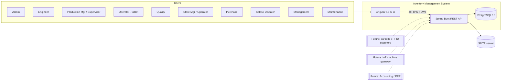

**External actors today:** browsers on desktop/tablet and an SMTP server (password reset, alert e-mail). Dotted systems are future integrations that attach to the same REST API and event seams.

---

## 3. Architecture Style and Layering

**Style:** modular monolith, package-by-feature, with strict layering inside each module. Modules communicate through **public service interfaces and domain events**, never by reaching into each other's repositories. Boundaries are verified in CI with **Spring Modulith / ArchUnit**.

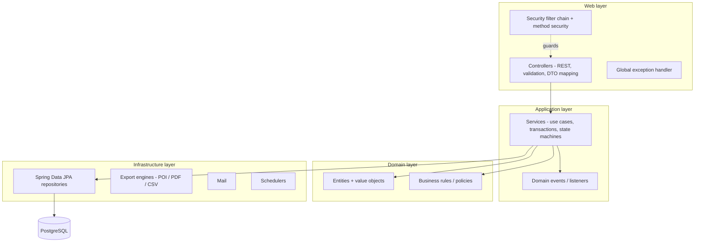

**Layer rules**
- Controller → Service → Repository → Database (per requirement). Controllers contain no business logic.
- DTOs (Java records) cross the web boundary; **entities never leave the service layer**. MapStruct performs mapping.
- Services own transactions (`@Transactional`). Controllers never open transactions.
- Cross-module calls go through the other module's `api` package only.

---

## 4. Backend Architecture

### 4.1 Module map

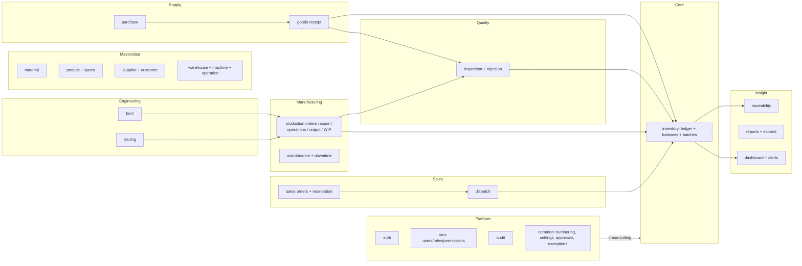

**Dependency direction:** `inventory` is the lowest business module — every transacting module depends on it; it depends on nothing but `common` and master data. Other modules call `InventoryPostingService`. Inventory never calls them back; it publishes events instead (`StockPosted`, `BatchStatusChanged`, `LowStockDetected`).

### 4.2 Package structure

```
ims-backend/
├── pom.xml
├── Dockerfile
└── src/
    ├── main/java/com/springmfg/ims/
    │   ├── ImsApplication.java
    │   ├── config/                  # Security, CORS, OpenAPI, Jackson, Async, Scheduling, Cache
    │   ├── common/
    │   │   ├── api/                 # ApiError, PageResponse, filter/spec builders
    │   │   ├── domain/              # BaseEntity (id, createdAt/By, updatedAt/By, @Version), Money, Quantity
    │   │   ├── exception/           # BusinessRuleException, NotFoundException, ConflictException, GlobalExceptionHandler
    │   │   ├── numbering/           # DocumentNumberService
    │   │   ├── settings/            # SystemSettingService
    │   │   ├── approval/            # ApprovalService (generic workflow engine)
    │   │   └── idempotency/         # IdempotencyKeyFilter
    │   ├── iam/                     # users, roles, permissions, user_roles, role_permissions
    │   ├── auth/                    # login, refresh, password reset, JWT service
    │   ├── audit/                   # @Audited, AuditService, AuditLog
    │   ├── masterdata/
    │   │   ├── material/ product/ supplier/ customer/ warehouse/ machine/ operation/ rejectionreason/
    │   ├── engineering/
    │   │   ├── bom/ routing/
    │   ├── inventory/
    │   │   ├── api/                 # InventoryPostingService, StockQueryService (public)
    │   │   ├── ledger/ balance/ batch/ adjustment/ count/ transfer/
    │   ├── purchase/                # requisition, purchase order, supplier performance
    │   ├── receipt/                 # goods receipt
    │   ├── production/              # order, materialissue, operation, output, wip, downtime
    │   ├── quality/                 # inspection, plan/parameters, rejection, fgbatch release
    │   ├── sales/                   # sales order, reservation
    │   ├── dispatch/
    │   ├── maintenance/
    │   ├── traceability/
    │   ├── report/                  # query services + exporters
    │   └── dashboard/               # KPI queries, role dashboards, alerts
    │   (each feature: web/ service/ domain/ repository/ dto/ mapper/ event/)
    ├── main/resources/
    │   ├── application.yml, application-dev.yml, application-prod.yml
    │   └── db/migration/            # Flyway V1__…; db/seed/ (dev profile only)
    └── test/java/…                  # unit, slice, Testcontainers integration, ArchUnit
```

### 4.3 Technology decisions (backend)

| Concern | Choice | Notes |
|---|---|---|
| Runtime | Java 17+ (21 LTS recommended), Spring Boot 3.3+ | |
| Persistence | Spring Data JPA / Hibernate 6, Flyway | Schema owned by Flyway; `ddl-auto=validate` |
| Mapping | MapStruct | compile-time, no reflection |
| Validation | Jakarta Bean Validation + class-level validators | Business rules live in services, not annotations |
| API docs | springdoc-openapi (Swagger UI) | Generated from controllers/DTOs |
| Security | Spring Security 6, JJWT (or Nimbus), BCrypt(12) | |
| Cache | Caffeine (permissions, settings, master data) | Redis only if scaling out |
| Export | Apache POI (SXSSF streaming), OpenCSV, OpenPDF | |
| Scheduling | `@Scheduled` + ShedLock | Alerts, reconciliation |
| Observability | Actuator, Micrometer, logback JSON + correlation id | |
| Build | Maven, Java toolchain | |

### 4.4 Entity base and conventions
- Surrogate `BIGINT` identity keys (`id`) plus human-readable unique business keys (`code`, `*_number`).
- `BaseEntity`: `created_at`, `created_by`, `updated_at`, `updated_by`, `version` (optimistic lock) via Spring Data auditing.
- Enums stored as `VARCHAR` with `CHECK` constraints (not ordinals).
- Money: `NUMERIC(18,4)`; quantities: `NUMERIC(18,3)`; never floating point.
- Master data uses **soft deactivation** (`active`/`status`); transactional documents are never hard-deleted.
- Multi-company/location hooks: `company_id` reserved on every aggregate root table (default 1, nullable-free) and a `Tenant` resolver stub — cheap now, avoids a rewrite later.

---

## 5. Core Design: Inventory Engine

This is the heart of the system and must be correct before anything else is built.

### 5.1 Ledger + balance model

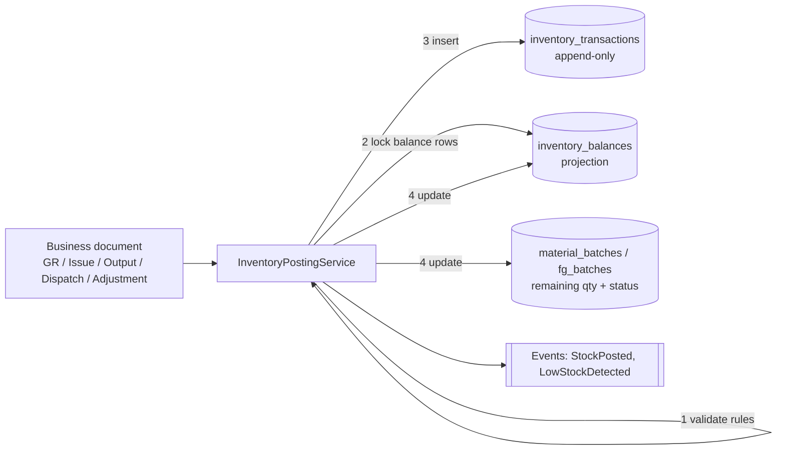

**Rules of the posting service** (single public entry point for all stock changes, one DB transaction):
1. Validate the command (item, batch, warehouse/location, quantity > 0, UOM).
2. Lock affected `inventory_balances` rows with `SELECT … FOR UPDATE`, **ordered by id** to avoid deadlocks.
3. Enforce stock rules (see 5.3).
4. Insert one ledger row per movement leg (signed quantity; transfers produce an OUT and an IN row sharing a `transfer_group_id`).
5. Update the balance projection and batch remaining quantity in the same transaction.
6. Emit a `StockPosted` event (after commit) for alerts, dashboards and audit.

No other class may write to `inventory_balances` or `inventory_transactions`. Enforced by package-private repositories and an ArchUnit rule.

### 5.2 Ledger transaction types

The 11 types from the requirements, plus one additive type required for correct WIP accounting:

| Type | Direction | Typical source document |
|---|---|---|
| OPENING_BALANCE | IN | Opening stock load |
| PURCHASE_RECEIPT | IN (to QUARANTINE or AVAILABLE) | Goods Receipt / Inspection acceptance |
| MATERIAL_ISSUE | OUT of RM location, IN to WIP location | Material issue to production order |
| MATERIAL_RETURN | OUT of WIP, IN to RM | Return from production |
| **MATERIAL_CONSUMPTION** *(additive)* | OUT of WIP | Consumption recorded against order |
| PRODUCTION_RECEIPT | IN to FG (after approval) | Final inspection approval |
| PRODUCTION_REJECTION | IN to SCRAP/rejection location | Inspection/operation rejection |
| SALES_DISPATCH | OUT of FG | Dispatch |
| STOCK_ADJUSTMENT | ± | Approved stock adjustment / count variance |
| STOCK_TRANSFER | OUT + IN | Transfer between locations |
| SCRAP | OUT | Scrap write-off |
| CUSTOMER_RETURN | IN | Customer return |

Without `MATERIAL_CONSUMPTION`, consumed wire would remain in WIP-location stock forever. This is recorded in ADR-04.

### 5.3 Stock rules enforced centrally

| Requirement rule | Enforcement point |
|---|---|
| No negative stock unless enabled | `balance.qty_on_hand + delta >= 0` unless setting `inventory.allow_negative_stock=true` (Admin only, audited); DB `CHECK` as backstop |
| Cannot issue insufficient stock | Posting service pre-check under row lock |
| Quarantine/Hold/Rejected cannot be issued | Issue allocator selects only `AVAILABLE` stock/batches; explicit check rejects otherwise |
| FG not available until approval | FG lands in `FG-QP` (quality pending) status; moves to `AVAILABLE` only via inspection approval event |
| Consumption ≤ issued | `production_order_materials`: `consumed + returned + scrap <= issued` (service check + DB `CHECK`) |
| Dispatch ≤ available FG | Dispatch posts under lock; available = on_hand − reserved for others |
| Completed order locked | Production services reject mutations when `status IN (COMPLETED, CLOSED)` unless caller has `PRODUCTION_REOPEN` |
| Ledger never silently deleted | DB trigger blocks `UPDATE`/`DELETE` on ledger; corrections use `reversal_of_id` |

### 5.4 Balance dimensions

`inventory_balances` is keyed by **(company, warehouse, location, item_type, item_id, batch_id, stock_status)**:

```
stock_status ∈ AVAILABLE | QUARANTINE | HOLD | REJECTED | QUALITY_PENDING
qty_on_hand, qty_reserved, qty_available (generated = on_hand − reserved, AVAILABLE only), version
```

A batch status change (e.g., QUARANTINE → AVAILABLE after incoming inspection) is a **status transfer**: ledger OUT from the old status bucket and IN to the new one, same location. This keeps the ledger as the single record of why quantities became usable.

### 5.5 Batch allocation
- Default **FEFO/FIFO** by `received_date` / `expiry_date` among `AVAILABLE` batches; user may override with an explicit batch.
- Allocation is a pure function `BatchAllocator.allocate(item, qty, warehouse)`; the result is persisted as `material_issue_lines` so traceability is exact.
- Reservation of finished goods (`sales_reservations`) increments `qty_reserved` and is released at dispatch or cancellation.

### 5.6 Costing and valuation
- Each ledger row stores `unit_cost` and `total_cost`.
- Default valuation: **moving weighted average** per item+warehouse, updated on every cost-bearing receipt; `standard_cost` from master data is the fallback and basis for variance reports.
- Valuation reports = Σ(on_hand × average cost). The cost method sits behind a `CostingStrategy` interface so future cost accounting (labour, overhead, standard costing) plugs in.

### 5.7 Reconciliation
Nightly job recomputes `Σ(ledger)` per balance key and compares with `inventory_balances`; mismatches raise a critical alert and are never auto-corrected. A "rebuild projection" admin operation exists for disaster recovery.

### 5.8 Concurrency
- Pessimistic row locks on balances during postings (short transactions, ordered lock acquisition).
- Optimistic `@Version` on documents (POs, production orders, sales orders) → `409 Conflict` for lost updates.
- `Idempotency-Key` header on posting endpoints (issue, output, dispatch, receipt) to make tablet double-taps and retries safe.

---

## 6. Workflows and State Machines

Each document has a `status` column and a transition table in code (`allowedTransitions`). Illegal transitions throw `BusinessRuleException` (HTTP 422). Every transition writes an audit record. Permissions are checked per transition, not only per endpoint.

### 6.1 Purchase Order
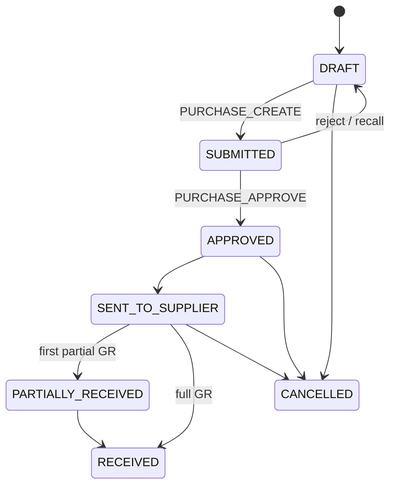
The requirement's list (`DRAFT, APPROVED, PARTIALLY_RECEIVED, RECEIVED, CANCELLED`) is a subset; `SUBMITTED` and `SENT_TO_SUPPLIER` come from the RBAC document.

### 6.2 Goods receipt and incoming inspection
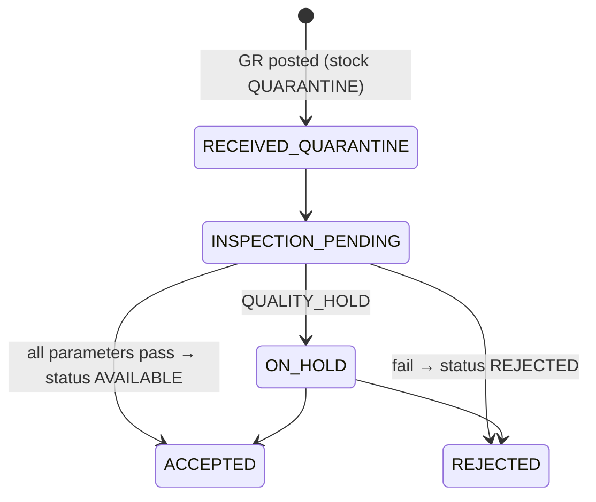
Partial acceptance is supported: an inspection can accept *x* and reject *y* of a batch (the batch is split into stock-status buckets via status transfers).

### 6.3 BOM
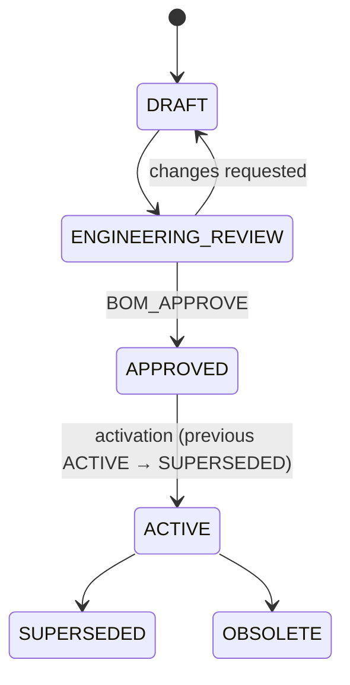
Only one `ACTIVE` revision per product, guaranteed by a **partial unique index** (see 8.4). Revisions are immutable once `APPROVED`; changes create a new revision (Rev A → Rev B).

### 6.4 Production Order
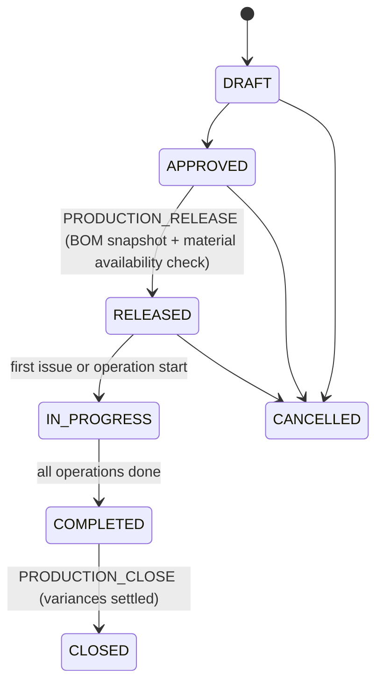
On release, the active BOM and routing are **snapshotted** into `production_order_materials` and `production_operations`, so later BOM revisions never alter running orders.

### 6.5 Operation (operator level)
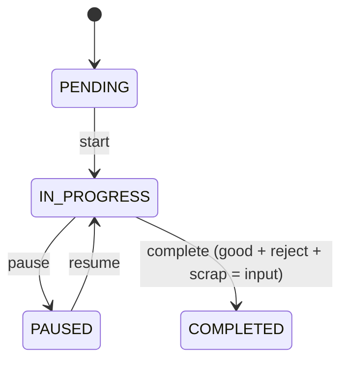

### 6.6 Finished goods quality
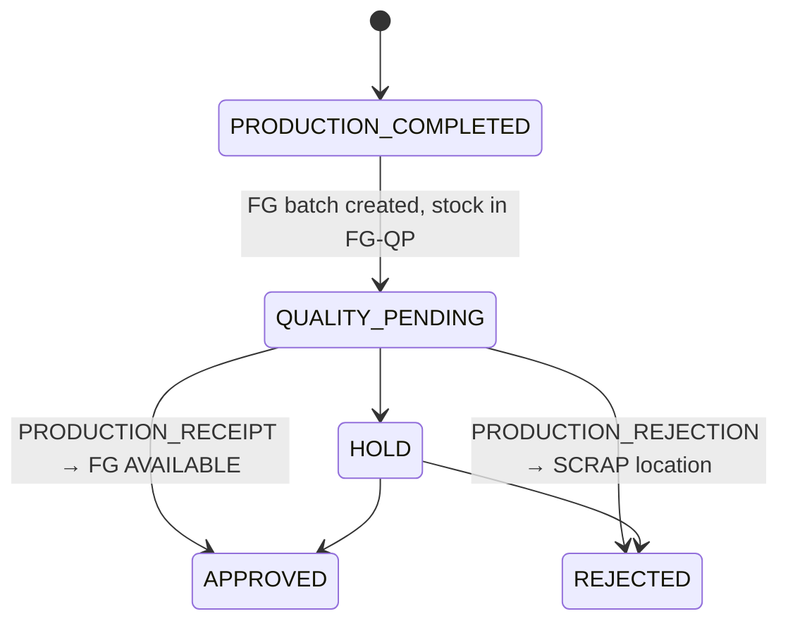

### 6.7 Sales Order and Dispatch
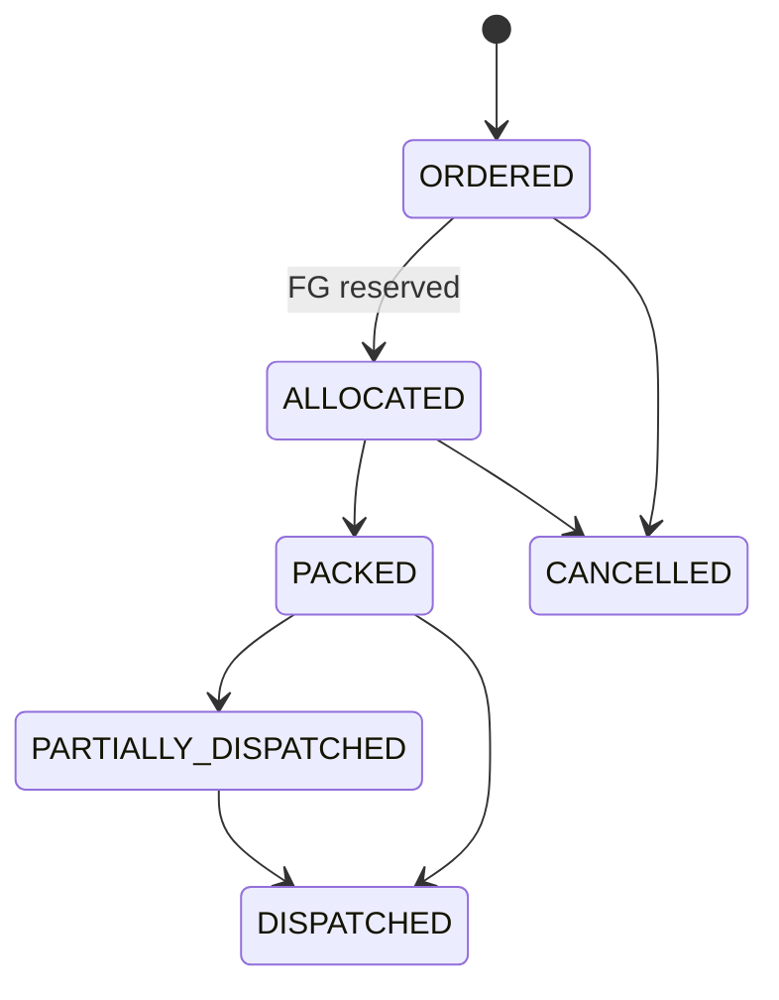

### 6.8 Stock Adjustment
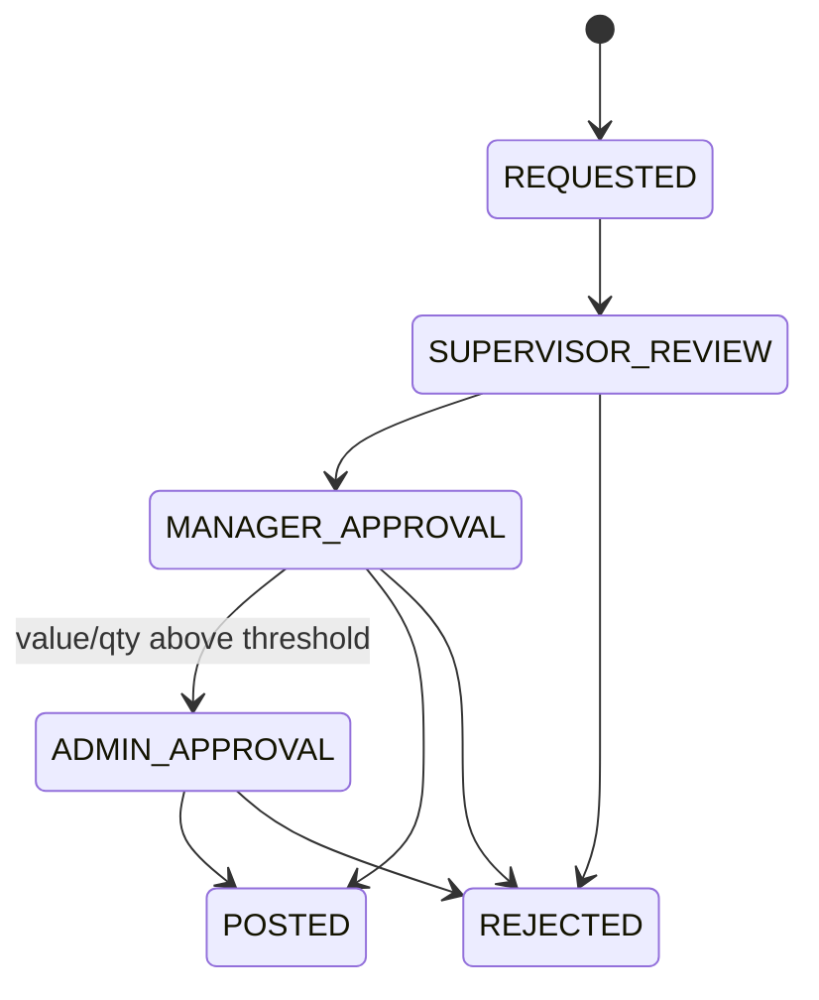
The threshold comes from `system_settings` (`inventory.adjustment.admin_threshold`, with a defined unit: quantity or currency value — open item). The requester cannot approve their own request (segregation of duties). Posting creates the `STOCK_ADJUSTMENT` ledger entry with old/new values in the audit log.

---

## 7. Key Sequence Flows

### 7.1 Purchase → Receipt → Inspection → Stock
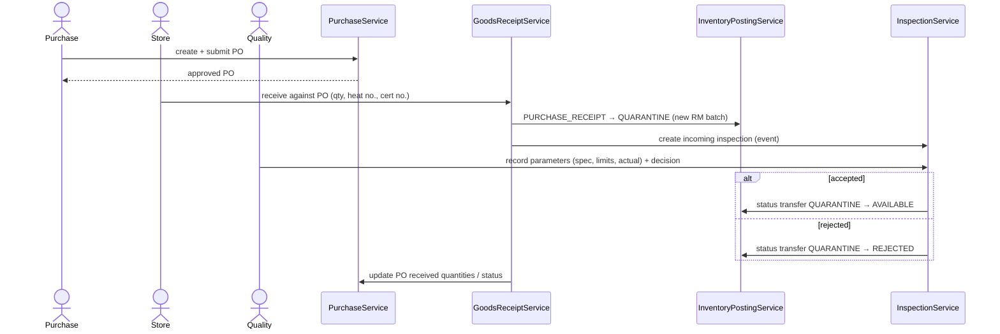

### 7.2 Production → Finished goods
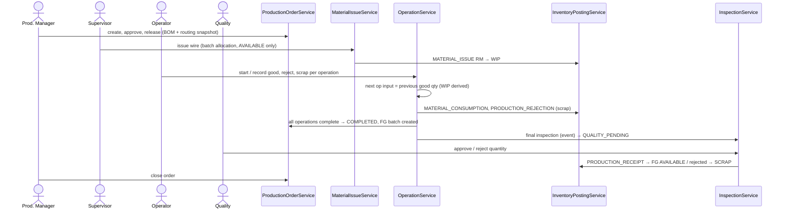

### 7.3 Sales → Dispatch
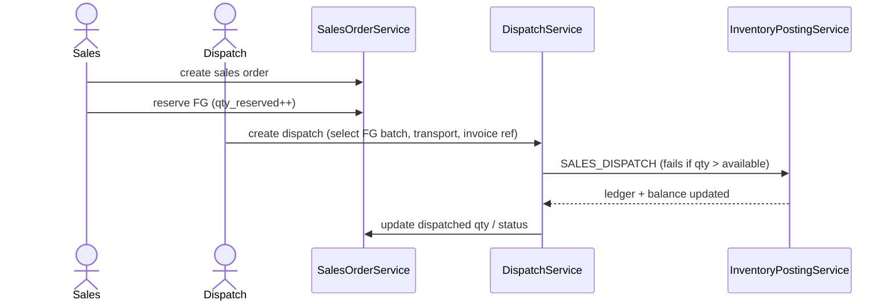

---

## 8. Database Architecture

### 8.1 Table groups

| Group | Tables |
|---|---|
| Identity & access | `users`, `roles`, `permissions`, `user_roles`, `role_permissions`, `refresh_tokens`, `password_reset_tokens`, `user_warehouse_access` |
| Platform | `system_settings`, `number_sequences`, `approval_requests`, `approval_steps`, `idempotency_keys`, `audit_logs`, `alerts`, `notification_outbox` |
| Master data | `materials`, `products`, `spring_specifications`, `spring_attribute_definitions`, `suppliers`, `customers`, `customer_product_specs`, `warehouses`, `warehouse_locations`, `machines`, `operations`, `rejection_reasons`, `uoms` |
| Engineering | `bom`, `bom_items`, `product_routing`, `routing_inspection_points` |
| Procurement | `purchase_requisitions`, `purchase_orders`, `purchase_order_items`, `goods_receipts`, `goods_receipt_items` |
| Inventory | `material_batches`, `fg_batches`, `inventory_balances`, `inventory_transactions`, `stock_adjustments`, `stock_counts`, `stock_count_lines` |
| Production | `production_orders`, `production_order_materials`, `material_issues`, `material_issue_lines`, `material_returns`, `production_operations`, `production_outputs`, `production_downtime`, `material_requests`, `rejections` |
| Quality | `quality_inspections`, `quality_inspection_items`, `inspection_plans`, `inspection_plan_parameters` |
| Sales | `sales_orders`, `sales_order_items`, `sales_reservations`, `dispatches`, `dispatch_items` |
| Maintenance | `maintenance_requests`, `maintenance_activities`, `spare_part_usage`, `pm_schedules` |

Tables beyond the requirements' list (`refresh_tokens`, `inspection_plans`, `machines`, `maintenance_*`, etc.) are needed by Attachment 2 roles and the architecture itself.

### 8.2 Core ER diagram — inventory and traceability spine

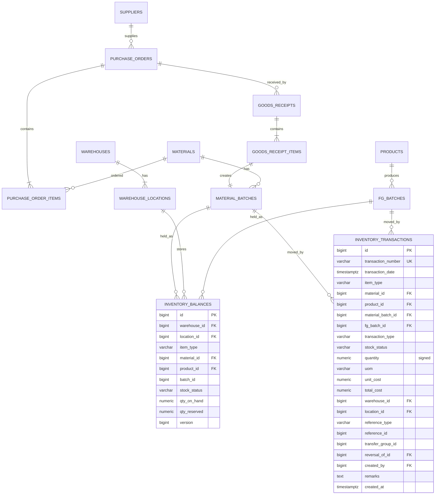

### 8.3 ER diagram — engineering, production and quality

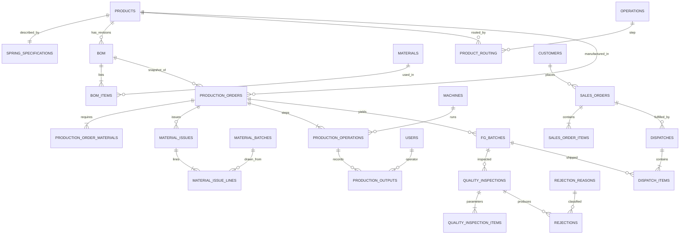

### 8.4 Critical constraints and DDL patterns

```sql
-- One ACTIVE BOM per product
CREATE UNIQUE INDEX ux_bom_one_active ON bom (product_id) WHERE status = 'ACTIVE';
ALTER TABLE bom ADD CONSTRAINT ux_bom_rev UNIQUE (bom_number, revision);

-- Ledger item is exactly one of material / product
ALTER TABLE inventory_transactions ADD CONSTRAINT ck_item_exclusive CHECK (
  (item_type='MATERIAL' AND material_id IS NOT NULL AND product_id IS NULL) OR
  (item_type='PRODUCT'  AND product_id  IS NOT NULL AND material_id IS NULL));

-- Never negative stock at DB level (setting can relax it by using a separate allow-negative flag column)
ALTER TABLE inventory_balances ADD CONSTRAINT ck_nonneg CHECK (qty_on_hand >= 0 OR allow_negative);

-- Balance key uniqueness
CREATE UNIQUE INDEX ux_balance_key ON inventory_balances
  (warehouse_id, location_id, item_type, COALESCE(material_id,0), COALESCE(product_id,0),
   COALESCE(batch_id,0), stock_status);

-- Production order materials cannot be over-consumed
ALTER TABLE production_order_materials ADD CONSTRAINT ck_consumed
  CHECK (consumed_qty + returned_qty + scrap_qty <= issued_qty);

-- Ledger and audit immutability
CREATE FUNCTION forbid_mutation() RETURNS trigger AS $$
BEGIN RAISE EXCEPTION '% is append-only', TG_TABLE_NAME; END; $$ LANGUAGE plpgsql;
CREATE TRIGGER trg_ledger_immutable BEFORE UPDATE OR DELETE ON inventory_transactions
  FOR EACH ROW EXECUTE FUNCTION forbid_mutation();
CREATE TRIGGER trg_audit_immutable  BEFORE UPDATE OR DELETE ON audit_logs
  FOR EACH ROW EXECUTE FUNCTION forbid_mutation();
```

### 8.5 Spring specifications — extensible design

Different spring types need different attributes, and new types must not require schema changes.

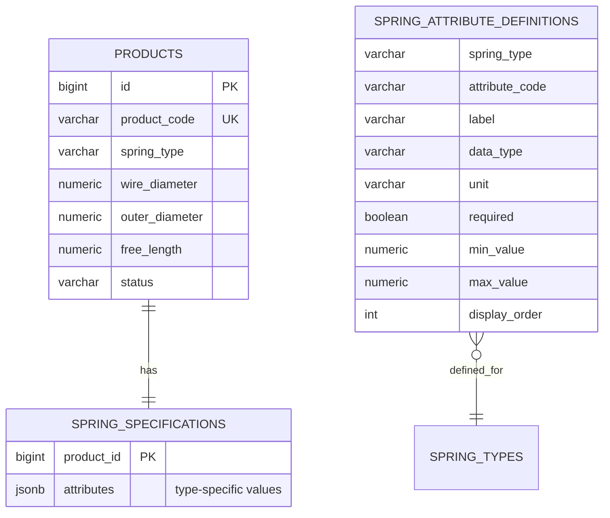

- **Common, frequently searched fields** (type, material, wire diameter, outer diameter, free length, drawing number, revision, customer, status) are real indexed columns on `products`.
- **Type-specific fields** (hook type, hook length, leg angle, torque, body diameter…) live in `spring_specifications.attributes` (`JSONB`, GIN-indexed).
- `spring_attribute_definitions` is the **metadata catalogue**: it drives backend validation (required, range, data type) and **renders the Angular form dynamically**. Adding "Belleville spring" or a new attribute is a data change (a migration/seed row or an Admin screen), not a code change.

### 8.6 Indexing strategy

| Table | Indexes |
|---|---|
| `inventory_transactions` | `(item, batch, transaction_date)`, `(reference_type, reference_id)`, `(warehouse_id, location_id)`, `(transaction_date)` BRIN |
| `inventory_balances` | unique balance key; `(material_id, stock_status)`, `(product_id, stock_status)` |
| `material_batches` | `(material_id, status, received_date)`, `(heat_number)`, `(supplier_id)`, `(purchase_order_id)` |
| `production_orders` | `(status, expected_completion_date)`, `(product_id)`, `(supervisor_id)` |
| `production_outputs` | `(production_order_id, operation_id)`, `(operator_id, start_time)`, `(machine_id, start_time)` |
| `audit_logs` | `(entity, entity_id)`, `(user_id, timestamp)`, `(action, timestamp)`; monthly range partitioning |
| Search | `pg_trgm` GIN on codes/names for fast `ILIKE` search |

### 8.7 Migrations
- **Flyway**, forward-only: `V1__iam.sql`, `V2__masterdata.sql`, `V3__inventory.sql` … one migration set per implementation phase.
- Reference data (roles, permissions, role-permission mapping, spring attribute definitions, rejection reasons, operations, default settings) ship as versioned migrations.
- **Demo seed data** (materials, products, suppliers, customers, 10+ production orders, transactions) is in `db/seed/` and loaded only under the `dev`/`demo` profile. Seed transactions are generated **through the posting service**, not raw SQL, so ledger and balances agree.

---

## 9. Traceability Design

Traceability is a by-product of the linkage columns already required by the workflows, not a separate bolt-on.

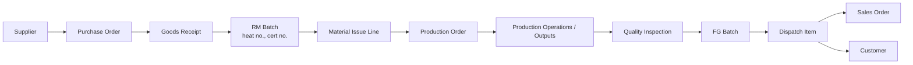

| Question | Query path |
|---|---|
| FG batch → raw material batches | `fg_batches → production_orders → material_issue_lines → material_batches → goods_receipt_items → purchase_orders → suppliers` |
| RM batch → FG batches and customers | `material_batches → material_issue_lines → production_orders → fg_batches → dispatch_items → dispatches → sales_orders → customers` |

**Granularity:** by default the link is order-level (an order's FG batches are linked to all RM batches issued to that order). Where one order uses several wire batches and several FG batches must be distinguished, `fg_batch_material_sources(fg_batch_id, material_batch_id, quantity)` records exact sourcing. It is populated from operation/output records when batch-level segregation is enabled. This is the only place where "complete traceability" has a cost choice, and it is configurable per product.

**Implementation:** `TraceabilityService` runs read-only recursive CTE/joins and returns a graph DTO (`nodes[]`, `edges[]`) consumed by the Angular traceability screen (tree + timeline). Results can be paged by batch. Recall report: "list every customer who received product made from heat number H".

---

## 10. Security Architecture

### 10.1 Authentication flow

```mermaid
sequenceDiagram
    participant U as Browser (Angular)
    participant A as AuthController
    participant S as AuthService
    participant DB as PostgreSQL

    U->>A: POST /api/auth/login (username, password)
    A->>S: authenticate
    S->>DB: load user + roles + permissions
    S-->>A: access token (15 min) + refresh token (7 d, rotating)
    A-->>U: access token in body; refresh token in HttpOnly Secure SameSite cookie
    U->>A: any API call with Authorization: Bearer <access>
    A->>A: JwtAuthenticationFilter validates signature, expiry, permission version
    U->>A: POST /api/auth/refresh (cookie) → new pair, old refresh revoked
```

- Passwords hashed with **BCrypt (strength 12)**; policy enforced server-side (≥ 12 chars, mixed classes, not equal to username, history of last 5, expiry configurable).
- Account lockout after 5 failed logins for 15 minutes (fixed window, both configurable in `system_settings`); login attempts audited.
- Refresh tokens stored **hashed** in `refresh_tokens`; each one expires 7 days after the sign-in that started its family (rotation does not extend it); reuse of a revoked token revokes the whole family.
- Forgot password: single-use, short-lived, hashed token delivered by e-mail; generic response to avoid user enumeration.
- Token carries `sub`, `roles`, and a `permission_version`; the authoritative permission set is resolved server-side from a Caffeine cache, so role changes take effect within seconds and a deactivated user is cut off immediately.

### 10.2 Authorization model

```mermaid
erDiagram
    USERS ||--o{ USER_ROLES : has
    ROLES ||--o{ USER_ROLES : assigned
    ROLES ||--o{ ROLE_PERMISSIONS : grants
    PERMISSIONS ||--o{ ROLE_PERMISSIONS : included
    USERS ||--o{ USER_WAREHOUSE_ACCESS : scoped_to
    WAREHOUSES ||--o{ USER_WAREHOUSE_ACCESS : restricts
```

Three enforcement layers, all server-side:

1. **Endpoint/method level** — permission authorities: `@PreAuthorize("hasAuthority('PRODUCT_UPDATE')")` on controller or service methods. Default is **deny**: the security filter chain requires authentication for everything except `/api/auth/**` and health. A missing annotation fails an ArchUnit test, so no endpoint ships unprotected.
2. **State/transition level** — e.g. `PURCHASE_APPROVE` for SUBMITTED→APPROVED, `PRODUCTION_REOPEN` to edit a completed order.
3. **Data-scope level** (`AccessScopeService`) — rules that permissions alone cannot express:
   - Operator/Supervisor see only production orders **assigned** to them (or their machines/shift).
   - Store Operator is limited to warehouses in `user_warehouse_access`.
   - Segregation of duties: requester ≠ approver for adjustments and POs.

Unauthorized calls return **403 Forbidden** (authenticated, not permitted) or 401 (unauthenticated) in a uniform error body. Example: an Operator sending `PUT /api/products/42` is rejected by step 1 regardless of any UI.

### 10.3 Role → permission mapping (initial seed)

Permissions from REQUIREMENTS §3.4 plus additive codes (marked ✚) needed to express the RBAC document precisely.

| Role | Permissions |
|---|---|
| ADMIN | USER_*, ROLE_MANAGE ✚, PERMISSION_MANAGE ✚, SETTINGS_MANAGE ✚, MASTERDATA_MANAGE ✚, WAREHOUSE_MANAGE ✚, MACHINE_MANAGE ✚, all *_VIEW, INVENTORY_ADJUST + ADJUST_APPROVE_ADMIN ✚, REPORT_VIEW, AUDIT_VIEW |
| ENGINEER | PRODUCT_CREATE/UPDATE/VIEW, BOM_CREATE/UPDATE/APPROVE/VIEW, ROUTING_MANAGE ✚, DRAWING_MANAGE ✚, INVENTORY_VIEW (read only) |
| PRODUCTION_MANAGER | PRODUCTION_CREATE/UPDATE/RELEASE/CLOSE, PRODUCTION_SCHEDULE ✚, PRODUCTION_VIEW ✚, INVENTORY_VIEW, REPORT_VIEW (production) |
| SUPERVISOR | PRODUCTION_EXECUTE, PRODUCTION_ASSIGN ✚, DOWNTIME_RECORD ✚, MATERIAL_REQUEST ✚, PRODUCT_VIEW, ADJUST_REVIEW ✚ |
| OPERATOR | PRODUCTION_EXECUTE (own work only), PROBLEM_REPORT ✚ |
| QUALITY_MANAGER | QUALITY_INSPECT/APPROVE/REJECT, QUALITY_HOLD ✚, REJECTION_REASON_MANAGE ✚, REPORT_VIEW (quality) |
| STORE_MANAGER | INVENTORY_VIEW/RECEIVE/ISSUE/TRANSFER, STOCK_COUNT ✚, INVENTORY_ADJUST (request), ADJUST_APPROVE ✚ (below threshold), LOCATION_MANAGE ✚, REPORT_VIEW (inventory) |
| PURCHASE_MANAGER | PURCHASE_CREATE/VIEW, REQUISITION_CREATE ✚, SUPPLIER_MANAGE ✚; PURCHASE_APPROVE only if granted |
| SALES | SALES_CREATE/UPDATE/VIEW, CUSTOMER_MANAGE ✚, RESERVE_FG ✚, DISPATCH_REQUEST ✚ |
| DISPATCH | DISPATCH_CREATE, SALES_VIEW (approved), INVENTORY_VIEW (FG) |
| MAINTENANCE | MACHINE_MANAGE ✚, MAINTENANCE_MANAGE ✚, DOWNTIME_RECORD ✚ |
| STORE_OPERATOR | INVENTORY_RECEIVE/ISSUE/TRANSFER, STOCK_COUNT (scoped to warehouse) |
| MANAGEMENT | `*_VIEW`, REPORT_VIEW, DASHBOARD_VIEW — **no write permissions** |

The mapping is data (a Flyway migration) and editable by Admin through the roles screen; the code only references permission codes.

### 10.4 Other controls
- **CORS:** explicit origin allow-list per profile; no wildcard with credentials.
- **Input:** Bean Validation on every DTO, parameterized queries only (JPA), request size limits, output encoding by Angular.
- **Headers:** CSP, HSTS, `X-Content-Type-Options`, `Referrer-Policy` (nginx + Spring).
- **Secrets:** JWT signing key, DB password, SMTP credentials from environment/secret store; never committed.
- **Rate limiting** on `/api/auth/**` (Bucket4j or reverse proxy).
- **Dependency hygiene:** OWASP dependency-check and `npm audit` in CI.
- **Transport:** TLS terminated at the reverse proxy in production.

---

## 11. Audit Architecture

- **Declarative:** services mark audited operations with `@Audited(action = "STOCK_ADJUSTMENT", entity = "StockAdjustment")`; an aspect captures user, **role(s) at the time**, action, entity, entity id, **old value**, **new value**, reason, timestamp, IP address, correlation id.
- **Explicit for quantities:** operations that change business numbers (e.g. `PRODUCTION_QUANTITY_UPDATE`, `STOCK_ADJUSTMENT`) call `AuditService.record(…)` with before/after snapshots and the mandatory reason (`@NotBlank` for those commands).
- **Same transaction** as the business change: if the audit insert fails, the business change rolls back.
- **Storage:** `audit_logs` is append-only (trigger from 8.4), JSONB for `old_value`/`new_value`, partitioned by month, retained according to policy.
- **Coverage:** user/role/permission changes, logins and failures, master-data edits, BOM approvals and activations, all document state transitions, stock adjustments, threshold approvals, production quantity corrections, setting changes, exports of sensitive reports.
- **Access:** only `AUDIT_VIEW`; filter by user, entity, action, date; exportable.
- **Ledger vs audit:** the ledger records *what stock moved*; the audit log records *who changed what and why*. Both are immutable.

---

## 12. API Architecture

### 12.1 Conventions
- Base path `/api`, JSON, plural nouns, standard verbs, `201 + Location` on create, `204` on delete/deactivate, `409` on version conflict, `422` on business-rule violation.
- **Errors** use RFC 7807 `ProblemDetail`: `type, title, status, detail, code (e.g. INSUFFICIENT_STOCK), fieldErrors[], traceId`.
- **Paging/sorting/filtering:** `?page=0&size=20&sort=createdAt,desc&q=text&status=…&from=…&to=…&productId=…&batchId=…&supplierId=…&customerId=…`. Implemented once with a generic `Specification` builder; response is `PageResponse<T>` (`content, page, size, totalElements, totalPages`).
- **Actions as sub-resources** for state changes: `POST /api/purchase-orders/{id}/approve`, `/release`, `/close`. No arbitrary `PATCH status`.
- **DELETE** means deactivate for master data and is **not provided** for transactions (cancel/reverse instead).
- Versioned by URL only when a breaking change is unavoidable (`/api/v2`).
- OpenAPI exposed at `/swagger-ui.html` (dev/staging; restricted in prod) with a bearer-auth scheme.

### 12.2 Endpoint catalogue

| Resource | Key endpoints | Required permission |
|---|---|---|
| `/api/auth` | `POST login`, `change-password`, `refresh`, `logout`, `forgot-password`, `reset-password`; `GET me` (profile + permissions) | public / authenticated |
| `/api/users`, `/api/roles`, `/api/permissions` | CRUD, `PUT /users/{id}/roles`, `PUT /roles/{id}/permissions` | USER_*, ROLE_MANAGE |
| `/api/materials` | CRUD, `GET /{id}/stock` | MASTERDATA / INVENTORY_VIEW |
| `/api/products` | CRUD, `GET /{id}/bom`, `/spring-types/{type}/attributes` | PRODUCT_* |
| `/api/boms` | CRUD, `POST /{id}/submit`, `/approve`, `/activate`, `GET /{id}/revisions` | BOM_* |
| `/api/routings`, `/api/operations`, `/api/machines`, `/api/warehouses` | CRUD | ROUTING_MANAGE / MASTERDATA / MACHINE_MANAGE |
| `/api/suppliers`, `/api/customers` | CRUD | SUPPLIER_MANAGE / CUSTOMER_MANAGE |
| `/api/purchase-orders` | CRUD, `submit`, `approve`, `send`, `cancel` | PURCHASE_* |
| `/api/goods-receipts` | `POST` (against PO), `GET` | INVENTORY_RECEIVE |
| `/api/inventory` | `GET /balances`, `/ledger`, `/batches`, `/valuation`; `POST /transfers`, `/adjustments`, `/counts`; `POST /adjustments/{id}/approve` | INVENTORY_* |
| `/api/production-orders` | CRUD, `approve`, `release`, `close`, `cancel`, `GET /{id}/materials`, `/wip` | PRODUCTION_* |
| `/api/production` | `POST /issues`, `/returns`, `/operations/{id}/start|pause|resume|complete`, `/outputs`, `/downtime`, `/material-requests`; `GET /my-work` | PRODUCTION_EXECUTE |
| `/api/quality` | `POST /inspections`, `PUT /inspections/{id}/results`, `POST /{id}/approve|reject|hold`; `GET /rejections` | QUALITY_* |
| `/api/sales-orders` | CRUD, `reserve`, `cancel` | SALES_* |
| `/api/dispatches` | `POST`, `GET`, `GET /{id}/document` (PDF) | DISPATCH_CREATE |
| `/api/traceability` | `GET /fg-batches/{no}`, `/rm-batches/{no}` | REPORT_VIEW / QUALITY_* |
| `/api/dashboard` | `GET /summary` (role-aware), `/alerts`, `/charts/{name}` | authenticated (content filtered by permission) |
| `/api/reports` | `GET /{reportCode}?format=json|xlsx|pdf|csv&…` | REPORT_VIEW (per report) |
| `/api/audit-logs` | `GET` with filters, `GET /export` | AUDIT_VIEW |
| `/api/settings` | `GET`, `PUT` | SETTINGS_MANAGE |

### 12.3 DTO strategy
- Separate request/response DTOs (`CreateProductRequest`, `ProductResponse`, `ProductSummary`) as Java records; no entity exposure, no generic maps.
- Nested summaries (`SupplierRef{id,code,name}`) instead of full object graphs to prevent N+1 and over-posting.
- Validation groups for create vs update; unknown JSON properties rejected.

---

## 13. Frontend Architecture

### 13.1 Technology
Angular 18+ **standalone components**, **signals** for local/state, RxJS for async streams, Angular Material (+ CDK), Reactive Forms, typed API clients, Chart.js via `ng2-charts` (or ngx-charts) for dashboards, ESLint + Prettier, Jest/Karma + Testing Library, Cypress/Playwright for E2E.

### 13.2 Structure

```
ims-frontend/src/app/
├── core/                       # singletons: auth, interceptors, guards, layout shell
│   ├── auth/                   # AuthService, token store, session timeout
│   ├── http/                   # auth.interceptor, error.interceptor, loading.interceptor, idempotency.interceptor
│   ├── permission/             # PermissionService, *hasPermission directive, permissionGuard
│   └── layout/                 # sidebar, top bar, breadcrumbs, toast host
├── shared/                     # data-table, status-badge, confirm-dialog, dynamic-form, date-range, file-export
├── features/                   # lazy-loaded route groups
│   ├── login/        (login, forgot-password)
│   ├── dashboard/    (role dashboards + widgets)
│   ├── masterdata/   (materials, products [dynamic spec form], suppliers, customers, operations, warehouses, machines)
│   ├── procurement/  (purchase-orders, goods-receipts, incoming-inspection)
│   ├── inventory/    (stock, ledger, adjustment, transfer, batches, counts)
│   ├── production/   (orders, issue, operations, wip, output, my-work)
│   ├── quality/      (inspections, rejections, quality-dashboard)
│   ├── sales/        (orders, finished-goods, dispatch)
│   ├── traceability/
│   ├── reports/
│   ├── maintenance/
│   └── admin/        (users, roles, audit-logs, settings)
└── app.routes.ts               # lazy routes + permissionGuard
```
Each feature has `api/` (typed service), `models/`, `pages/`, `components/`, and its own routes.

### 13.3 Key frontend mechanisms
- **Permissions:** on login the SPA calls `GET /api/auth/me` and keeps the permission set in a signal. `permissionGuard` hides routes and `*hasPermission="'PRODUCT_UPDATE'"` hides controls — **purely UX**; the backend remains authoritative (principle P4). A 403 from the API is handled by the error interceptor with a friendly message.
- **Navigation:** menu items are declared with required permissions; the sidebar renders the permitted subset.
- **Role-based dashboards:** a dashboard shell calls `/api/dashboard/summary`; the backend returns the widget set for the user's roles (primary role first for multi-role users). Widgets are standalone components registered by key: KPI card, trend chart, alert list, recent-transactions table, operator work-card.
- **Operator experience:** a dedicated `my-work` page with large touch targets, one-screen quantity entry (good / reject / scrap with numeric keypad), Start/Pause/Complete buttons, offline-tolerant retries using the idempotency key, minimal navigation.
- **Dynamic spring form:** the product form loads `spring_attribute_definitions` for the chosen spring type and builds the Reactive Form group at runtime, so new types need no frontend change.
- **Data tables:** one reusable server-side table component (search, sort, pagination, status/date/product/batch/supplier/customer filters synced to the URL query string).
- **Status badges:** a single `StatusBadge` mapping statuses to the consistent palette (AVAILABLE – green, LOW STOCK – amber, QUARANTINE – orange, REJECTED – red, IN PRODUCTION – blue, COMPLETED – teal, PENDING – grey) with an icon/label so colour is never the only signal.
- **Feedback:** confirmation dialogs for irreversible actions, toast notifications for outcomes, field-level server errors mapped back onto form controls.
- **Responsive:** Material layout targeting desktop and tablet (≥ 768 px); sidebar collapses to rail/drawer.
- **Security hygiene:** access token in memory, refresh token in HttpOnly cookie, strict CSP, no `innerHTML` with untrusted data, session-timeout warning.
- **Config:** `environment.ts` for API base URL; runtime config via `assets/config.json` for container deployments.

---

## 14. Reporting, Dashboards and Alerts

### 14.1 Reports
- Each report is a `ReportDefinition` (code, parameters, query, columns, required permission). `GET /api/reports/{code}` returns JSON for on-screen display or streams `xlsx` / `pdf` / `csv` by `format`.
- **Excel** via POI SXSSF (streaming, bounded memory), **CSV** via OpenCSV streaming, **PDF** via OpenPDF templates (dispatch note, inspection certificate, valuation, summary reports).
- Large exports (> N rows) run asynchronously and are fetched from a download link; exports of sensitive data are audited.
- Read-heavy reports query read-optimized SQL/views (not entity graphs); batch-wise, warehouse-wise and valuation reports aggregate the balance projection, while the **stock ledger** and historical "stock as of date" reports aggregate the ledger.

### 14.2 Dashboards
- KPI queries are SQL aggregates behind `DashboardService`, cached in Caffeine for 30–60 s; heavy trend series come from **materialized views** refreshed on a schedule (or incrementally by `StockPosted` events).
- Definitions: Rejection % = rejected ÷ (good + rejected); Scrap % = scrap qty ÷ input qty; First Pass Yield = units passing final inspection first time ÷ units inspected; Achievement % = produced ÷ target; Inventory value = Σ(on_hand × average cost).
- Production target comes from `system_settings` or a `production_targets` table (open item).

### 14.3 Alerts

| Alert | Trigger | Mechanism |
|---|---|---|
| LOW STOCK / MATERIAL SHORTAGE | available < reorder level; or issue requirement > available | Event-driven on `StockPosted` + nightly sweep |
| OVERSTOCK | on_hand > maximum level | Event-driven |
| PENDING INSPECTION | inspection older than SLA | Scheduled |
| PRODUCTION DELAY | `expected_completion_date` passed, status not COMPLETED | Scheduled |
| EXPIRING / AGING BATCH | expiry or age beyond threshold | Scheduled (daily) |
| PENDING PO | past expected delivery date | Scheduled |
| LEDGER MISMATCH | reconciliation job | Scheduled (critical) |

Alerts are rows in `alerts` (type, severity, entity, first-seen, acknowledged-by) de-duplicated by an open-alert key; the UI shows them on the dashboard and in a bell menu; optional e-mail through the notification outbox.

---

## 15. Cross-Cutting Concerns

| Concern | Design |
|---|---|
| **Transactions** | One `@Transactional` use case per business operation; posting and audit in the same transaction; events published `AFTER_COMMIT` |
| **Document numbering** | `DocumentNumberService` using a `number_sequences` row lock; formats like `PO-2026-00125`, `GR-…`, `RM-BATCH-2026-001`, `FG-2026-0050`; per-year reset, gap-free for posted documents |
| **Settings** | `system_settings` key/value with typed accessors and cache: negative-stock flag, adjustment threshold, password policy, aging thresholds, auto-backflush, trace granularity |
| **Approvals** | Generic `ApprovalService` (steps, approver permission, segregation of duties) reused by PO, BOM, production order and stock adjustment |
| **Events** | Spring `ApplicationEventPublisher` + `@TransactionalEventListener`; designed so an outbox + broker can replace it for IoT/ERP integration |
| **Error handling** | `GlobalExceptionHandler` maps domain exceptions → ProblemDetail with stable `code` values for the UI |
| **Time** | Store `timestamptz` UTC; display in the user's zone (default Asia/Kolkata); server clock via injectable `Clock` for tests |
| **Units of measure** | `uoms` table with conversion factors; quantities always stored in the item's base UOM |
| **Logging** | JSON logs with correlation id, user id; no PII or secrets; audit separate from application logs |
| **Performance** | Pagination mandatory; DTO projections for lists; `@EntityGraph`/fetch joins to avoid N+1; connection pool tuned (HikariCP); read-heavy endpoints cached |
| **Data protection** | Backups (pg_dump + WAL archiving), restore tested, role-separated DB users (app vs migration), TLS to DB in production |
| **i18n** | UI strings externalized from the start (Angular i18n) to allow Kannada/Hindi later |

---

## 16. Deployment Architecture

```mermaid
flowchart LR
    B[Browser] -->|HTTPS 443| NGINX
    subgraph Docker host / Compose
        NGINX[nginx: serves Angular build<br/>+ reverse proxy /api]
        BE[Spring Boot app :8080]
        PG[(PostgreSQL 16<br/>volume: pgdata)]
        MAIL[MailHog - dev only]
        PGA[pgAdmin - dev only]
    end
    NGINX -->|/api| BE
    BE --> PG
    BE --> MAIL
```

| Item | Detail |
|---|---|
| **Containers** | `frontend` (multi-stage Node build → nginx), `backend` (multi-stage Maven build → JRE 17/21 slim, non-root user), `postgres`, optional `mailhog`, `pgadmin` |
| **Compose files** | `docker-compose.yml` (base), `docker-compose.dev.yml` (ports, seed data, mail catcher), `docker-compose.prod.yml` (restart policies, resource limits, secrets) |
| **Profiles** | `dev` (seed + Swagger on), `test` (Testcontainers), `prod` (Swagger restricted, strict CORS, secure cookies) |
| **Startup order** | Postgres healthy → backend runs Flyway → starts → nginx |
| **Health** | Actuator `/actuator/health` (liveness/readiness), DB check, disk |
| **Config** | 12-factor environment variables (`DB_URL`, `DB_USER`, `DB_PASSWORD`, `JWT_SECRET`, `CORS_ORIGINS`, `SMTP_*`) |
| **Local run without Docker** | PostgreSQL local → `mvn spring-boot:run -Dspring-boot.run.profiles=dev` → `npm install && ng serve` (proxy to :8080) |
| **Scaling path** | Backend is stateless (JWT), so horizontal scaling needs only ShedLock for schedulers and a shared cache if Caffeine is replaced by Redis; Postgres read replica for reporting |
| **CI/CD** | Build → unit tests → Testcontainers integration tests → ArchUnit → OWASP check → image build → compose smoke test |

**Repository layout**
```
/ims
├── backend/            # Spring Boot
├── frontend/           # Angular
├── docker/             # compose files, nginx.conf, init scripts
├── docs/               # REQUIREMENTS.md, ARCHITECTURE.md, ER diagrams, API notes, demo workflow
└── README.md
```

---

## 17. Testing Architecture

| Level | Scope | Tooling |
|---|---|---|
| Unit | Domain rules, state machines, allocators, costing, validators | JUnit 5, Mockito, AssertJ |
| Repository | Queries, constraints, partial indexes, triggers | `@DataJpaTest` + **Testcontainers PostgreSQL** (real DB; never H2) |
| Service | Posting service rules (negative stock, quarantine, over-consumption), approval flows | Spring Boot slice + Testcontainers |
| Controller/API | Validation, status codes, ProblemDetail, pagination | `@WebMvcTest`, MockMvc |
| Security | **Per-role 403 matrix**: for every endpoint × role, assert allow/deny; JWT expiry/tamper; scope rules | `@SpringBootTest` + parameterized tests generated from the permission matrix |
| Concurrency | Parallel issues against the same batch never oversell; idempotency key replay | Multi-threaded integration test |
| Architecture | Layering, module boundaries, "no unprotected endpoint", "only posting service writes ledger" | ArchUnit |
| Integration workflows | PO → GR → inspection → stock; production order → issue → output → inspection → FG; sales order → dispatch → stock reduction; adjustment with threshold approval; traceability both directions | Testcontainers, full context |
| Frontend | Component, service (HttpTestingController), form-validation, permission directive, dynamic form | Jest/Karma + Testing Library |
| E2E | Demo workflow end to end through the UI | Playwright/Cypress against Compose |
| Non-functional | Load test on ledger posting and dashboard queries | k6/Gatling (later phase) |

**Test data:** shared builders and the same seed generator used for the demo; the end-to-end demonstration script in `docs/` doubles as the acceptance test.

---

## 18. Extensibility Roadmap

| Future capability | Architectural seam already in place |
|---|---|
| Barcode / QR / RFID scanning | Batch numbers and location codes are first-class keys; `/api/inventory/scan` can resolve a code to item+batch+location; Store Operator permission set exists |
| IoT machine data / OEE | `machines`, `production_operations`, `production_downtime` tables; ingestion endpoint or message consumer writes outputs through the same `OperationService`; outbox/event seam |
| Predictive maintenance | `maintenance_*` and downtime history captured now |
| AI demand forecasting / inventory optimisation | Complete ledger history (consumption by period), reorder/min/max parameters per item, read-only reporting schema/replica |
| Production scheduling / MRP | Routing standard + setup times, BOM with scrap %, material availability service, sales order demand; `ProductionPlanner` interface reserved |
| Cost accounting | Unit cost on every ledger row, `CostingStrategy` interface, operation standard times |
| Supplier performance analytics | PO promise vs actual receipt dates, inspection pass rates per supplier/batch |
| Mobile application | Stateless JWT REST API; operator endpoints designed for small payloads |
| Multi-company | `company_id` on aggregate roots + tenant resolver stub; unique business keys scoped per company |
| Multi-location | `warehouses`/`locations` already first-class; `user_warehouse_access` scoping |
| External ERP/accounting | Domain events + notification outbox; documents carry external reference columns |

---

## 19. Implementation Phasing

Each phase is delivered complete (backend + migration + Angular + tests + seed) before the next, per the requirements.

| Phase | Backend modules | DB migration | Frontend | Cross-cutting delivered |
|---|---|---|---|---|
| **1** Foundation | auth, iam, material, product (+specs), supplier, customer, audit skeleton, common (exceptions, numbering, settings, base entity) | V1–V3 | Login, shell/layout, users, roles, master-data screens, dynamic spring form | JWT + RBAC with full permission seed; ArchUnit rules; Docker Compose; CI skeleton |
| **2** Inventory core | warehouse, inventory (posting service, ledger, balances, batches, transfers, adjustments, counts), approval engine | V4–V5 | Warehouses, current stock, ledger, batches, transfer, adjustment (with approval) | Ledger immutability triggers, reconciliation job, idempotency |
| **3** Procurement | purchase, receipt, incoming inspection | V6 | PO, goods receipt, incoming inspection | PO workflow; quarantine rules |
| **4** Manufacturing | bom, routing, operations, machines, production orders, material issue, operations, outputs, WIP | V7–V8 | BOM, routing, production orders, issue, operator `my-work`, WIP | Release snapshots, over-consumption rules, assignment scoping |
| **5** Quality & FG | inspections (in-process/final), rejection, FG batches, release | V9 | Inspections, rejections, quality dashboard | FG quality gate, rejection analytics |
| **6** Sales | sales orders, reservation, dispatch, dispatch documents | V10 | Orders, finished goods, dispatch | Dispatch ≤ available; PDF dispatch note |
| **7** Insight | reports, dashboards, alerts, traceability, audit viewer, exports, maintenance | V11 | Role dashboards, report screens, traceability screen, audit logs | Materialized views, export streaming, alert engine |

Phase 4 pulls in machines and maintenance-lite (machine master, downtime recording), because the Supervisor and Operator roles from the RBAC document depend on them; the full Maintenance module follows in Phase 7.

---

## 20. Architecture Decision Records

| ADR | Decision | Rationale | Alternatives rejected |
|---|---|---|---|
| 01 | **Modular monolith** | One deployable, ACID across stock + documents, easy local run; modules keep the option to split | Microservices: distributed transactions on inventory are the hardest problem here |
| 02 | **Ledger + transactional balance projection** | Requirement mandates ledger-derived stock; projection gives O(1) availability checks and row-level locking | Ledger-only (slow availability checks); balance-only (violates requirement) |
| 03 | **Pessimistic locks for stock, optimistic locks for documents** | Stock contention is real and correctness-critical; documents rarely conflict | Optimistic for stock (retry storms) |
| 04 | **Add `MATERIAL_CONSUMPTION` ledger type** | Without it consumed wire would remain in WIP stock; additive to the specified types | Track consumption outside the ledger (violates "every stock change creates a transaction") |
| 05 | **Stock status as a balance dimension; status changes are transfers** | Quarantine/hold/rejected are first-class and fully auditable | A status flag on batches only (loses partial acceptance and ledger history) |
| 06 | **Relational columns + JSONB for spring specs, with a metadata catalogue** | Extensible without schema change, still validated and indexable; common fields stay queryable | Pure EAV (painful queries); one table per spring type (rigid); fully free-form JSON (unvalidated) |
| 07 | **Permissions as data; authorities checked server-side** | Meets "managed centrally by backend"; roles editable without code change | Role-name checks in code (brittle); frontend-only guards (insecure) |
| 08 | **Adopt the 13-role RBAC model as baseline** | Attachment 2 supersedes and refines Attachment 1's 7 roles | Keeping both lists (ambiguous) |
| 09 | **Short-lived JWT + rotating HttpOnly refresh cookie; permission version in token** | Limits XSS exposure and makes revocation timely | Long-lived JWT in localStorage |
| 10 | **Snapshot BOM + routing into the production order on release** | Revisions never change running orders; reproducible traceability | Live reference to the BOM |
| 11 | **Corrections by reversal; DB triggers enforce immutability** | Satisfies "history must not be silently deleted" even against a rogue developer or DBA script | Application-level convention only |
| 12 | **Flyway + Testcontainers PostgreSQL** | Test the same engine, constraints and partial indexes used in production | H2 in-memory (divergent behaviour) |
| 13 | **Order-level traceability by default, batch-level optional** | Meets the stated trace questions with low overhead; precision available where needed | Always batch-level (heavy data capture on the shop floor) |
| 14 | **Spring events now, outbox later** | Simplicity today with a defined path to IoT/ERP integration | Message broker from day one (over-engineering) |

---

## 21. Requirements Traceability Matrix

| REQUIREMENTS section | Realised by (ARCHITECTURE section) |
|---|---|
| §1 Purpose / lifecycle | §2, §3, §7 |
| §2 Tech stack, layering, DTOs | §3, §4.3, §12.3 |
| §3 Roles / RBAC / 403 | §10.2, §10.3, §17 (403 matrix) |
| §3.5 Role dashboards | §13.3, §14.2 |
| §4 Master data / spring types | §8.1, §8.5, §13.3 |
| §5.1 BOM + revisions | §6.3, §8.4 (partial unique index), ADR-10 |
| §5.2 Ledger and stock | §5.1–5.7 |
| §5.3 Batch/lot, warehouse | §5.4, §5.5, §8.2 |
| §5.4 Purchasing / goods receipt | §6.1, §6.2, §7.1 |
| §5.5 Production, issue, WIP, output | §6.4, §6.5, §7.2 |
| §5.6 Quality / rejection | §6.2, §6.6, §14.2 |
| §5.7 Sales / dispatch | §6.7, §7.3 |
| §5.8 Stock adjustment approvals | §6.8, §15 (approvals, settings) |
| §5.9 Traceability | §9 |
| §5.10 Alerts | §14.3 |
| §5.11–5.12 Dashboards / reports | §14 |
| §5.13 Search/filter | §12.1, §13.3 |
| §6 Business rules 1–15 | §5.3 (enforcement table), §6, §8.4 |
| §7 Audit | §11, §8.4 |
| §8 Data design | §8 |
| §9 REST API | §12 |
| §10 Security | §10 |
| §11 Frontend / UI | §13 |
| §12 Seed data | §8.7 |
| §13 Testing | §17 |
| §14 Phases | §19 |
| §15 Deliverables (Docker, migrations, README, demo) | §16, §8.7, §17 |
| §16 Future extensibility | §18 |
| §17 Open questions | Adjustment threshold unit (§6.8), production targets (§14.2), PO/production extra states (§6.1, §6.4), tax/currency (costing, §5.6) |

---

*End of ARCHITECTURE.md*
