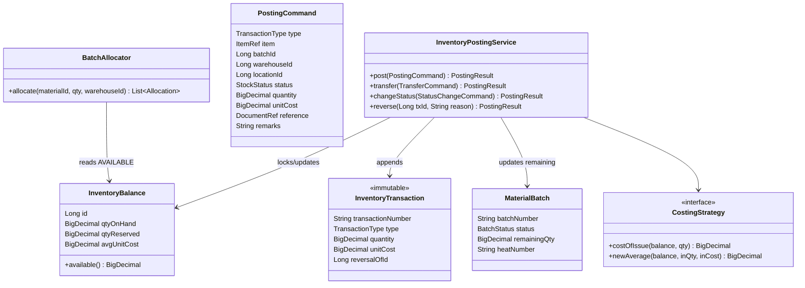
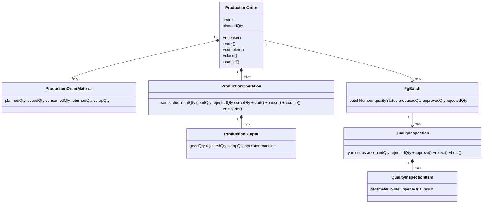

# DESIGN.md — Spring Manufacturing Inventory Management System

**Version:** 1.0  **Date:** 2026-10-01
**Inputs:** REQUIREMENTS.md v1.0 (what), ARCHITECTURE.md v1.0 (structure)
**Purpose:** the detailed, implementable design — schemas, domain model, algorithms, API contracts, screens, seed data and test cases. A developer should be able to build each phase from this document without further design decisions.

> Document map: REQUIREMENTS = *what* · ARCHITECTURE = *how it is structured* · **DESIGN = exactly how each part works.**

## Contents
1. Conventions and Shared Types
2. Detailed Database Design
3. Domain Model
4. Component Design (algorithms)
5. Module Designs
6. API Contracts
7. Security Design Details
8. Frontend Design
9. Dashboards, Reports and Alerts
10. Configuration and Settings
11. Seed Data Design
12. End-to-End Demonstration Workflow
13. Test Design
14. Assumptions and Open Items

---

## 1. Conventions and Shared Types

### 1.1 Data types
| Concept | PostgreSQL | Java | Notes |
|---|---|---|---|
| Surrogate key | `BIGINT GENERATED ALWAYS AS IDENTITY` | `Long` | every table |
| Business key | `VARCHAR(40) UNIQUE` | `String` | codes and document numbers |
| Quantity | `NUMERIC(18,3)` | `BigDecimal` | base UOM; never `double` |
| Money / cost | `NUMERIC(18,4)` | `BigDecimal` | currency INR default |
| Dimension (mm) | `NUMERIC(10,3)` | `BigDecimal` | |
| Timestamp | `TIMESTAMPTZ` | `Instant` | stored UTC, shown Asia/Kolkata |
| Date | `DATE` | `LocalDate` | |
| Flexible attributes | `JSONB` | `JsonNode`/`Map` | spring-specific specs, audit values |
| Enum | `VARCHAR(30)` + `CHECK` | Java `enum` (`@Enumerated(STRING)`) | never ordinals |

Standard columns on every non-ledger table: `created_at, created_by, updated_at, updated_by, version BIGINT NOT NULL DEFAULT 0, company_id BIGINT NOT NULL DEFAULT 1`. Master data adds `active BOOLEAN NOT NULL DEFAULT TRUE`.

### 1.2 Enumerations
| Enum | Values |
|---|---|
| `SpringType` | COMPRESSION, EXTENSION, TORSION, CONICAL, DISC_BELLEVILLE, WIRE_FORM, CUSTOM |
| `ItemType` | MATERIAL, PRODUCT |
| `StockStatus` | AVAILABLE, QUARANTINE, HOLD, REJECTED, QUALITY_PENDING |
| `BatchStatus` (RM) | AVAILABLE, QUARANTINE, REJECTED, CONSUMED, EXPIRED, HOLD |
| `TransactionType` | OPENING_BALANCE, PURCHASE_RECEIPT, MATERIAL_ISSUE, MATERIAL_RETURN, MATERIAL_CONSUMPTION, PRODUCTION_RECEIPT, PRODUCTION_REJECTION, SALES_DISPATCH, STOCK_ADJUSTMENT, STOCK_TRANSFER, SCRAP, CUSTOMER_RETURN |
| `PurchaseOrderStatus` | DRAFT, SUBMITTED, APPROVED, SENT_TO_SUPPLIER, PARTIALLY_RECEIVED, RECEIVED, CANCELLED |
| `BomStatus` | DRAFT, ENGINEERING_REVIEW, APPROVED, ACTIVE, SUPERSEDED, OBSOLETE |
| `ProductionOrderStatus` | DRAFT, APPROVED, RELEASED, IN_PROGRESS, COMPLETED, CLOSED, CANCELLED |
| `OperationStatus` | PENDING, IN_PROGRESS, PAUSED, COMPLETED |
| `InspectionType` | INCOMING, IN_PROCESS, FINAL |
| `InspectionStatus` | PENDING, IN_PROGRESS, APPROVED, REJECTED, HOLD |
| `ParameterResult` | PASS, FAIL, NOT_MEASURED |
| `FgQualityStatus` | PRODUCTION_COMPLETED, QUALITY_PENDING, APPROVED, REJECTED, HOLD |
| `SalesOrderStatus` | ORDERED, ALLOCATED, PACKED, PARTIALLY_DISPATCHED, DISPATCHED, CANCELLED |
| `AdjustmentStatus` | REQUESTED, SUPERVISOR_REVIEW, MANAGER_APPROVAL, ADMIN_APPROVAL, POSTED, REJECTED |
| `AlertType` | LOW_STOCK, OVERSTOCK, PENDING_INSPECTION, PRODUCTION_DELAY, MATERIAL_SHORTAGE, AGING_BATCH, PENDING_PO, LEDGER_MISMATCH |

### 1.3 Document number formats
Generated by `DocumentNumberService` from `number_sequences` (one row per `prefix + year`, locked `FOR UPDATE`).

| Document | Format | Example |
|---|---|---|
| Purchase requisition | `PR-{yyyy}-{00000}` | PR-2026-00018 |
| Purchase order | `PUR-{yyyy}-{00000}` | PUR-2026-00031 |
| Goods receipt | `GR-{yyyy}-{00000}` | GR-2026-00044 |
| RM batch | `RM-BATCH-{yyyy}-{000}` | RM-BATCH-2026-001 |
| Production order | `PO-{yyyy}-{00000}` | PO-2026-00125 |
| Material issue | `MI-{yyyy}-{00000}` | MI-2026-00210 |
| FG batch | `FG-{yyyy}-{0000}` | FG-2026-0050 |
| Inspection | `QI-{yyyy}-{00000}` | QI-2026-00071 |
| Stock transaction | `TXN-{yyyyMM}-{000000}` | TXN-202610-000412 |
| Stock adjustment | `ADJ-{yyyy}-{00000}` | ADJ-2026-00009 |
| Sales order | `SO-{yyyy}-{00000}` | SO-2026-00052 |
| Dispatch | `DSP-{yyyy}-{00000}` | DSP-2026-00033 |
| BOM | `BOM-{000}` + revision letter | BOM-001 Rev B |

> Note: production orders use `PO-` (requirements example) and purchase orders use `PUR-` here to avoid ambiguity; the requirement's example for purchase orders did not fix a prefix.

---

## 2. Detailed Database Design

Schema `ims`. All DDL below is the target for Flyway migrations (grouped per phase in §2.9). Standard columns (§1.1) are omitted for brevity except where relevant.

### 2.1 Identity and access (Phase 1 — V1)
```sql
CREATE TABLE users (
  id BIGINT GENERATED ALWAYS AS IDENTITY PRIMARY KEY,
  username VARCHAR(50) NOT NULL UNIQUE,
  employee_code VARCHAR(20) UNIQUE,                 -- e.g. S001
  full_name VARCHAR(120) NOT NULL,
  email VARCHAR(160) NOT NULL UNIQUE,
  phone VARCHAR(20),
  password_hash VARCHAR(100) NOT NULL,              -- BCrypt(12)
  password_changed_at TIMESTAMPTZ,
  must_change_password BOOLEAN NOT NULL DEFAULT TRUE,
  failed_attempts INT NOT NULL DEFAULT 0,
  locked_until TIMESTAMPTZ,
  permission_version INT NOT NULL DEFAULT 1,        -- bumped when roles/permissions change
  active BOOLEAN NOT NULL DEFAULT TRUE,
  last_login_at TIMESTAMPTZ
  /* + standard columns */
);
CREATE TABLE roles (id BIGINT … PRIMARY KEY, code VARCHAR(40) UNIQUE NOT NULL, name VARCHAR(80) NOT NULL,
                    description VARCHAR(300), system_role BOOLEAN NOT NULL DEFAULT FALSE);
CREATE TABLE permissions (id BIGINT … PRIMARY KEY, code VARCHAR(60) UNIQUE NOT NULL,
                          module VARCHAR(30) NOT NULL, description VARCHAR(200));
CREATE TABLE user_roles (user_id BIGINT REFERENCES users, role_id BIGINT REFERENCES roles, PRIMARY KEY (user_id, role_id));
CREATE TABLE role_permissions (role_id BIGINT REFERENCES roles, permission_id BIGINT REFERENCES permissions,
                               PRIMARY KEY (role_id, permission_id));
CREATE TABLE user_warehouse_access (user_id BIGINT REFERENCES users, warehouse_id BIGINT, PRIMARY KEY (user_id, warehouse_id));
CREATE TABLE refresh_tokens (id BIGINT … PRIMARY KEY, user_id BIGINT NOT NULL REFERENCES users,
  token_hash CHAR(64) NOT NULL UNIQUE, family_id UUID NOT NULL, expires_at TIMESTAMPTZ NOT NULL,
  revoked_at TIMESTAMPTZ, replaced_by BIGINT, user_agent VARCHAR(200), ip VARCHAR(45), created_at TIMESTAMPTZ NOT NULL);
CREATE TABLE password_reset_tokens (id BIGINT … PRIMARY KEY, user_id BIGINT NOT NULL REFERENCES users,
  token_hash CHAR(64) UNIQUE NOT NULL, expires_at TIMESTAMPTZ NOT NULL, used_at TIMESTAMPTZ);
CREATE TABLE password_history (user_id BIGINT REFERENCES users, password_hash VARCHAR(100), changed_at TIMESTAMPTZ);
```

### 2.2 Platform (V1–V2)
```sql
CREATE TABLE system_settings (key VARCHAR(100) PRIMARY KEY, value VARCHAR(500) NOT NULL,
  value_type VARCHAR(15) NOT NULL CHECK (value_type IN ('BOOLEAN','INTEGER','DECIMAL','STRING')),
  description VARCHAR(300), updated_at TIMESTAMPTZ, updated_by BIGINT);
CREATE TABLE number_sequences (prefix VARCHAR(20), seq_year INT, last_value BIGINT NOT NULL DEFAULT 0,
  PRIMARY KEY (prefix, seq_year));
CREATE TABLE audit_logs (
  id BIGINT GENERATED ALWAYS AS IDENTITY, occurred_at TIMESTAMPTZ NOT NULL DEFAULT now(),
  user_id BIGINT, username VARCHAR(50), roles VARCHAR(200),
  action VARCHAR(60) NOT NULL, entity VARCHAR(60) NOT NULL, entity_id VARCHAR(60),
  old_value JSONB, new_value JSONB, reason VARCHAR(500),
  ip_address VARCHAR(45), correlation_id VARCHAR(40),
  PRIMARY KEY (id, occurred_at)
) PARTITION BY RANGE (occurred_at);
CREATE TABLE approval_requests (id BIGINT … PRIMARY KEY, document_type VARCHAR(30) NOT NULL, document_id BIGINT NOT NULL,
  step_no INT NOT NULL, required_permission VARCHAR(60) NOT NULL, status VARCHAR(15) NOT NULL, -- PENDING/APPROVED/REJECTED
  requested_by BIGINT NOT NULL, decided_by BIGINT, decided_at TIMESTAMPTZ, comment VARCHAR(500));
CREATE TABLE idempotency_keys (key VARCHAR(80) PRIMARY KEY, user_id BIGINT NOT NULL, request_hash CHAR(64) NOT NULL,
  response_status INT, response_body JSONB, created_at TIMESTAMPTZ NOT NULL DEFAULT now());  -- purge after 48h
CREATE TABLE alerts (id BIGINT … PRIMARY KEY, alert_type VARCHAR(30) NOT NULL, severity VARCHAR(10) NOT NULL,
  entity_type VARCHAR(40), entity_id BIGINT, open_key VARCHAR(120) NOT NULL, message VARCHAR(300) NOT NULL,
  first_seen_at TIMESTAMPTZ NOT NULL, last_seen_at TIMESTAMPTZ NOT NULL,
  acknowledged_by BIGINT, acknowledged_at TIMESTAMPTZ, resolved_at TIMESTAMPTZ);
CREATE UNIQUE INDEX ux_alert_open ON alerts(open_key) WHERE resolved_at IS NULL;
```

### 2.3 Master data (V2–V3)
```sql
CREATE TABLE uoms (code VARCHAR(10) PRIMARY KEY, name VARCHAR(40) NOT NULL, kind VARCHAR(10) NOT NULL); -- KG, G, PCS, M, MM, CARTON
CREATE TABLE materials (
  id …, material_code VARCHAR(30) UNIQUE NOT NULL,  -- RM-SS-001
  name VARCHAR(150) NOT NULL, material_type VARCHAR(40) NOT NULL, -- SPRING_STEEL, STAINLESS, HIGH_CARBON, ALLOY, PHOSPHOR_BRONZE, MUSIC_WIRE, CONSUMABLE
  grade VARCHAR(30), diameter_mm NUMERIC(10,3), uom VARCHAR(10) NOT NULL REFERENCES uoms,
  preferred_supplier_id BIGINT REFERENCES suppliers,
  min_stock NUMERIC(18,3) NOT NULL DEFAULT 0, reorder_level NUMERIC(18,3) NOT NULL DEFAULT 0, max_stock NUMERIC(18,3),
  standard_cost NUMERIC(18,4) NOT NULL DEFAULT 0, shelf_life_days INT, description VARCHAR(500),
  CHECK (min_stock <= reorder_level AND (max_stock IS NULL OR reorder_level <= max_stock)));
CREATE TABLE products (
  id …, product_code VARCHAR(30) UNIQUE NOT NULL,   -- SPR-COMP-001
  name VARCHAR(150) NOT NULL, spring_type VARCHAR(20) NOT NULL, primary_material_id BIGINT REFERENCES materials,
  wire_diameter NUMERIC(10,3), outer_diameter NUMERIC(10,3), inner_diameter NUMERIC(10,3), free_length NUMERIC(10,3),
  number_of_coils NUMERIC(8,2), active_coils NUMERIC(8,2), spring_rate NUMERIC(12,4),
  max_load NUMERIC(12,3), min_load NUMERIC(12,3), working_length NUMERIC(10,3), solid_height NUMERIC(10,3),
  end_type VARCHAR(30), surface_treatment VARCHAR(60), heat_treatment VARCHAR(60), tolerance VARCHAR(60),
  unit_weight_kg NUMERIC(12,6), uom VARCHAR(10) NOT NULL DEFAULT 'PCS',
  drawing_number VARCHAR(40), drawing_revision VARCHAR(10), customer_id BIGINT REFERENCES customers,
  status VARCHAR(15) NOT NULL DEFAULT 'DRAFT' CHECK (status IN ('DRAFT','ACTIVE','OBSOLETE')),
  reorder_level NUMERIC(18,3) DEFAULT 0, standard_cost NUMERIC(18,4) DEFAULT 0);
CREATE TABLE spring_specifications (product_id BIGINT PRIMARY KEY REFERENCES products ON DELETE CASCADE,
  attributes JSONB NOT NULL DEFAULT '{}'::jsonb);
CREATE INDEX ix_specs_gin ON spring_specifications USING GIN (attributes jsonb_path_ops);
CREATE TABLE spring_attribute_definitions (
  id …, spring_type VARCHAR(20) NOT NULL, attribute_code VARCHAR(40) NOT NULL, label VARCHAR(80) NOT NULL,
  data_type VARCHAR(12) NOT NULL CHECK (data_type IN ('NUMBER','TEXT','ENUM','BOOLEAN')),
  unit VARCHAR(10), required BOOLEAN NOT NULL DEFAULT FALSE, min_value NUMERIC, max_value NUMERIC,
  enum_values JSONB, display_order INT NOT NULL DEFAULT 0, UNIQUE (spring_type, attribute_code));
CREATE TABLE suppliers (id …, supplier_code VARCHAR(20) UNIQUE NOT NULL, name VARCHAR(150) NOT NULL, contact_person VARCHAR(100),
  phone VARCHAR(20), email VARCHAR(160), address VARCHAR(400), gst_number VARCHAR(15), payment_terms VARCHAR(60),
  status VARCHAR(10) NOT NULL DEFAULT 'ACTIVE', lead_time_days INT);
CREATE TABLE customers (… same shape …, customer_code VARCHAR(20) UNIQUE NOT NULL);
CREATE TABLE customer_product_specs (id …, customer_id BIGINT, product_id BIGINT, customer_part_no VARCHAR(40),
  special_requirements VARCHAR(500), attributes JSONB, UNIQUE (customer_id, product_id));
CREATE TABLE warehouses (id …, warehouse_code VARCHAR(20) UNIQUE NOT NULL, name VARCHAR(100) NOT NULL, address VARCHAR(300));
CREATE TABLE warehouse_locations (id …, warehouse_id BIGINT NOT NULL REFERENCES warehouses, location_code VARCHAR(20) NOT NULL,
  name VARCHAR(100) NOT NULL, location_type VARCHAR(15) NOT NULL
    CHECK (location_type IN ('RAW_MATERIAL','WIP','FINISHED','QUARANTINE','QUALITY_PENDING','SCRAP','DISPATCH')),
  UNIQUE (warehouse_id, location_code));
CREATE TABLE machines (id …, machine_code VARCHAR(20) UNIQUE NOT NULL, name VARCHAR(100), machine_type VARCHAR(40),
  production_line VARCHAR(40), status VARCHAR(15) NOT NULL DEFAULT 'AVAILABLE'  -- AVAILABLE/RUNNING/DOWN/MAINTENANCE
);
CREATE TABLE operations (id …, operation_code VARCHAR(20) UNIQUE NOT NULL, name VARCHAR(80) NOT NULL, description VARCHAR(300),
  default_machine_type VARCHAR(40), standard_time_min NUMERIC(10,2), setup_time_min NUMERIC(10,2), is_inspection BOOLEAN DEFAULT FALSE);
CREATE TABLE rejection_reasons (id …, reason_code VARCHAR(20) UNIQUE NOT NULL, name VARCHAR(100) NOT NULL, applies_to VARCHAR(15)); -- INCOMING/PROCESS/FINAL/ALL
```

### 2.4 Engineering — BOM and routing (Phase 4 — V7)
```sql
CREATE TABLE bom (
  id …, bom_number VARCHAR(20) NOT NULL, revision VARCHAR(5) NOT NULL, product_id BIGINT NOT NULL REFERENCES products,
  status VARCHAR(20) NOT NULL DEFAULT 'DRAFT', effective_from DATE, effective_to DATE,
  base_quantity NUMERIC(18,3) NOT NULL DEFAULT 1,       -- BOM quantities are per this many product units
  change_reason VARCHAR(500), approved_by BIGINT, approved_at TIMESTAMPTZ,
  UNIQUE (bom_number, revision));
CREATE UNIQUE INDEX ux_bom_one_active ON bom(product_id) WHERE status = 'ACTIVE';
CREATE TABLE bom_items (id …, bom_id BIGINT NOT NULL REFERENCES bom ON DELETE CASCADE, line_no INT NOT NULL,
  item_kind VARCHAR(12) NOT NULL CHECK (item_kind IN ('MATERIAL','PROCESS','PACKAGING')),
  material_id BIGINT REFERENCES materials, operation_id BIGINT REFERENCES operations,
  required_qty NUMERIC(18,6), uom VARCHAR(10), scrap_pct NUMERIC(5,2) NOT NULL DEFAULT 0 CHECK (scrap_pct BETWEEN 0 AND 100),
  instruction VARCHAR(300), UNIQUE (bom_id, line_no),
  CHECK ((item_kind='MATERIAL' AND material_id IS NOT NULL AND required_qty > 0) OR item_kind <> 'MATERIAL'));
CREATE TABLE product_routing (id …, product_id BIGINT NOT NULL REFERENCES products, sequence_no INT NOT NULL,
  operation_id BIGINT NOT NULL REFERENCES operations, machine_id BIGINT REFERENCES machines,
  standard_time_min NUMERIC(10,2), setup_time_min NUMERIC(10,2),
  inspection_point BOOLEAN NOT NULL DEFAULT FALSE, active BOOLEAN NOT NULL DEFAULT TRUE,
  UNIQUE (product_id, sequence_no));
```

### 2.5 Inventory (Phase 2 — V4–V5)
```sql
CREATE TABLE material_batches (
  id …, batch_number VARCHAR(30) UNIQUE NOT NULL, material_id BIGINT NOT NULL REFERENCES materials,
  supplier_id BIGINT REFERENCES suppliers, purchase_order_id BIGINT, goods_receipt_item_id BIGINT,
  manufacturing_date DATE, received_date DATE NOT NULL, expiry_date DATE,
  received_qty NUMERIC(18,3) NOT NULL CHECK (received_qty > 0), remaining_qty NUMERIC(18,3) NOT NULL CHECK (remaining_qty >= 0),
  heat_number VARCHAR(40), certificate_number VARCHAR(40), unit_cost NUMERIC(18,4),
  status VARCHAR(15) NOT NULL DEFAULT 'QUARANTINE');
CREATE TABLE fg_batches (
  id …, batch_number VARCHAR(30) UNIQUE NOT NULL, product_id BIGINT NOT NULL REFERENCES products,
  production_order_id BIGINT NOT NULL, produced_qty NUMERIC(18,3) NOT NULL CHECK (produced_qty > 0),
  approved_qty NUMERIC(18,3) NOT NULL DEFAULT 0, rejected_qty NUMERIC(18,3) NOT NULL DEFAULT 0,
  remaining_qty NUMERIC(18,3) NOT NULL DEFAULT 0, produced_on DATE NOT NULL,
  quality_status VARCHAR(25) NOT NULL DEFAULT 'PRODUCTION_COMPLETED', unit_cost NUMERIC(18,4),
  CHECK (approved_qty + rejected_qty <= produced_qty));
CREATE TABLE fg_batch_material_sources (fg_batch_id BIGINT REFERENCES fg_batches, material_batch_id BIGINT REFERENCES material_batches,
  quantity NUMERIC(18,3) NOT NULL, PRIMARY KEY (fg_batch_id, material_batch_id));   -- optional fine-grained trace
CREATE TABLE inventory_balances (
  id …, warehouse_id BIGINT NOT NULL, location_id BIGINT NOT NULL REFERENCES warehouse_locations,
  item_type VARCHAR(10) NOT NULL, material_id BIGINT REFERENCES materials, product_id BIGINT REFERENCES products,
  material_batch_id BIGINT REFERENCES material_batches, fg_batch_id BIGINT REFERENCES fg_batches,
  stock_status VARCHAR(20) NOT NULL, qty_on_hand NUMERIC(18,3) NOT NULL DEFAULT 0, qty_reserved NUMERIC(18,3) NOT NULL DEFAULT 0,
  avg_unit_cost NUMERIC(18,4) NOT NULL DEFAULT 0, version BIGINT NOT NULL DEFAULT 0, updated_at TIMESTAMPTZ NOT NULL DEFAULT now(),
  CHECK ((item_type='MATERIAL' AND material_id IS NOT NULL AND product_id IS NULL) OR
         (item_type='PRODUCT'  AND product_id  IS NOT NULL AND material_id IS NULL)),
  CHECK (qty_reserved >= 0 AND qty_reserved <= GREATEST(qty_on_hand,0)));
CREATE UNIQUE INDEX ux_balance_key ON inventory_balances
  (warehouse_id, location_id, item_type, COALESCE(material_id,0), COALESCE(product_id,0),
   COALESCE(material_batch_id,0), COALESCE(fg_batch_id,0), stock_status);
CREATE TABLE inventory_transactions (
  id BIGINT GENERATED ALWAYS AS IDENTITY PRIMARY KEY, transaction_number VARCHAR(25) UNIQUE NOT NULL,
  transaction_date TIMESTAMPTZ NOT NULL DEFAULT now(), transaction_type VARCHAR(25) NOT NULL,
  item_type VARCHAR(10) NOT NULL, material_id BIGINT, product_id BIGINT, material_batch_id BIGINT, fg_batch_id BIGINT,
  warehouse_id BIGINT NOT NULL, location_id BIGINT NOT NULL, stock_status VARCHAR(20) NOT NULL,
  quantity NUMERIC(18,3) NOT NULL CHECK (quantity <> 0),            -- signed: + in, − out
  uom VARCHAR(10) NOT NULL, unit_cost NUMERIC(18,4) NOT NULL DEFAULT 0, total_cost NUMERIC(18,4) NOT NULL DEFAULT 0,
  reference_type VARCHAR(30) NOT NULL, reference_id BIGINT NOT NULL, reference_number VARCHAR(30),
  transfer_group_id BIGINT, reversal_of_id BIGINT REFERENCES inventory_transactions,
  balance_after NUMERIC(18,3) NOT NULL,                              -- on-hand of that balance row after this leg
  remarks VARCHAR(500), created_by BIGINT NOT NULL, created_at TIMESTAMPTZ NOT NULL DEFAULT now(),
  CHECK ((item_type='MATERIAL' AND material_id IS NOT NULL AND product_id IS NULL) OR
         (item_type='PRODUCT'  AND product_id  IS NOT NULL AND material_id IS NULL)));
CREATE INDEX ix_tx_item ON inventory_transactions (item_type, material_id, product_id, transaction_date);
CREATE INDEX ix_tx_batch ON inventory_transactions (material_batch_id, fg_batch_id);
CREATE INDEX ix_tx_ref ON inventory_transactions (reference_type, reference_id);
CREATE INDEX ix_tx_date_brin ON inventory_transactions USING BRIN (transaction_date);
CREATE TABLE stock_adjustments (id …, adjustment_number VARCHAR(20) UNIQUE NOT NULL, item_type VARCHAR(10), material_id BIGINT, product_id BIGINT,
  batch_id BIGINT, warehouse_id BIGINT, location_id BIGINT, system_qty NUMERIC(18,3) NOT NULL, counted_qty NUMERIC(18,3) NOT NULL,
  variance_qty NUMERIC(18,3) GENERATED ALWAYS AS (counted_qty - system_qty) STORED, variance_value NUMERIC(18,4),
  reason VARCHAR(500) NOT NULL, status VARCHAR(20) NOT NULL DEFAULT 'REQUESTED', requested_by BIGINT NOT NULL,
  posted_transaction_id BIGINT, stock_count_id BIGINT);
CREATE TABLE stock_counts (id …, count_number VARCHAR(20) UNIQUE, warehouse_id BIGINT, status VARCHAR(15), count_date DATE);
CREATE TABLE stock_count_lines (id …, stock_count_id BIGINT, item_type VARCHAR(10), material_id BIGINT, product_id BIGINT,
  batch_id BIGINT, location_id BIGINT, system_qty NUMERIC(18,3), counted_qty NUMERIC(18,3), counted_by BIGINT);
```

### 2.6 Procurement (Phase 3 — V6)
```sql
CREATE TABLE purchase_orders (id …, po_number VARCHAR(20) UNIQUE NOT NULL, supplier_id BIGINT NOT NULL REFERENCES suppliers,
  po_date DATE NOT NULL, expected_delivery_date DATE, status VARCHAR(20) NOT NULL DEFAULT 'DRAFT',
  subtotal NUMERIC(18,4) NOT NULL DEFAULT 0, tax_total NUMERIC(18,4) NOT NULL DEFAULT 0, grand_total NUMERIC(18,4) NOT NULL DEFAULT 0,
  currency CHAR(3) NOT NULL DEFAULT 'INR', payment_terms VARCHAR(60), remarks VARCHAR(500), requisition_id BIGINT,
  submitted_by BIGINT, approved_by BIGINT, approved_at TIMESTAMPTZ);
CREATE TABLE purchase_order_items (id …, purchase_order_id BIGINT NOT NULL REFERENCES purchase_orders ON DELETE CASCADE, line_no INT NOT NULL,
  material_id BIGINT NOT NULL REFERENCES materials, ordered_qty NUMERIC(18,3) NOT NULL CHECK (ordered_qty > 0),
  received_qty NUMERIC(18,3) NOT NULL DEFAULT 0, accepted_qty NUMERIC(18,3) NOT NULL DEFAULT 0, rejected_qty NUMERIC(18,3) NOT NULL DEFAULT 0,
  rate NUMERIC(18,4) NOT NULL CHECK (rate >= 0), tax_pct NUMERIC(5,2) NOT NULL DEFAULT 0, line_total NUMERIC(18,4) NOT NULL,
  UNIQUE (purchase_order_id, line_no));
CREATE TABLE goods_receipts (id …, gr_number VARCHAR(20) UNIQUE NOT NULL, purchase_order_id BIGINT NOT NULL REFERENCES purchase_orders,
  receipt_date DATE NOT NULL, supplier_challan_no VARCHAR(40), vehicle_no VARCHAR(20), warehouse_id BIGINT NOT NULL,
  status VARCHAR(20) NOT NULL DEFAULT 'POSTED', received_by BIGINT NOT NULL);
CREATE TABLE goods_receipt_items (id …, goods_receipt_id BIGINT NOT NULL REFERENCES goods_receipts, po_item_id BIGINT NOT NULL REFERENCES purchase_order_items,
  material_id BIGINT NOT NULL, received_qty NUMERIC(18,3) NOT NULL CHECK (received_qty > 0), location_id BIGINT NOT NULL,
  heat_number VARCHAR(40), certificate_number VARCHAR(40), manufacturing_date DATE, material_batch_id BIGINT REFERENCES material_batches,
  inspection_required BOOLEAN NOT NULL DEFAULT TRUE);
```
`purchase_requisitions` (`pr_number, requested_by, material_id, qty, needed_by, status, converted_po_id`) is added in the same migration.

### 2.7 Production (Phase 4 — V8)
```sql
CREATE TABLE production_orders (
  id …, order_number VARCHAR(20) UNIQUE NOT NULL, product_id BIGINT NOT NULL REFERENCES products, bom_id BIGINT NOT NULL REFERENCES bom,
  planned_qty NUMERIC(18,3) NOT NULL CHECK (planned_qty > 0), good_qty NUMERIC(18,3) NOT NULL DEFAULT 0,
  rejected_qty NUMERIC(18,3) NOT NULL DEFAULT 0, scrap_qty NUMERIC(18,3) NOT NULL DEFAULT 0,
  start_date DATE, expected_completion_date DATE, actual_start_at TIMESTAMPTZ, actual_completion_at TIMESTAMPTZ,
  production_line VARCHAR(40), primary_machine_id BIGINT REFERENCES machines, supervisor_id BIGINT REFERENCES users,
  sales_order_id BIGINT, priority SMALLINT NOT NULL DEFAULT 3, status VARCHAR(15) NOT NULL DEFAULT 'DRAFT',
  released_by BIGINT, released_at TIMESTAMPTZ, closed_by BIGINT, closed_at TIMESTAMPTZ, remarks VARCHAR(500));
CREATE TABLE production_order_materials (            -- BOM snapshot at release
  id …, production_order_id BIGINT NOT NULL REFERENCES production_orders ON DELETE CASCADE, material_id BIGINT NOT NULL REFERENCES materials,
  planned_qty NUMERIC(18,3) NOT NULL, issued_qty NUMERIC(18,3) NOT NULL DEFAULT 0, consumed_qty NUMERIC(18,3) NOT NULL DEFAULT 0,
  returned_qty NUMERIC(18,3) NOT NULL DEFAULT 0, scrap_qty NUMERIC(18,3) NOT NULL DEFAULT 0,
  remaining_qty NUMERIC(18,3) GENERATED ALWAYS AS (issued_qty - consumed_qty - returned_qty - scrap_qty) STORED,
  scrap_pct_applied NUMERIC(5,2), uom VARCHAR(10) NOT NULL, UNIQUE (production_order_id, material_id),
  CONSTRAINT ck_not_overconsumed CHECK (consumed_qty + returned_qty + scrap_qty <= issued_qty));
CREATE TABLE material_issues (id …, issue_number VARCHAR(20) UNIQUE NOT NULL, production_order_id BIGINT NOT NULL REFERENCES production_orders,
  issue_date TIMESTAMPTZ NOT NULL DEFAULT now(), from_warehouse_id BIGINT, issued_by BIGINT NOT NULL, received_by BIGINT, remarks VARCHAR(300));
CREATE TABLE material_issue_lines (id …, material_issue_id BIGINT NOT NULL REFERENCES material_issues, material_id BIGINT NOT NULL,
  material_batch_id BIGINT NOT NULL REFERENCES material_batches, from_location_id BIGINT NOT NULL, to_location_id BIGINT NOT NULL,
  quantity NUMERIC(18,3) NOT NULL CHECK (quantity > 0), unit_cost NUMERIC(18,4) NOT NULL);
CREATE TABLE production_operations (       -- routing snapshot at release
  id …, production_order_id BIGINT NOT NULL REFERENCES production_orders ON DELETE CASCADE, sequence_no INT NOT NULL,
  operation_id BIGINT NOT NULL REFERENCES operations, machine_id BIGINT REFERENCES machines, assigned_operator_id BIGINT REFERENCES users,
  inspection_point BOOLEAN NOT NULL DEFAULT FALSE, status VARCHAR(15) NOT NULL DEFAULT 'PENDING',
  input_qty NUMERIC(18,3) NOT NULL DEFAULT 0, good_qty NUMERIC(18,3) NOT NULL DEFAULT 0, rejected_qty NUMERIC(18,3) NOT NULL DEFAULT 0,
  scrap_qty NUMERIC(18,3) NOT NULL DEFAULT 0, started_at TIMESTAMPTZ, completed_at TIMESTAMPTZ,
  UNIQUE (production_order_id, sequence_no),
  CHECK (good_qty + rejected_qty + scrap_qty <= input_qty));
CREATE TABLE production_outputs (id …, production_operation_id BIGINT NOT NULL REFERENCES production_operations, production_order_id BIGINT NOT NULL,
  entry_no INT NOT NULL, input_qty NUMERIC(18,3) NOT NULL, good_qty NUMERIC(18,3) NOT NULL CHECK (good_qty >= 0),
  rejected_qty NUMERIC(18,3) NOT NULL DEFAULT 0, scrap_qty NUMERIC(18,3) NOT NULL DEFAULT 0, rejection_reason_id BIGINT REFERENCES rejection_reasons,
  operator_id BIGINT NOT NULL REFERENCES users, machine_id BIGINT REFERENCES machines, start_time TIMESTAMPTZ, end_time TIMESTAMPTZ,
  shift VARCHAR(10), remarks VARCHAR(300), correction_of_id BIGINT REFERENCES production_outputs);   -- corrections are new rows
CREATE TABLE production_downtime (id …, machine_id BIGINT NOT NULL, production_order_id BIGINT, reason VARCHAR(100) NOT NULL,
  category VARCHAR(20), started_at TIMESTAMPTZ NOT NULL, ended_at TIMESTAMPTZ, reported_by BIGINT NOT NULL);
CREATE TABLE material_requests (id …, production_order_id BIGINT, material_id BIGINT, requested_qty NUMERIC(18,3), requested_by BIGINT,
  status VARCHAR(15) NOT NULL DEFAULT 'OPEN', fulfilled_issue_id BIGINT);
```

### 2.8 Quality, sales (Phases 3, 5, 6 — V6, V9, V10)
```sql
CREATE TABLE inspection_plans (id …, plan_code VARCHAR(20) UNIQUE, inspection_type VARCHAR(12) NOT NULL, product_id BIGINT, material_id BIGINT,
  active BOOLEAN DEFAULT TRUE);
CREATE TABLE inspection_plan_parameters (id …, plan_id BIGINT NOT NULL REFERENCES inspection_plans, seq INT, parameter_name VARCHAR(60) NOT NULL,
  specification VARCHAR(80), nominal NUMERIC(14,4), lower_limit NUMERIC(14,4), upper_limit NUMERIC(14,4), unit VARCHAR(10),
  is_attribute BOOLEAN DEFAULT FALSE, mandatory BOOLEAN DEFAULT TRUE);
CREATE TABLE quality_inspections (
  id …, inspection_number VARCHAR(20) UNIQUE NOT NULL, inspection_type VARCHAR(12) NOT NULL, status VARCHAR(12) NOT NULL DEFAULT 'PENDING',
  goods_receipt_item_id BIGINT, material_batch_id BIGINT, production_order_id BIGINT, production_operation_id BIGINT, fg_batch_id BIGINT,
  inspected_qty NUMERIC(18,3) NOT NULL, sample_size INT, accepted_qty NUMERIC(18,3) NOT NULL DEFAULT 0, rejected_qty NUMERIC(18,3) NOT NULL DEFAULT 0,
  hold_qty NUMERIC(18,3) NOT NULL DEFAULT 0, inspector_id BIGINT, inspected_at TIMESTAMPTZ, decision_by BIGINT, decision_at TIMESTAMPTZ,
  remarks VARCHAR(500),
  CHECK (accepted_qty + rejected_qty + hold_qty <= inspected_qty));
CREATE TABLE quality_inspection_items (id …, inspection_id BIGINT NOT NULL REFERENCES quality_inspections ON DELETE CASCADE, seq INT NOT NULL,
  parameter_name VARCHAR(60) NOT NULL, specification VARCHAR(80), lower_limit NUMERIC(14,4), upper_limit NUMERIC(14,4),
  actual_value NUMERIC(14,4), actual_text VARCHAR(80), unit VARCHAR(10), result VARCHAR(12) NOT NULL DEFAULT 'NOT_MEASURED', deviation_note VARCHAR(300));
CREATE TABLE rejections (id …, inspection_id BIGINT, production_output_id BIGINT, rejection_reason_id BIGINT NOT NULL REFERENCES rejection_reasons,
  item_type VARCHAR(10), material_id BIGINT, product_id BIGINT, batch_id BIGINT, quantity NUMERIC(18,3) NOT NULL CHECK (quantity > 0),
  disposition VARCHAR(15) NOT NULL DEFAULT 'SCRAP',  -- SCRAP / REWORK / RETURN_TO_SUPPLIER
  inventory_transaction_id BIGINT, recorded_by BIGINT NOT NULL, recorded_at TIMESTAMPTZ NOT NULL DEFAULT now());
CREATE TABLE sales_orders (id …, so_number VARCHAR(20) UNIQUE NOT NULL, customer_id BIGINT NOT NULL REFERENCES customers, order_date DATE NOT NULL,
  required_date DATE, customer_po_ref VARCHAR(40), delivery_address VARCHAR(400), status VARCHAR(25) NOT NULL DEFAULT 'ORDERED', remarks VARCHAR(500));
CREATE TABLE sales_order_items (id …, sales_order_id BIGINT NOT NULL REFERENCES sales_orders ON DELETE CASCADE, line_no INT NOT NULL,
  product_id BIGINT NOT NULL REFERENCES products, ordered_qty NUMERIC(18,3) NOT NULL CHECK (ordered_qty > 0),
  reserved_qty NUMERIC(18,3) NOT NULL DEFAULT 0, packed_qty NUMERIC(18,3) NOT NULL DEFAULT 0, dispatched_qty NUMERIC(18,3) NOT NULL DEFAULT 0,
  unit_price NUMERIC(18,4), CHECK (dispatched_qty <= ordered_qty), UNIQUE (sales_order_id, line_no));
CREATE TABLE sales_reservations (id …, sales_order_item_id BIGINT NOT NULL, fg_batch_id BIGINT NOT NULL, warehouse_id BIGINT, location_id BIGINT,
  reserved_qty NUMERIC(18,3) NOT NULL CHECK (reserved_qty > 0), status VARCHAR(10) NOT NULL DEFAULT 'ACTIVE', reserved_by BIGINT);
CREATE TABLE dispatches (id …, dispatch_number VARCHAR(20) UNIQUE NOT NULL, sales_order_id BIGINT NOT NULL REFERENCES sales_orders,
  customer_id BIGINT NOT NULL, dispatch_date DATE NOT NULL, transporter VARCHAR(100), vehicle_no VARCHAR(20), lr_number VARCHAR(30),
  delivery_address VARCHAR(400) NOT NULL, invoice_reference VARCHAR(40), status VARCHAR(12) NOT NULL DEFAULT 'DISPATCHED', dispatched_by BIGINT NOT NULL);
CREATE TABLE dispatch_items (id …, dispatch_id BIGINT NOT NULL REFERENCES dispatches, sales_order_item_id BIGINT NOT NULL, product_id BIGINT NOT NULL,
  fg_batch_id BIGINT NOT NULL REFERENCES fg_batches, quantity NUMERIC(18,3) NOT NULL CHECK (quantity > 0), warehouse_id BIGINT, location_id BIGINT);
```
Maintenance tables (`maintenance_requests`, `maintenance_activities`, `spare_part_usage`, `pm_schedules`) are defined in the Phase 7 migration with a straightforward shape (machine FK, type, status, dates, downtime minutes, user FKs).

### 2.9 Migration plan
| File | Content |
|---|---|
| V1 | schema, uoms, identity tables, settings, number sequences, audit (partitioned + default partition), triggers, base roles/permissions seed |
| V2 | suppliers, customers, materials, warehouses, locations, machines, operations, rejection reasons |
| V3 | products, spring specs, attribute definitions (seed per spring type), customer specs |
| V4 | batches, balances, ledger + immutability triggers, indexes |
| V5 | adjustments, counts, approvals, alerts |
| V6 | requisitions, POs, goods receipts, inspection tables (incoming) |
| V7 | BOM, routing |
| V8 | production tables |
| V9 | final/in-process inspection plans, rejections, FG batch quality |
| V10 | sales, reservations, dispatch |
| V11 | reporting views/materialized views, maintenance, partition maintenance function |
| `db/seed/R__*.sql` (dev only) | none — seeds are produced by `DemoDataLoader` through services (§11) |

Audit partitions: the migration creates the current and next 12 monthly partitions; a scheduled job creates future ones.

---

## 3. Domain Model

### 3.1 Inventory aggregate


### 3.2 Production and quality aggregates


### 3.3 Invariants (checked in the domain layer, backed by DB constraints)
| Aggregate | Invariant |
|---|---|
| InventoryBalance | `0 ≤ reserved ≤ on_hand` (on_hand ≥ 0 unless negative stock allowed) |
| MaterialBatch | `0 ≤ remaining ≤ received`; status ∈ {QUARANTINE, HOLD, REJECTED} ⇒ not allocatable |
| ProductionOrderMaterial | `consumed + returned + scrap ≤ issued` |
| ProductionOperation | `good + rejected + scrap ≤ input`; operation *n* input ≤ operation *n−1* good (cumulative) |
| ProductionOrder | cannot be modified in COMPLETED/CLOSED without `PRODUCTION_REOPEN` |
| QualityInspection | `accepted + rejected + hold ≤ inspected`; a PASS decision requires all mandatory parameters measured and not FAIL (or a documented deviation approved by a Quality Manager) |
| SalesOrderItem | `dispatched ≤ ordered`; `reserved ≤ available FG` |
| Bom | at most one ACTIVE per product; items immutable once APPROVED |

---

## 4. Component Design

### 4.1 `InventoryPostingService.post()` — algorithm
```text
post(cmd):                                           // @Transactional(REQUIRED), isolation READ COMMITTED
  1. validate(cmd)                                   // qty != 0, UOM = item base UOM, location belongs to warehouse,
                                                     // reference document exists and is in a postable state
  2. key  = BalanceKey(warehouse, location, item, batch, status)
     bal  = balanceRepo.lockOrCreate(key)            // SELECT … FOR UPDATE; INSERT … ON CONFLICT DO NOTHING then re-select
  3. if cmd.quantity < 0:                            // an OUT leg
        require cmd.status == AVAILABLE or cmd.type in (SCRAP, PRODUCTION_REJECTION, STOCK_ADJUSTMENT, MATERIAL_RETURN, SALES_DISPATCH…) 
        require type == MATERIAL_ISSUE ⇒ status == AVAILABLE            // rules 3, 4 (quarantine/rejected cannot be issued)
        available = bal.onHand - bal.reserved
        if available + cmd.quantity < 0 and !settings.allowNegativeStock:
             throw INSUFFICIENT_STOCK(item, available, requested)       // rules 1, 2, 7
        unitCost = costing.costOfIssue(bal, |qty|)
     else:
        unitCost = cmd.unitCost ?? batch.unitCost ?? material.standardCost
        bal.avgUnitCost = costing.newAverage(bal, qty, unitCost)
  4. bal.onHand += cmd.quantity ; bal.version++      // flush
  5. if cmd.batchId: batch.remaining += (quantity affecting AVAILABLE stock) ; set CONSUMED when remaining == 0
  6. tx = new InventoryTransaction(number = numbering.next("TXN"), …, balanceAfter = bal.onHand)
     txRepo.save(tx)                                 // append-only
  7. events.publish(StockPosted(tx))                 // AFTER_COMMIT
  8. return PostingResult(tx.id, tx.number, bal.onHand)
```
- **`transfer()`** posts the OUT leg then the IN leg inside one transaction, same `transfer_group_id`. Lock acquisition order: sort the two balance keys by id/key to avoid deadlocks.
- **`changeStatus()`** (QUARANTINE→AVAILABLE etc.) is a transfer with the same location and different `stock_status`; it uses transaction type `STOCK_TRANSFER` with `reference_type = 'INSPECTION'`.
- **`reverse(txId)`**: creates an opposite-sign transaction with `reversal_of_id = txId`; refuses a second reversal of the same row; requires `INVENTORY_ADJUST` and a reason; audited.
- **Deadlock/serialization failures** (`40P01`) are retried up to 3 times with jitter by an `@Retryable` wrapper around the use-case, never inside the posting service.

### 4.2 `BatchAllocator`
```text
allocate(materialId, requiredQty, warehouseId, explicitBatchId?):
  if explicitBatchId: verify batch.status == AVAILABLE and balance(AVAILABLE).available >= requiredQty ⇒ single Allocation
  else:
    candidates = balances WHERE material, warehouse, stock_status = AVAILABLE, location_type = RAW_MATERIAL,
                 qty_on_hand - qty_reserved > 0
                 ORDER BY batch.expiry_date NULLS LAST, batch.received_date, batch.id        // FEFO then FIFO
    take from candidates until requiredQty is met
    if short: throw INSUFFICIENT_STOCK(shortage) with the list of QUARANTINE/HOLD quantities in the message
                (so the user sees "300 kg exist but are in quarantine")
  return list of Allocation(batchId, locationId, qty, unitCost)
```

### 4.3 Costing
`MovingAverageCostingStrategy` (default):
`newAvg = (onHand × avg + inQty × inCost) / (onHand + inQty)`; issues are costed at the current average; status changes and transfers carry the average unchanged. `StandardCostingStrategy` is a stub implementing the same interface (variance = actual − standard) for future activation by setting `inventory.costing.method`.

### 4.4 State machine framework
```java
public interface StateMachine<S extends Enum<S>> {
    boolean canTransition(S from, S to);
    Optional<String> requiredPermission(S from, S to);   // e.g. SUBMITTED→APPROVED = PURCHASE_APPROVE
}
// Usage in a service:
void transition(PurchaseOrder po, PurchaseOrderStatus to, String reason) {
    machine.assertAllowed(po.getStatus(), to);                 // 422 ILLEGAL_STATE_TRANSITION
    security.require(machine.requiredPermission(po.getStatus(), to));   // 403
    po.setStatus(to);  audit.record("PO_" + to, po, oldStatus, to, reason);
}
```
Transition tables are declared once in an `EnumMap` per document; the same tables generate the diagrams in ARCHITECTURE §6 and the allowed-actions list returned to the UI (`allowedActions[]` in every document response, so the frontend never re-implements the rules).

### 4.5 `ApprovalService`
`requestApproval(docType, docId, steps)` creates ordered `approval_requests`. `approve(requestId, comment)` checks: caller holds `required_permission`; caller ≠ requester (segregation); previous step approved. When the last step is approved it publishes `ApprovalCompleted(docType, docId)` which the owning module handles (post the adjustment, move the PO to APPROVED, etc.).
Adjustment routing: `|variance_value| ≤ threshold` → Supervisor review → Manager approval → post; `> threshold` → additional Admin step.

### 4.6 Goods receipt flow (`GoodsReceiptService.receive`)
```text
for each item:
   check po_item.remaining = ordered − received ≥ received_qty  (over-receipt tolerance from setting purchase.over_receipt_pct)
   batch = batchService.create(material, supplier, po, heat, cert, mfg date, qty, status = QUARANTINE if inspection_required else AVAILABLE)
   post(PURCHASE_RECEIPT, status = QUARANTINE|AVAILABLE, location = QUARANTINE location, unitCost = po rate)
   if inspection_required: publish GoodsReceivedForInspection → InspectionService.createIncoming(batch)
po_item.received += qty ; po.status = PARTIALLY_RECEIVED | RECEIVED
```
Incoming inspection `approve(acceptedQty, rejectedQty)`: `changeStatus(QUARANTINE→AVAILABLE, accepted)` and moves the accepted stock to its RM location; `changeStatus(QUARANTINE→REJECTED, rejected)` to the rejection location; updates `po_item.accepted/rejected`; batch.status = AVAILABLE (or REJECTED if all rejected).

### 4.7 Production services

**Release** (`ProductionOrderService.release`): checks BOM ACTIVE, routing exists, approval present → copies BOM materials into `production_order_materials` with `planned_qty = bom.required_qty × planned_qty ÷ bom.base_quantity × (1 + scrap_pct/100)` → copies routing into `production_operations` → computes material availability and returns a shortage list (warning; release is allowed only if setting `production.release.require_material` is false or availability is sufficient).

**Issue** (`MaterialIssueService.issue`): for each requested line, allocate batches → `MATERIAL_ISSUE` OUT from RM location (status AVAILABLE) and IN to the order's WIP location (status AVAILABLE) → `issued_qty += qty`. Allows over-issue up to `production.issue.tolerance_pct` above planned, otherwise 422 `ISSUE_EXCEEDS_PLAN` unless approved via a material request.

**Output** (`OperationService.recordOutput`):
```text
validate op.status == IN_PROGRESS and caller is assigned operator/supervisor or has PRODUCTION_EXECUTE with scope
input = (op.sequence == 1) ? order.planned_qty − op.alreadyProcessed : previousOp.good_qty − op.alreadyProcessed
require good + rejected + scrap <= input − (already recorded on this op)
insert production_outputs ; op.good/rejected/scrap += ; next op.input += good
backflush (if setting production.auto_backflush) : consumption = (good+rejected+scrap) × bom qty/unit for first operation → post MATERIAL_CONSUMPTION
rejected/scrap qty → post PRODUCTION_REJECTION to SCRAP location (value at average cost) + rejections row if reason supplied
order.good/rejected/scrap totals updated ; first output moves order RELEASED→IN_PROGRESS
```
**Complete operation**: allowed when `good + rejected + scrap == input` (else requires a remark for "short" closure by the Supervisor). When the last operation completes, `ProductionOrderService.complete()` creates the **FG batch** (`produced_qty = last op good`) in `QUALITY_PENDING`, posts `PRODUCTION_RECEIPT` IN to `FG-QP` location with status `QUALITY_PENDING`, publishes `FinalInspectionRequired`.

**WIP view** (derived, no extra table): for each operation, `wip_after_op = good_qty(op) − input_qty(next op processed)`; per order, quantity "sitting" before operation *n* = `good(n−1) − (good+rejected+scrap)(n)`.

**Material reconciliation at close**: unconsumed `remaining_qty` must be returned (`MATERIAL_RETURN`) or scrapped (`SCRAP`) before `CLOSED`; the close action lists open remainders and refuses to proceed until zero or explicitly written off (`PRODUCTION_CLOSE` + reason).

### 4.8 Final inspection
`approve(qtyApproved, qtyRejected, reasons[])`: `changeStatus(QUALITY_PENDING→AVAILABLE)` and move to `FG-01` (`PRODUCTION_RECEIPT`); rejected quantity → `PRODUCTION_REJECTION` to `SCRAP-01` + `rejections` rows; `fg_batch.approved_qty/rejected_qty/remaining_qty/quality_status` updated; if hold quantity > 0 → stock status HOLD. Measurements are validated automatically: `result = PASS` iff `lower ≤ actual ≤ upper`; any FAIL forces the batch decision to REJECT/HOLD unless a Quality Manager records a deviation note and override (audited).

### 4.9 Dispatch and reservation
`reserve(soItemId, fgBatchId, qty)`: lock balance(FG, AVAILABLE) → `available ≥ qty` → `qty_reserved += qty` → `sales_reservations` row. `dispatch.create`: for each item lock balance, `qty ≤ reserved_for_this_order` (or free available if no reservation) → post `SALES_DISPATCH` (OUT) → release the reservation → `so_item.dispatched += qty` → SO status PARTIALLY_DISPATCHED/DISPATCHED. A cancelled/over-aged reservation is released by a scheduled job (`sales.reservation.max_days`).

### 4.10 `AccessScopeService`
```java
boolean canAccessOrder(User u, ProductionOrder o) {
   if (u.has("PRODUCTION_CREATE") || u.has("PRODUCTION_VIEW")) return true;        // managers / management
   return o.getSupervisorId().equals(u.id()) || operationsOf(o).stream().anyMatch(op -> u.id().equals(op.getAssignedOperatorId()));
}
Set<Long> warehousesFor(User u) { return u.has("INVENTORY_VIEW_ALL") ? ALL : userWarehouseAccessRepo.find(u.id()); }
```
Repository queries for operator/supervisor lists add the same predicate in SQL (not post-filtering in memory).

### 4.11 Audit aspect
`@Audited(action, entity)` around service methods returns/accepts a `Auditable` result containing `oldValue`/`newValue`; the aspect pulls user, roles, IP and correlation id from the request context and calls `AuditService.record()` in the same transaction. Sensitive explicit audits (quantity corrections, adjustments, overrides) supply `reason` (validated `@NotBlank`).

### 4.12 Scheduled jobs
| Job | Schedule | Action |
|---|---|---|
| `AlertSweepJob` | every 15 min | evaluates pending inspection, production delay, pending PO, aging; upserts/resolves alerts |
| `StockAlertListener` | on `StockPosted` | low/overstock/shortage per affected item |
| `LedgerReconciliationJob` | nightly 02:00 | compares Σledger to balances; raises LEDGER_MISMATCH |
| `ReservationExpiryJob` | nightly | releases stale reservations |
| `PartitionMaintenanceJob` | monthly | creates future audit partitions |
| `IdempotencyPurgeJob` | hourly | deletes keys older than 48 h |
| `TokenPurgeJob` | daily | removes expired refresh/reset tokens |

All use ShedLock for single execution when multiple instances run.

---

## 5. Module Designs

For each module: key operations, validations and events. (Field lists are in §2.)

### 5.1 Auth / IAM
| Operation | Rules |
|---|---|
| Login | username/password; lockout after 5 failures for 15 min; `must_change_password` forces change flow; audit success/failure |
| Refresh | rotate; reuse of revoked token ⇒ revoke family |
| Create/Update user | unique username/email; password policy; cannot remove the last ADMIN; changing roles bumps `permission_version` |
| Assign roles/permissions | Admin only; system roles' permission sets editable but not deletable; audit old/new |
| Deactivate user | no delete; active=false; refresh tokens revoked |
| Password policy | ≥12 chars, upper/lower/digit/symbol, not in last 5, not containing username |

### 5.2 Master data
| Entity | Special rules |
|---|---|
| Material | code unique; cannot deactivate if open POs or stock > 0 (warn → require flag); `min ≤ reorder ≤ max` |
| Product | spring-type attributes validated against `spring_attribute_definitions`; editing an ACTIVE product's technical fields requires Engineer and creates an audit entry; drawing revision change when BOM active ⇒ warning to review BOM |
| Supplier/Customer | GST format validated (`^\d{2}[A-Z]{5}\d{4}[A-Z]\d[Z][A-Z\d]$`); deactivation blocks new documents only |
| Warehouse/Location | location types enumerated; at least one RAW_MATERIAL, WIP, FINISHED, QUARANTINE, QUALITY_PENDING, SCRAP location per active warehouse (checked at startup, reported in Admin screen) |
| Operation | standard/setup time ≥ 0 |

### 5.3 BOM / routing
- **Create revision:** copies an APPROVED/ACTIVE BOM into a new DRAFT with next revision letter.
- **Activate:** in one transaction sets previous ACTIVE → SUPERSEDED (effective_to = today) and the new one ACTIVE; unique partial index is the safety net.
- Items: MATERIAL lines require qty > 0; PROCESS lines reference an operation; PACKAGING lines may use a text `instruction` (e.g. "100 pcs/carton").
- **Routing:** unique sequence per product; at least one operation and one inspection point before a BOM can be activated.

### 5.4 Purchase
- PO totals computed server-side (`line_total = qty × rate × (1 + tax%)`); client totals ignored.
- Edit allowed in DRAFT (and SUBMITTED→recalled); APPROVED POs are immutable except expected delivery date (audited) and cancellation (reason).
- Cancel is blocked when any receipt exists unless remaining qty is closed short with a reason.
- Supplier performance view: on-time % (receipt date ≤ expected), acceptance % (accepted ÷ received), lead-time variance.

### 5.5 Quality
- Plans pre-fill inspection items for each type/product; users may add parameters.
- Pass/fail is computed by the server; client-supplied `result` is ignored.
- A final inspection cannot be created for a batch that is not QUALITY_PENDING; an incoming inspection cannot be completed twice.
- Hold → later Approve/Reject requires `QUALITY_APPROVE` / `QUALITY_REJECT`.

### 5.6 Sales
- Customer-specific product spec (`customer_product_specs`) shown on the SO line and the dispatch document.
- SO cannot be edited after PACKED except by Sales manager with reason; cancel releases reservations.

### 5.7 Traceability (query design)
```sql
-- Backward: FG batch → RM batches / suppliers
SELECT mb.batch_number, mb.heat_number, mb.certificate_number, s.name AS supplier, po.po_number, SUM(mil.quantity) AS qty_issued
FROM fg_batches fg
JOIN material_issues mi       ON mi.production_order_id = fg.production_order_id
JOIN material_issue_lines mil ON mil.material_issue_id = mi.id
JOIN material_batches mb      ON mb.id = mil.material_batch_id
LEFT JOIN suppliers s         ON s.id = mb.supplier_id
LEFT JOIN purchase_orders po  ON po.id = mb.purchase_order_id
WHERE fg.batch_number = :fgBatch
GROUP BY mb.batch_number, mb.heat_number, mb.certificate_number, s.name, po.po_number;
-- Forward: RM batch → production orders → FG batches → dispatches → customers
SELECT po.order_number, fg.batch_number, d.dispatch_number, d.dispatch_date, c.name AS customer, di.quantity
FROM material_batches mb
JOIN material_issue_lines mil ON mil.material_batch_id = mb.id
JOIN material_issues mi       ON mi.id = mil.material_issue_id
JOIN production_orders po     ON po.id = mi.production_order_id
JOIN fg_batches fg            ON fg.production_order_id = po.id
LEFT JOIN dispatch_items di   ON di.fg_batch_id = fg.id
LEFT JOIN dispatches d        ON d.id = di.dispatch_id
LEFT JOIN customers c         ON c.id = d.customer_id
WHERE mb.batch_number = :rmBatch;
```
When `fg_batch_material_sources` has rows for an FG batch, the backward query uses it instead of the order-level join.
Response graph: `{ nodes:[{id, type, label, status, date}], edges:[{from,to,qty}] }`.

---

## 6. API Contracts

### 6.1 Common
**Headers:** `Authorization: Bearer <jwt>`, `Content-Type: application/json`, `Idempotency-Key: <uuid>` (required on POST of issue, output, goods receipt, dispatch, adjustment post), `X-Correlation-Id` (optional; echoed).

**Page response**
```json
{ "content": [ … ], "page": 0, "size": 20, "totalElements": 134, "totalPages": 7 }
```
**Error (RFC 7807)**
```json
{
  "type": "https://ims.local/errors/insufficient-stock",
  "title": "Insufficient stock",
  "status": 422,
  "code": "INSUFFICIENT_STOCK",
  "detail": "Requested 400.000 KG of RM-SS-001; available 250.000 KG (300.000 KG in QUARANTINE).",
  "fieldErrors": [],
  "traceId": "9f2c1c1e7a",
  "timestamp": "2026-10-01T09:42:11Z"
}
```

### 6.2 Error code catalogue
| HTTP | Code | When |
|---|---|---|
| 400 | `VALIDATION_FAILED` | Bean validation; `fieldErrors[{field,message}]` |
| 401 | `UNAUTHENTICATED`, `TOKEN_EXPIRED` | missing/invalid/expired JWT |
| 403 | `ACCESS_DENIED`, `OUT_OF_SCOPE` | lacks permission / data-scope violation |
| 404 | `NOT_FOUND` | entity not found |
| 409 | `VERSION_CONFLICT`, `DUPLICATE_KEY`, `IDEMPOTENCY_REPLAY_MISMATCH` | optimistic lock, unique violation |
| 422 | `INSUFFICIENT_STOCK`, `NEGATIVE_STOCK_NOT_ALLOWED`, `BATCH_NOT_AVAILABLE`, `QUARANTINE_NOT_ISSUABLE`, `REJECTED_NOT_USABLE` | stock rules 1–4 |
| 422 | `OVER_CONSUMPTION`, `ISSUE_EXCEEDS_PLAN`, `OPERATION_QTY_EXCEEDS_INPUT` | production rules |
| 422 | `FG_NOT_APPROVED`, `DISPATCH_EXCEEDS_STOCK`, `ORDER_LOCKED`, `ILLEGAL_STATE_TRANSITION`, `BOM_NOT_ACTIVE`, `SEGREGATION_OF_DUTIES`, `APPROVAL_REQUIRED`, `INSPECTION_INCOMPLETE` | other business rules |
| 423 | `ACCOUNT_LOCKED` | lockout |
| 429 | `RATE_LIMITED` | auth throttling |
| 500 | `INTERNAL_ERROR` | no internals leaked; `traceId` only |

### 6.3 Representative contracts

**Login** — `POST /api/auth/login`
```json
// request
{ "username": "operator1", "password": "••••••••" }
// 200
{ "accessToken": "eyJ…", "expiresIn": 900, "mustChangePassword": false,
  "user": { "id": 12, "username": "operator1", "fullName": "Ravi Kumar", "roles": ["OPERATOR"],
            "permissions": ["PRODUCTION_EXECUTE","PROBLEM_REPORT"], "primaryDashboard": "OPERATOR" } }
```

**Create product** — `POST /api/products` (Engineer)
```json
{ "productCode": "SPR-COMP-001", "name": "Compression Spring 2.5 x 20 x 50", "springType": "COMPRESSION",
  "primaryMaterialId": 4, "wireDiameter": 2.500, "outerDiameter": 20.000, "freeLength": 50.000,
  "numberOfCoils": 8.5, "activeCoils": 6.5, "springRate": 12.40, "maxLoad": 180.0, "solidHeight": 21.5,
  "endType": "CLOSED_GROUND", "surfaceTreatment": "ZINC_PLATING", "heatTreatment": "STRESS_RELIEF",
  "tolerance": "±0.5 mm", "unitWeightKg": 0.045, "uom": "PCS", "drawingNumber": "DRG-1001", "drawingRevision": "A",
  "customerId": 3,
  "specifications": { "endType": "CLOSED_GROUND", "coilDirection": "RIGHT" } }
// 201 Location: /api/products/17  → ProductResponse (with allowedActions)
```
Validation: `specifications` checked against attribute definitions for `COMPRESSION` (required keys present, numeric ranges, enum membership); unknown keys rejected.

**Goods receipt** — `POST /api/goods-receipts`
```json
{ "purchaseOrderId": 31, "receiptDate": "2026-10-02", "warehouseId": 1, "supplierChallanNo": "CH-8841", "vehicleNo": "KA09AB1234",
  "items": [ { "poItemId": 58, "receivedQty": 500.000, "locationId": 2, "heatNumber": "H-77821",
               "certificateNumber": "MTC-2231", "manufacturingDate": "2026-09-15" } ] }
// 201
{ "id": 44, "grNumber": "GR-2026-00044", "items": [ { "materialBatchNumber": "RM-BATCH-2026-001", "stockStatus": "QUARANTINE",
  "inspectionNumber": "QI-2026-00071" } ] }
```

**Record incoming inspection result** — `PUT /api/quality/inspections/71/results`
```json
{ "items": [ { "seq": 1, "actualValue": 2.49 }, { "seq": 2, "actualValue": 1795 }, { "seq": 3, "actualText": "OK" } ],
  "acceptedQty": 500.000, "rejectedQty": 0, "remarks": "Matches MTC" }
// 200 – server returns each item with computed result PASS/FAIL and the inspection status APPROVED/REJECTED/HOLD
```

**Release production order** — `POST /api/production-orders/125/release`
```json
// 200
{ "orderNumber": "PO-2026-00125", "status": "RELEASED",
  "materials": [ { "materialCode": "RM-SS-001", "plannedQty": 450.000, "availableQty": 1190.000, "shortage": 0 } ],
  "operations": [ { "seq": 10, "operation": "COILING" }, { "seq": 20, "operation": "GRINDING" } ],
  "allowedActions": ["START","CANCEL"] }
```

**Issue material** — `POST /api/production/issues`
```json
{ "productionOrderId": 125, "lines": [ { "materialId": 4, "quantity": 400.000 } ], "remarks": "First issue" }
// 201 – allocations resolved by FEFO
{ "issueNumber": "MI-2026-00210", "lines": [ { "materialBatch": "RM-BATCH-2026-001", "quantity": 400.000, "fromLocation": "RM-02", "toLocation": "WIP-01" } ] }
```

**Record production output** — `POST /api/production/outputs`
```json
{ "productionOperationId": 903, "goodQty": 9950, "rejectedQty": 30, "scrapQty": 20, "rejectionReasonId": 6,
  "machineId": 3, "startTime": "2026-10-05T04:00:00Z", "endTime": "2026-10-05T09:30:00Z", "remarks": "" }
// 422 if good+rejected+scrap > available input → OPERATION_QTY_EXCEEDS_INPUT
```

**Create dispatch** — `POST /api/dispatches`
```json
{ "salesOrderId": 52, "dispatchDate": "2026-10-20", "transporter": "VRL Logistics", "vehicleNo": "KA01XY9876",
  "deliveryAddress": "ABC Automotive Pvt Ltd, Plot 14, Peenya, Bengaluru", "invoiceReference": "INV-26-0412",
  "items": [ { "salesOrderItemId": 88, "fgBatchId": 50, "quantity": 5000 } ] }
// 422 DISPATCH_EXCEEDS_STOCK if quantity > available
```

**Post stock adjustment** — `POST /api/inventory/adjustments`
```json
{ "itemType": "MATERIAL", "materialId": 4, "batchId": 1, "warehouseId": 1, "locationId": 2, "countedQty": 480.000,
  "reason": "Physical stock verification" }
// 201 { "adjustmentNumber":"ADJ-2026-00009", "systemQty":500.000, "variance":-20.000, "status":"REQUESTED", "requiresAdminApproval": false }
```

**Traceability** — `GET /api/traceability/fg-batches/FG-2026-0050` → graph JSON (§5.7).

**Dashboard** — `GET /api/dashboard/summary` returns `{ "dashboard":"PRODUCTION_MANAGER", "widgets":[{ "key":"TODAY_PRODUCTION","type":"KPI","value":9850,"unit":"PCS","trend":+4.2 }, … ] }`; the backend decides the widget set.

### 6.4 Allowed-actions pattern
Every document response includes `"allowedActions": ["SUBMIT","CANCEL"]`, computed from state machine ∩ caller's permissions ∩ data scope. The UI renders buttons from this list.

---

## 7. Security Design Details

### 7.1 Permission catalogue (complete)
| Module | Codes |
|---|---|
| IAM | `USER_VIEW, USER_CREATE, USER_UPDATE, USER_DELETE, ROLE_MANAGE, PERMISSION_MANAGE, SETTINGS_MANAGE, AUDIT_VIEW` |
| Master data | `MASTERDATA_MANAGE, MATERIAL_VIEW, SUPPLIER_MANAGE, CUSTOMER_MANAGE, WAREHOUSE_MANAGE, LOCATION_MANAGE, MACHINE_MANAGE, OPERATION_MANAGE, REJECTION_REASON_MANAGE` |
| Engineering | `PRODUCT_VIEW, PRODUCT_CREATE, PRODUCT_UPDATE, DRAWING_MANAGE, BOM_VIEW, BOM_CREATE, BOM_UPDATE, BOM_REVIEW, BOM_APPROVE, ROUTING_MANAGE` |
| Inventory | `INVENTORY_VIEW, INVENTORY_VIEW_ALL, INVENTORY_RECEIVE, INVENTORY_ISSUE, INVENTORY_TRANSFER, INVENTORY_RETURN, INVENTORY_ADJUST, ADJUST_REVIEW, ADJUST_APPROVE, ADJUST_APPROVE_ADMIN, STOCK_COUNT, VALUATION_VIEW` |
| Purchase | `PURCHASE_VIEW, PURCHASE_CREATE, PURCHASE_APPROVE, REQUISITION_CREATE` |
| Production | `PRODUCTION_VIEW, PRODUCTION_CREATE, PRODUCTION_UPDATE, PRODUCTION_APPROVE, PRODUCTION_RELEASE, PRODUCTION_SCHEDULE, PRODUCTION_ASSIGN, PRODUCTION_EXECUTE, PRODUCTION_CLOSE, PRODUCTION_REOPEN, DOWNTIME_RECORD, MATERIAL_REQUEST, PROBLEM_REPORT` |
| Quality | `QUALITY_VIEW, QUALITY_INSPECT, QUALITY_APPROVE, QUALITY_REJECT, QUALITY_HOLD` |
| Sales | `SALES_VIEW, SALES_CREATE, SALES_UPDATE, RESERVE_FG, DISPATCH_REQUEST, DISPATCH_VIEW, DISPATCH_CREATE, DISPATCH_APPROVE` |
| Maintenance | `MAINTENANCE_VIEW, MAINTENANCE_MANAGE` |
| Insight | `REPORT_VIEW, DASHBOARD_VIEW, TRACEABILITY_VIEW, EXPORT_DATA` |

Role → permission mapping follows ARCHITECTURE §10.3 and is expanded into the `V1__…` seed with these exact codes.

### 7.2 JWT
```json
{ "iss":"ims", "sub":"12", "usr":"operator1", "roles":["OPERATOR"], "pv":3, "iat":…, "exp":…, "jti":"…" }
```
Signing: HS256 with a ≥ 256-bit secret from the environment for the single-service deployment (RS256 if a second service ever validates tokens). On each request the filter loads `(userId → active, permission_version, authorities)` from a 60-second Caffeine cache; mismatch of `pv` ⇒ 401 `TOKEN_EXPIRED` (client silently refreshes).

### 7.3 Filter chain
`CorrelationIdFilter → RateLimitFilter(/api/auth) → JwtAuthenticationFilter → IdempotencyFilter → MethodSecurity (@PreAuthorize) → controller`. `AuthenticationEntryPoint` returns 401 ProblemDetail; `AccessDeniedHandler` returns 403 ProblemDetail.

### 7.4 Endpoint protection pattern
```java
@RestController @RequestMapping("/api/products")
class ProductController {
  @GetMapping            @PreAuthorize("hasAuthority('PRODUCT_VIEW')")   Page<ProductSummary> list(...)
  @PostMapping           @PreAuthorize("hasAuthority('PRODUCT_CREATE')") ResponseEntity<ProductResponse> create(...)
  @PutMapping("/{id}")   @PreAuthorize("hasAuthority('PRODUCT_UPDATE')") ProductResponse update(...)
  @DeleteMapping("/{id}")@PreAuthorize("hasAuthority('PRODUCT_UPDATE')") void deactivate(...)
}
```
A security test iterates over all mappings in the Spring `RequestMappingHandlerMapping`, asserts each has `@PreAuthorize` (or is explicitly whitelisted), and generates role × endpoint cases from the seeded permission matrix.

### 7.5 Sensitive-data handling
Passwords never logged or returned; `password_hash` excluded from all DTOs; refresh token only in HttpOnly cookie (`Path=/api/auth`, `SameSite=Strict`, `Secure`); audit values mask secret fields; error responses never contain stack traces.

---

## 8. Frontend Design

### 8.1 Route map
| Route | Component | Guard permission |
|---|---|---|
| `/login`, `/forgot-password`, `/reset-password/:token` | auth pages | public |
| `/dashboard` | role-aware shell | `DASHBOARD_VIEW` or any role |
| `/master/materials`, `/master/products`, `/master/suppliers`, `/master/customers`, `/master/operations`, `/master/warehouses`, `/master/machines` | list + dialog/detail | respective `*_VIEW` / `MASTERDATA_MANAGE` |
| `/engineering/boms`, `/engineering/boms/:id`, `/engineering/routing/:productId` | | `BOM_VIEW`, `ROUTING_MANAGE` |
| `/procurement/purchase-orders`, `/procurement/goods-receipts`, `/procurement/incoming-inspection` | | `PURCHASE_VIEW`, `INVENTORY_RECEIVE`, `QUALITY_INSPECT` |
| `/inventory/stock`, `/inventory/ledger`, `/inventory/batches`, `/inventory/transfer`, `/inventory/adjustments`, `/inventory/counts` | | `INVENTORY_VIEW` … |
| `/production/orders`, `/production/orders/:id`, `/production/issue`, `/production/operations`, `/production/wip`, `/production/my-work` | | `PRODUCTION_*` |
| `/quality/inspections`, `/quality/rejections`, `/quality/dashboard` | | `QUALITY_VIEW` |
| `/sales/orders`, `/sales/finished-goods`, `/sales/dispatch` | | `SALES_VIEW`, `DISPATCH_VIEW` |
| `/traceability` | | `TRACEABILITY_VIEW` |
| `/reports/:category` | | `REPORT_VIEW` |
| `/maintenance/machines`, `/maintenance/requests` | | `MAINTENANCE_VIEW` |
| `/admin/users`, `/admin/roles`, `/admin/audit-logs`, `/admin/settings` | | `USER_VIEW`, `ROLE_MANAGE`, `AUDIT_VIEW`, `SETTINGS_MANAGE` |

### 8.2 Layout
```text
┌──────────────────────────────────────────────────────────────────────────────┐
│ ☰  Spring IMS            [ global search ]        🔔 3   Ravi K. ▾ (Operator)│  ← top bar
├─────────────┬────────────────────────────────────────────────────────────────┤
│ Dashboard   │  Breadcrumb › Page title                       [ + New ] [⋮]   │
│ Master Data │ ┌────────────────────────────────────────────────────────────┐ │
│ Engineering │ │ filters: [search…] [status ▾] [date from–to] [product ▾]   │ │
│ Procurement │ ├────────────────────────────────────────────────────────────┤ │
│ Inventory   │ │ data table (server-side sort / page)                       │ │
│ Production  │ │ …                                                          │ │
│ Quality     │ └────────────────────────────────────────────────────────────┘ │
│ Sales       │                                         rows 20 ▾  ‹ 1 2 3 ›  │
│ Reports     │                                                                │
│ Admin       │                                                                │
└─────────────┴────────────────────────────────────────────────────────────────┘
```
Sidebar groups appear only if the user has at least one permission in the group; collapsible to icons below 1024 px, drawer below 768 px.

### 8.3 Key screen designs

**Management / Production dashboard**
```text
┌ KPI row ──────────────────────────────────────────────────────────────────────┐
│ [RM Stock 12,480 kg] [WIP 38,200 pcs] [FG 61,450 pcs] [Low stock 4 ⚠] [Quarantine 500 kg] │
├───────────────────────────────┬───────────────────────────────────────────────┤
│ Production – last 30 days     │ Rejection % by reason (bar)                   │
│ (line: actual vs target)      │ ▇▇▇▇ Incorrect dimension  ▇▇ Surface defect … │
├───────────────────────────────┼───────────────────────────────────────────────┤
│ Orders by status (donut)      │ Alerts                                        │
│                               │ ⚠ LOW STOCK  SS304 2.5mm  120 / 200 kg        │
├───────────────────────────────┴───────────────────────────────────────────────┤
│ Recent transactions (table, 10 rows)                                          │
└───────────────────────────────────────────────────────────────────────────────┘
```

**Product form (dynamic)**
```text
Product code [SPR-COMP-001]   Name [………………]   Spring type [Compression ▾]
── Core geometry ───────────────────────────────────────────────
Wire Ø [2.5] mm  Outer Ø [20] mm  Free length [50] mm  Coils [8.5]  Active coils [6.5]
── Compression-specific (rendered from spring_attribute_definitions) ──
Spring rate [12.4] N/mm   Max load [180] N   Solid height [21.5] mm   End type [Closed & ground ▾]
── Treatment & drawing ─────────────────────────────────────────
Heat [Stress relief ▾]  Surface [Zinc plating ▾]  Drawing [DRG-1001] Rev [A]  Customer [ABC Automotive ▾]
                                                       [Cancel]  [Save draft]  [Save & activate]
```
Changing the spring type re-renders the type-specific block and clears its values after confirmation.

**Operator "My Work" (tablet, large targets)**
```text
┌──────────────────────────────────────────────┐
│ MY WORK                          Shift A  ⏱  │
├──────────────────────────────────────────────┤
│ PO-2026-00125 · SPR-COMP-001                 │
│ Operation 10 · COILING · Machine CL-03       │
│ Target 10,000     Done 9,950     Left 50     │
│                                              │
│   [  ▶ START  ]   [  ⏸ PAUSE  ]   [ ✔ DONE ] │
│                                              │
│ Good      [  9,950  ]  ┌─┬─┬─┐               │
│ Rejected  [     30  ]  │7│8│9│  numeric       │
│ Scrap     [     20  ]  │4│5│6│  keypad        │
│ Reason    [ Coiling defect ▾]  │1│2│3│        │
│ [ ⚠ Report machine problem ] [ ⚠ Report material problem ] │
│                           [ SAVE QUANTITIES ] │
└──────────────────────────────────────────────┘
```
Shows only assigned work. Saving shows a confirmation toast; a failed save is retried with the same idempotency key.

**Goods receipt**
```text
PO [PUR-2026-00031 ▾] Supplier: Sundaram Wires  Receipt date [02-Oct-2026] Challan [CH-8841] Warehouse [MAIN-WH]
┌ Line ┬ Material ┬ Ordered ┬ Prev recd ┬ Receive now ┬ Location ┬ Heat no. ┬ Cert no. ┬ Mfg date ┐
│ 1    │ RM-SS-001│ 1,000   │ 0         │ [500]       │ [RM-02▾] │ [H-77821]│[MTC-2231]│[15-09-26]│
└──────┴──────────┴─────────┴───────────┴─────────────┴──────────┴──────────┴──────────┴──────────┘
ℹ Received material is placed in QUARANTINE until incoming inspection is approved.      [Receive]
```

**Inspection entry**
```text
QI-2026-00123 · FINAL · FG-2026-0050 · SPR-COMP-001 · Inspect qty [9,850]
┌ Parameter      ┬ Specification ┬ Lower ┬ Upper ┬ Actual ┬ Result ┐
│ Wire diameter  │ 2.50 ± 0.03   │ 2.47  │ 2.53  │ [2.49] │ ● PASS │
│ Outer diameter │ 20.0 ± 0.2    │ 19.8  │ 20.2  │ [20.1] │ ● PASS │
│ Free length    │ 50.0 ± 0.5    │ 49.5  │ 50.5  │ [49.8] │ ● PASS │
│ Spring rate    │ 12.4 ± 0.6    │ 11.8  │ 13.0  │ [13.4] │ ● FAIL │
Approve qty [9,800]  Reject qty [50] Reason [Incorrect spring rate ▾]  Hold qty [0]
                         [Save measurements]  [Approve]  [Reject]  [Hold]
```
Result chips update live (client-side preview) but the server recomputes on save.

**Traceability**
```text
Search: ( ) FG batch  ( ) RM batch   [ FG-2026-0050 ]  [Trace ▶]
Supplier ▸ PO ▸ RM batch ▸ Material issue ▸ Production order ▸ Operations ▸ Inspection ▸ FG batch ▸ Sales order ▸ Dispatch ▸ Customer
(horizontal stepper, each node clickable → side panel with details, quantities, dates, users; "Export recall list" button)
```

### 8.4 Reusable components
| Component | Responsibility |
|---|---|
| `DataTable<T>` | server-side paging/sorting, column config, filters bound to URL query params, row actions from `allowedActions` |
| `FilterBar` | search, status, date range, product, batch, supplier, customer pickers (typeahead using `/api/lookups`) |
| `StatusBadge` | status→colour/icon/label map (§8.7) |
| `ConfirmDialog`, `ReasonDialog` | irreversible actions; reasons for adjustments, cancellations, overrides |
| `QuantityInput` | numeric entry with UOM, step, min/max, keypad mode for tablets |
| `DynamicSpecForm` | builds `FormGroup` from attribute definitions |
| `KpiCard`, `TrendChart`, `BarChart`, `DonutChart`, `AlertList` | dashboard widgets |
| `DocumentTimeline` | shows state transitions from audit log for a document |
| `ExportMenu` | Excel / PDF / CSV buttons calling `/api/reports/{code}?format=` |
| `HasPermissionDirective` | `*hasPermission="'CODE'"` or `any`/`all` modes |

### 8.5 State and services
- Per-feature `*Api` services (typed, `HttpClient`), per-feature signal stores for lists and the current document; global `SessionStore` (user, permissions, settings), `AlertStore` (polling every 60 s, pauses when tab hidden).
- Interceptors: `AuthInterceptor` (adds bearer, queues requests during refresh), `ErrorInterceptor` (maps ProblemDetail → toast / form errors; 401 → login; 403 → "not permitted"), `IdempotencyInterceptor` (adds key to marked POSTs), `LoadingInterceptor`.
- Forms: Reactive Forms with shared validators (`positiveQty`, `maxQty`, `gstNumber`, `codePattern`, `limitsOrdered`), cross-field validators (e.g. good + rejected + scrap ≤ remaining). Server `fieldErrors` are applied to controls by `field` path.

### 8.6 Role-specific landing and menu
| Role | Landing | Visible groups |
|---|---|---|
| Admin | Admin dashboard | all |
| Engineer | Engineering dashboard | Master (products), Engineering, Reports (read) |
| Production Manager | Production dashboard | Production, Inventory (view), Reports |
| Supervisor | Supervisor dashboard | Production (assigned), Maintenance (downtime) |
| Operator | **My Work** | My Work only |
| Quality | Quality dashboard | Quality, Procurement › Incoming inspection, Traceability |
| Store Manager / Operator | Store dashboard | Inventory, Procurement › Goods receipt |
| Purchase | Purchase dashboard | Master (suppliers), Procurement |
| Sales | Sales dashboard | Sales |
| Dispatch | Dispatch queue | Sales › Dispatch |
| Maintenance | Machine status | Maintenance |
| Management | Management dashboard | Dashboards and Reports (read-only) |

### 8.7 Status colour tokens
| Status | Colour | Icon | Applies to |
|---|---|---|---|
| AVAILABLE, APPROVED, ACTIVE, PASS, RECEIVED, DISPATCHED | green | ✔ | stock, documents |
| LOW STOCK, HOLD, PARTIALLY_* | amber | ▲ | alerts, partial states |
| QUARANTINE, QUALITY_PENDING | orange | ◔ | stock |
| REJECTED, FAIL, CANCELLED, BREAKDOWN | red | ✖ | |
| IN_PROGRESS, IN PRODUCTION, RELEASED | blue | ▶ | production |
| COMPLETED, CLOSED | teal | ● | |
| PENDING, DRAFT, SUBMITTED | grey | ○ | |
Colour is always paired with icon and text for accessibility.

### 8.8 Frontend testing hooks
Components expose `data-testid` attributes; forms have stable control names matching API fields; Playwright scripts follow the demo workflow in §12.

---

## 9. Dashboards, Reports and Alerts

### 9.1 KPI definitions and queries
| KPI | Definition / source |
|---|---|
| Total RM stock | Σ on_hand, `item_type=MATERIAL`, status AVAILABLE, RM locations (shown per UOM; value also shown) |
| Quarantine stock | Σ on_hand where `stock_status IN (QUARANTINE, HOLD)` |
| Rejected stock | Σ on_hand where `stock_status = REJECTED` or SCRAP location |
| Total WIP | Σ over open orders of quantity in transit between operations |
| FG available | Σ(on_hand − reserved), PRODUCT, AVAILABLE |
| Inventory value | Σ(on_hand × avg_unit_cost) over all balances |
| Low-stock items | materials where available < `reorder_level` |
| Today / month production | Σ good qty of `production_outputs` on last operation in period |
| Target / Achievement % | target from `system_settings` `production.monthly_target` (or per product); achievement = produced ÷ target × 100 |
| Rejection % | (rejected ÷ (good + rejected)) × 100 |
| Scrap % | scrap ÷ input × 100 |
| First Pass Yield | units passing final inspection with no rework ÷ units inspected × 100 |
| Pending inspections / failed | count of inspections PENDING / REJECTED in the period |
| Open POs / pending receipts | POs in APPROVED/SENT/PARTIALLY_RECEIVED; items with received < ordered |
| Supplier delivery | % received on or before `expected_delivery_date` |
| Open SOs / pending dispatch | SOs not DISPATCHED/CANCELLED; ALLOCATED/PACKED not yet dispatched |
| Machine downtime | Σ(`ended_at − started_at`) of `production_downtime`, % of scheduled time |

Dashboard endpoints use dedicated SQL/read models; none loads entities.

### 9.2 Report catalogue
| Code | Report | Key parameters | Columns (summary) | Permission |
|---|---|---|---|---|
| INV-STOCK | Current stock | warehouse, location, item type, status | item, batch, location, status, on hand, reserved, available, UOM | INVENTORY_VIEW |
| INV-LEDGER | Stock ledger | item, batch, type, date range | date, txn no., type, in, out, balance, ref doc, user | INVENTORY_VIEW |
| INV-VALUATION | Stock valuation | as-of date, warehouse | item, qty, avg cost, value | VALUATION_VIEW |
| INV-LOW | Low stock | warehouse | item, available, reorder, shortfall, preferred supplier | INVENTORY_VIEW |
| INV-BATCH | Batch-wise stock | material, status | batch, heat, supplier, received, remaining, age | INVENTORY_VIEW |
| INV-WH | Warehouse-wise stock | warehouse | location totals | INVENTORY_VIEW |
| PRD-SUMMARY | Production summary | period, product | planned, produced, rejected, scrap, yield | PRODUCTION_VIEW |
| PRD-STATUS | Production order status | status, date | order, product, planned, done, % complete, delay days | PRODUCTION_VIEW |
| PRD-CONSUMPTION | Material consumption | order/period | planned vs issued vs consumed vs returned vs scrap, variance | PRODUCTION_VIEW |
| PRD-EFFICIENCY | Production efficiency | period | standard vs actual time, yield, OEE-ready fields | PRODUCTION_VIEW |
| PRD-MACHINE / PRD-OPERATOR | Machine-wise / Operator-wise | period | output, rejects, hours | PRODUCTION_VIEW |
| QLT-REJECTION | Rejection report | period, reason, product | qty, % by reason/operation | QUALITY_VIEW |
| QLT-DEFECT | Defect analysis (Pareto) | period | reason, count, cumulative % | QUALITY_VIEW |
| QLT-INSPECTION | Inspection report | type, status, dates | per-parameter results | QUALITY_VIEW |
| QLT-BATCH-HISTORY | Batch quality history | batch | all inspections for a batch | QUALITY_VIEW |
| QLT-COMPLAINT | Customer complaint analysis | period, customer | returns/complaints by reason, product, batch (uses `CUSTOMER_RETURN` + remarks) | QUALITY_VIEW |
| PUR-HISTORY / PUR-SUPPLIER / PUR-PENDING | Purchase history / supplier-wise / pending POs | period, supplier | value, qty, on-time % | PURCHASE_VIEW |
| SAL-ORDERS / SAL-DISPATCH / SAL-PRODUCT | Customer orders / dispatch / product-wise | period, customer, product | qty, value, fill rate | SALES_VIEW |
| AUD-LOG | Audit log | user, entity, action, dates | audit rows | AUDIT_VIEW |

All reports: JSON on screen (paged) plus `format=xlsx|pdf|csv`. Excel/CSV stream rows; PDFs use a common header (company, report name, filters, generated by/at) and page numbers.

### 9.3 Alert rules
| Type | Condition | Severity | Resolve when |
|---|---|---|---|
| LOW_STOCK | available < reorder_level (> min) | WARNING; CRITICAL if < min_stock | available ≥ reorder_level |
| OVERSTOCK | on_hand > max_stock | INFO | on_hand ≤ max_stock |
| MATERIAL_SHORTAGE | open order requirement > available | CRITICAL | issued/available restored |
| PENDING_INSPECTION | inspection PENDING > `quality.pending_hours` | WARNING | decision recorded |
| PRODUCTION_DELAY | today > expected_completion & status < COMPLETED | WARNING (CRITICAL > 3 days) | order completed |
| AGING_BATCH | days since received > `inventory.aging_days` or expiry ≤ `inventory.expiry_warning_days` | WARNING | batch consumed/disposed |
| PENDING_PO | past expected delivery & not RECEIVED | WARNING | received/cancelled |
| LEDGER_MISMATCH | Σledger ≠ balance | CRITICAL | after investigation (manual resolve) |

Alert example text: `LOW STOCK — RM-SS-001 SS304 Wire 2.5 mm: current 120 KG, reorder level 200 KG`.

---

## 10. Configuration and Settings

### 10.1 Runtime settings (`system_settings`)
| Key | Type | Default | Meaning |
|---|---|---|---|
| `inventory.allow_negative_stock` | BOOLEAN | false | rule 1 (Admin only) |
| `inventory.adjustment.admin_threshold` | DECIMAL | 10000.00 | variance **value** (INR) above which Admin approval is required |
| `inventory.costing.method` | STRING | MOVING_AVERAGE | costing strategy |
| `inventory.aging_days` | INTEGER | 180 | aging alert |
| `inventory.expiry_warning_days` | INTEGER | 30 | expiry alert |
| `purchase.over_receipt_pct` | DECIMAL | 5 | over-receipt tolerance |
| `production.release.require_material` | BOOLEAN | false | block release on shortage |
| `production.issue.tolerance_pct` | DECIMAL | 5 | over-issue tolerance |
| `production.auto_backflush` | BOOLEAN | true | auto MATERIAL_CONSUMPTION from output |
| `production.monthly_target` | INTEGER | 0 | dashboard target |
| `quality.pending_hours` | INTEGER | 24 | pending inspection alert |
| `quality.trace_granularity` | STRING | ORDER | ORDER / BATCH |
| `sales.reservation.max_days` | INTEGER | 14 | auto-release stale reservations |
| `security.password.min_length` | INTEGER | 12 | policy |
| `security.lockout.attempts` | INTEGER | 5 | lockout |

### 10.2 Application properties (environment)
```yaml
spring:
  datasource: { url: ${DB_URL}, username: ${DB_USER}, password: ${DB_PASSWORD} }
  jpa: { hibernate.ddl-auto: validate, open-in-view: false, properties.hibernate.jdbc.time_zone: UTC }
  flyway: { enabled: true, locations: classpath:db/migration }
ims:
  security: { jwt-secret: ${JWT_SECRET}, access-ttl: 15m, refresh-ttl: 7d, cors-origins: ${CORS_ORIGINS} }
  demo: { load-data: false }          # true only in dev/demo profile
  mail: { from: no-reply@springmfg.local }
springdoc: { swagger-ui.enabled: ${SWAGGER_ENABLED:false} }
```

---

## 11. Seed Data Design

Loaded by `DemoDataLoader` only when `ims.demo.load-data=true`; it uses the real services (posting service, approvals), so the ledger, balances, audit log and traceability are consistent.

### 11.1 Reference data (always, via migrations)
Roles (13), permissions (catalogue in §7.1), role-permission map, UOMs, spring attribute definitions per type, rejection reasons (the nine from the requirements), standard operations (Wire Drawing, Coiling, Cutting, Grinding, Heat Treatment, Shot Peening, Surface Treatment, Inspection, Packaging), default settings, one warehouse `MAIN-WH` with locations `RM-01, RM-02, WIP-01, FG-01, SCRAP-01` plus `QRN-01` (quarantine) and `FGQ-01` (FG quality pending).

### 11.2 Demo users (dev/demo only)
Initial password for all demo users: `Demo@123456!` (forced change on first login; **never loaded in prod**).
| Username | Role | Notes |
|---|---|---|
| `admin` | ADMIN | |
| `engineer1` | ENGINEER | |
| `prodmgr1` | PRODUCTION_MANAGER | |
| `supervisor1` | SUPERVISOR | employee code S001 |
| `operator1`, `operator2` | OPERATOR | assigned to coiling / grinding |
| `quality1` | QUALITY_MANAGER | |
| `storemgr1` | STORE_MANAGER | |
| `storeop1` | STORE_OPERATOR | MAIN-WH only |
| `purchase1` | PURCHASE_MANAGER | |
| `sales1` | SALES | |
| `dispatch1` | DISPATCH | |
| `maint1` | MAINTENANCE | |
| `mgmt1` | MANAGEMENT | read-only |

### 11.3 Master data
- **Materials (≥ 10):** `RM-SS-001` SS304 2.5 mm (KG) · `RM-SS-002` SS304 1.6 mm · `RM-SS-003` SS316 3.0 mm · `RM-SPR-001` Spring steel 3.2 mm · `RM-HC-001` High-carbon 2.0 mm · `RM-HC-002` High-carbon 4.0 mm · `RM-AL-001` Alloy (chrome-silicon) 3.0 mm · `RM-PB-001` Phosphor bronze 1.2 mm · `RM-MW-001` Music wire 0.8 mm · `RM-MW-002` Music wire 1.5 mm · `RM-PK-001` Packaging carton (PCS).
- **Products (15):** 5 compression (`SPR-COMP-001…005`), 3 extension (`SPR-EXT-001…003`), 3 torsion (`SPR-TOR-001…003`), 2 conical (`SPR-CON-001…002`), 2 wire forms (`SPR-WF-001…002`), each with specs per type, an active BOM (rev A; `SPR-COMP-001` also has rev B draft to demonstrate revisions) and routing.
- **Suppliers (5):** e.g. Sundaram Wires, Mysore Steel Traders, Precision Alloys, Bharat Bronze, Southern Packaging.
- **Customers (5):** ABC Automotive Pvt Ltd, Karnataka Auto Components, Deccan Engineering, Hoysala Appliances, Cauvery Machinery.
- **Machines:** CL-01..04 (coiling), GR-01..02 (grinding), HT-01 (furnace), SP-01 (shot peening), PK-01.

### 11.4 Transactional demo data
| Data | Volume |
|---|---|
| Opening balances | every material, e.g. `RM-SS-001` 1,000 kg |
| POs | 8 (mixed DRAFT … RECEIVED), 4 goods receipts, 3 incoming inspections (1 rejected partially) |
| Production orders | 12: 2 DRAFT, 2 RELEASED, 3 IN_PROGRESS, 3 COMPLETED/in QA, 2 CLOSED; with issues, outputs, rejections |
| Inspections | final inspections for completed orders, includes one failed parameter and one hold |
| Sales | 6 SOs, 4 dispatches (one partial) |
| Alerts | seed values chosen so that LOW STOCK (`RM-SS-001` 120 vs 200), PENDING_INSPECTION and PRODUCTION_DELAY are visible |
| Audit | one stock adjustment 500 → 480 kg "Physical stock verification" |

---

## 12. End-to-End Demonstration Workflow

Reproducible script (also the E2E acceptance test). Quantities follow the examples in REQUIREMENTS.

| # | Actor (user) | Action | Expected result |
|---|---|---|---|
| 1 | `purchase1` | Create PO `PUR-2026-00031`: 500 kg `RM-SS-001` @ ₹ 285/kg from Sundaram Wires, submit | status SUBMITTED |
| 2 | `admin` (holds `PURCHASE_APPROVE`) | Approve and send | APPROVED → SENT_TO_SUPPLIER |
| 3 | `storemgr1` | Goods receipt: 500 kg, heat `H-77821`, cert `MTC-2231` | batch `RM-BATCH-2026-001` in **QUARANTINE**, inspection QI created, PO PARTIALLY→RECEIVED; stock *available* unchanged |
| 4 | `storemgr1` | Try to issue the quarantined batch to a production order | **422 `QUARANTINE_NOT_ISSUABLE`** |
| 5 | `quality1` | Incoming inspection, parameters within limits, accept 500 kg | batch AVAILABLE; ledger: STOCK_TRANSFER QUARANTINE→AVAILABLE; available = 1,000 (opening) + 500 = **1,500** (demo shows 1,190 after earlier consumption in seeded data) |
| 6 | `engineer1` | Activate BOM-001 Rev A for `SPR-COMP-001` (0.045 kg wire/pc) | ACTIVE; previous revision (if any) SUPERSEDED |
| 7 | `prodmgr1` | Create order `PO-2026-00125`: 10,000 pcs, supervisor `supervisor1`; approve; release | snapshot: wire 450 kg planned; 9 operations copied; shortage = 0 |
| 8 | `storemgr1`/`supervisor1` | Issue 400 kg; later 50 kg | `issued 450`, ledger MATERIAL_ISSUE ×2 (RM-02 → WIP-01); batch remaining reduced |
| 9 | `operator1` | Start Coiling, record 10,000 good | op 10 COMPLETED; op 20 input = 10,000 |
| 10 | `operator2` | Grinding: good 9,950, rejected 30, scrap 20 | WIP view: Coiling 10,000 · Grinding 9,950 |
| 11 | `supervisor1` | Heat treatment 9,900; Inspection op 9,850 | WIP matches requirement example |
| 12 | `prodmgr1`/system | Last op completed | order COMPLETED; FG batch `FG-2026-0050` (9,850) status QUALITY_PENDING; **FG available unchanged** |
| 13 | `storemgr1` | Try to dispatch/reserve FG-2026-0050 | **422 `FG_NOT_APPROVED`** |
| 14 | `quality1` | Final inspection; spring rate FAIL for 50 pcs sample lot → approve 9,800, reject 50 | PRODUCTION_RECEIPT 9,800 → FG-01 AVAILABLE; PRODUCTION_REJECTION 50 → SCRAP-01; rejection reason recorded; rejection % shown on dashboard |
| 15 | `sales1` | SO `SO-2026-00052` ABC Automotive, 5,000 × SPR-COMP-001, required 15-Nov-2026; reserve from FG-2026-0050 | ALLOCATED; reserved 5,000 |
| 16 | `dispatch1` | Dispatch 5,000 with vehicle/invoice; then try 6,000 more | first OK → FG on hand 4,800; second **422 `DISPATCH_EXCEEDS_STOCK`** |
| 17 | `prodmgr1` | Return 5 kg unused wire, close order | MATERIAL_RETURN posted; status CLOSED |
| 18 | `storemgr1` | Adjustment 500 → 480 kg ("Physical stock verification") | request → supervisor review → manager approval (below threshold) → posted; audit row old 500 / new 480 |
| 19 | `operator1` | `PUT /api/products/17` via API client | **403** |
| 20 | `quality1` | Traceability on `FG-2026-0050` | shows RM-BATCH-2026-001, heat H-77821, supplier, PO |
| 21 | `quality1` | Traceability on `RM-BATCH-2026-001` | shows PO-2026-00125 → FG-2026-0050 → DSP-… → ABC Automotive |
| 22 | `mgmt1` | Open dashboard; try any write | KPIs visible; writes **403** |

---

## 13. Test Design

### 13.1 Backend unit/service cases (selected)
| ID | Subject | Case | Expected |
|---|---|---|---|
| INV-01 | Posting | Issue more than available | `INSUFFICIENT_STOCK`; no ledger row written |
| INV-02 | Posting | Same, with `allow_negative_stock=true` | succeeds; balance negative; audit entry |
| INV-03 | Posting | Issue from QUARANTINE batch | `QUARANTINE_NOT_ISSUABLE` |
| INV-04 | Posting | Issue from REJECTED batch | `REJECTED_NOT_USABLE` |
| INV-05 | Ledger | UPDATE/DELETE on `inventory_transactions` via SQL | trigger exception |
| INV-06 | Ledger | Σledger equals balance after random sequence of 1,000 postings | equal |
| INV-07 | Concurrency | 20 threads each issue 100 kg from 1,000 kg | exactly 10 succeed; never negative |
| INV-08 | Idempotency | Replay POST issue with same key | one ledger entry; same response |
| INV-09 | Reversal | Reverse a transaction twice | second fails |
| INV-10 | Allocator | FEFO ordering across batches with expiry | earliest expiry first |
| PUR-01 | PO | Illegal transition APPROVED→DRAFT | `ILLEGAL_STATE_TRANSITION` |
| PUR-02 | GR | Over-receipt beyond tolerance | 422 |
| PUR-03 | Flow | PO→GR→inspection accept | stock AVAILABLE, PO RECEIVED |
| BOM-01 | BOM | Activate second revision | first SUPERSEDED; unique index intact; concurrent activations never produce two ACTIVE |
| PRD-01 | Order | Release without ACTIVE BOM | `BOM_NOT_ACTIVE` |
| PRD-02 | Order | BOM revised after release | running order unchanged |
| PRD-03 | Consumption | consumed > issued | `OVER_CONSUMPTION` |
| PRD-04 | Output | good+rejected+scrap > input | `OPERATION_QTY_EXCEEDS_INPUT` |
| PRD-05 | Order | Edit COMPLETED order without `PRODUCTION_REOPEN` | `ORDER_LOCKED` |
| PRD-06 | Close | Close with unreturned remainder | refused with list |
| QLT-01 | Inspection | Actual outside limits | server marks FAIL even if client says PASS |
| QLT-02 | FG | Dispatch before approval | `FG_NOT_APPROVED` |
| QLT-03 | FG | Partial approval 9,800/50 | ledger entries to FG-01 and SCRAP-01 |
| SAL-01 | Dispatch | qty > available | `DISPATCH_EXCEEDS_STOCK` |
| SAL-02 | Reservation | Reserve more than available | 422; reserved never exceeds on-hand |
| ADJ-01 | Adjustment | Variance above threshold | requires Admin step; requester cannot self-approve |
| TRC-01 | Trace | FG → RM and RM → FG/customer | match demo workflow |
| AUD-01 | Audit | Every state transition and adjustment writes an audit row with old/new | present |

### 13.2 Security tests
- Generated **role × endpoint** matrix: every endpoint called with each role's token; expected 200/201 vs 403 derived from the permission seed. Particular explicit cases: Operator `PUT /api/products/{id}` → 403; Engineer `POST /api/inventory/adjustments` → 403; Sales `POST /api/inventory/transfers` → 403; Management any `POST` → 403; Store Operator reading a warehouse outside scope → 403 `OUT_OF_SCOPE`.
- JWT: expired, tampered signature, wrong `pv`, deactivated user, refresh-token reuse.
- Lockout, password policy, BCrypt hash present, no plaintext in logs.
- ArchUnit: every controller method has `@PreAuthorize`; only `InventoryPostingService` touches balance/ledger repositories; controllers don't import entities.

### 13.3 Frontend tests
| Area | Cases |
|---|---|
| Directive/guard | `*hasPermission` hides control; route guard redirects with message |
| Forms | quantity validators, limits ordering, `good+rejected+scrap ≤ remaining`, GST format, dynamic spec form per spring type |
| Interceptors | token refresh queue; ProblemDetail → field errors; idempotency header on marked calls |
| Components | DataTable pagination/sort events, StatusBadge mapping, operator keypad |
| E2E (Playwright) | the 22-step workflow in §12 |

### 13.4 Non-functional targets (initial)
| Metric | Target |
|---|---|
| List endpoints (20 rows, filtered) | p95 < 300 ms at 1 M ledger rows |
| Posting a single stock movement | p95 < 150 ms |
| Dashboard summary | p95 < 800 ms (cached) |
| Excel export 100k rows | < 30 s, bounded memory |
| Startup with migrations (empty DB) | < 60 s |

---

## 14. Assumptions and Open Items

| # | Item | Working assumption in this design | Needs confirmation |
|---|---|---|---|
| 1 | BOM quantity basis | Requirement example "0.45 kg" vs 450 kg for 10,000 pcs implies **0.045 kg per piece** (0.45 kg per 10); BOM has `base_quantity` so either can be modelled | confirm real consumption per piece |
| 2 | Adjustment threshold | measured as **variance value in INR**, default ₹10,000 | confirm value vs quantity |
| 3 | PO status set | superset of both documents (adds SUBMITTED, SENT_TO_SUPPLIER) | confirm Admin vs Purchase Manager approves POs (demo uses Admin holding `PURCHASE_APPROVE`) |
| 4 | Production target | single monthly setting, optional per product | confirm target source |
| 5 | Costing | moving average; no labour/overhead | confirm for valuation reports |
| 6 | Tax / currency | INR, GST % per PO line; GST number format validated; no GST invoice generation (invoice reference is only a text field) | confirm if invoicing is in scope |
| 7 | Traceability granularity | order-level default; batch-level optional per `quality.trace_granularity` | confirm customer/regulatory need |
| 8 | Customer complaints | recorded via `CUSTOMER_RETURN` with reason/remarks; no full CAPA module | confirm if a complaint register is needed |
| 9 | Hold quantity in final inspection | HOLD status bucket retained until decision | confirm shop practice |
| 10 | Languages | English UI; i18n-ready | confirm Kannada/Hindi need |
| 11 | Disc/Belleville and Custom springs | attribute definitions seeded for all seven types; custom type uses a free-form definition set | confirm attributes for Belleville (outer/inner Ø, thickness, free height, load, stack) |
| 12 | Barcode labels | not generated in v1; batch/location codes are scan-ready | confirm label printing |

---

*End of DESIGN.md*
