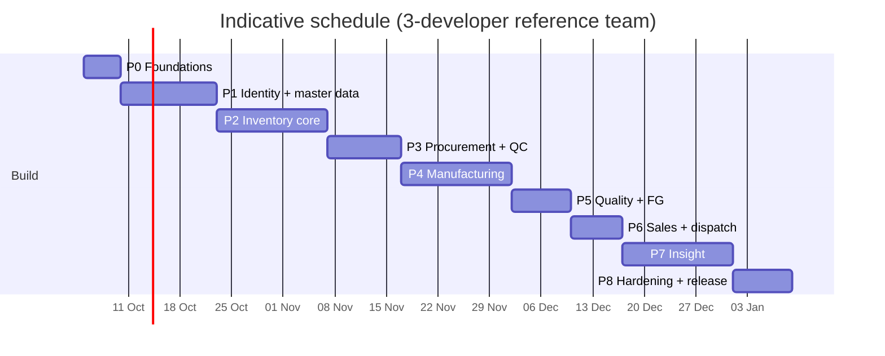
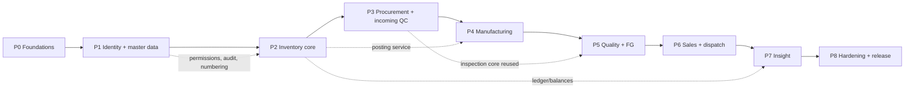

# PLAN.md — Spring Manufacturing Inventory Management System

**Version:** 1.0  **Date:** 2026-10-01
**Inputs:** REQUIREMENTS.md (what) · ARCHITECTURE.md (structure) · DESIGN.md (detail)
**Purpose:** the execution plan — phases, tasks, estimates, dependencies, quality gates, risks and the order of work. Each task points to the exact section of DESIGN.md / ARCHITECTURE.md it implements, so it can be handed to a developer or to an AI coding session without further design work.

> Document map: REQUIREMENTS = *what* · ARCHITECTURE = *structure* · DESIGN = *detail* · **PLAN = *order, effort and gates*.**

## Contents
1. Planning Basis and Assumptions
2. Schedule Summary and Milestones
3. Working Agreements (Definition of Ready / Done)
4. Phase 0 — Foundations
5. Phase 1 — Identity, Security and Master Data
6. Phase 2 — Warehouses and Inventory Core
7. Phase 3 — Procurement and Incoming Quality
8. Phase 4 — Manufacturing
9. Phase 5 — Quality and Finished Goods
10. Phase 6 — Sales and Dispatch
11. Phase 7 — Insight: Dashboards, Reports, Alerts, Traceability
12. Phase 8 — Hardening and Release
13. Dependency Map
14. Decisions Needed (Blockers)
15. Risk Register
16. Quality Gates and Metrics
17. Requirements Coverage by Phase
18. Building with Claude Code (AI-assisted protocol)
19. Release and Handover Checklist
20. Command Cheat Sheet

---

## 1. Planning Basis and Assumptions

| Item | Assumption |
|---|---|
| Scope | Everything in REQUIREMENTS.md, delivered in the seven phases it prescribes, plus a Phase 0 (foundations) and Phase 8 (hardening/release) |
| Order | **Each phase is finished completely (backend + migration + Angular + tests + seed + docs) before the next starts.** No placeholders or TODOs carried forward. Work *inside* a phase can be parallel (backend / frontend / tests). |
| Team (reference) | 3 developers (2 backend-leaning, 1 frontend-leaning, all comfortable across the stack), part-time QA and DevOps support, product owner available for decisions and UAT |
| Effort unit | person-days (pd). Estimates include unit/integration tests, code review and documentation for the task |
| Capacity | ~12 effective pd/week for the reference team (3 devs × 5 days × 80% focus) |
| Start date | Monday 5 Oct 2026 (indicative) |
| Change policy | Additive-only: never edit an applied Flyway migration, add a new `V#` file; extend APIs by adding fields/endpoints rather than changing behaviour |
| Estimates | planning estimates (±25%). Re-baseline after Phase 1 using actual velocity |

If a single engineer is building with an AI coding assistant, the same task list and gates apply; see §18. Effort in that case is dominated by review, testing and decisions rather than typing, so measure velocity on Phase 1 before committing to dates.

---

## 2. Schedule Summary and Milestones

| Phase | Name | Effort (pd) | Duration | Indicative dates | Milestone gate |
|---|---|---|---|---|---|
| 0 | Foundations | 8 | 1 wk | 5 – 9 Oct | **M0** pipeline green, stack runs via Docker |
| 1 | Identity, security, master data | 28.5 | 2.5 wk | 12 – 28 Oct | **M1** login + RBAC + master data demo; 403 matrix passes |
| 2 | Warehouses and inventory core | 32 | 3 wk | 29 Oct – 18 Nov | **M2** ledger-based stock, batches, approved adjustments |
| 3 | Procurement and incoming quality | 20 | 2 wk | 19 Nov – 2 Dec | **M3** PO → GR → inspection → stock works end to end |
| 4 | Manufacturing | 35.5 | 3 wk | 3 – 23 Dec | **M4** BOM → order → issue → operations → WIP → FG pending |
| 5 | Quality and finished goods | 17.5 | 1.5 wk | 24 Dec – 5 Jan | **M5** final inspection gates FG stock; rejections tracked |
| 6 | Sales and dispatch | 14.5 | 1.5 wk | 6 – 14 Jan | **M6** sales order → reservation → dispatch reduces stock |
| 7 | Insight | 32.5 | 3 wk | 15 Jan – 4 Feb | **M7** dashboards, reports, alerts, traceability, audit viewer |
| 8 | Hardening and release | 15.5 | 1.5 wk | 5 – 17 Feb | **M8** UAT signed off, release candidate |
| | **Total** | **204** | **~19 wk** | **5 Oct 2026 – ~17 Feb 2027** | |

Festival and holiday days (for example Dussehra and Diwali) fall in Phases 1–2; confirm the company calendar and add 3–5 days if the team is unavailable. The 20% focus factor in the capacity figure already covers meetings and ordinary interruptions, not extended leave.



### Milestone demonstration map (steps from DESIGN.md §12)
| Milestone | Demonstrable steps of the 22-step workflow |
|---|---|
| M1 | 19 (Operator gets 403 on `PUT /api/products/{id}`), 22 (Management read-only) |
| M2 | 18 (stock adjustment with approval and audit) |
| M3 | 1 – 5 (PO, receipt into quarantine, quarantine blocked, inspection accepts) |
| M4 | 6 – 12, 17 (BOM, order, issue, operations, WIP, FG pending, close) |
| M5 | 13 – 14 (FG not approved until inspection; partial approval) |
| M6 | 15 – 16 (reservation, dispatch, over-dispatch refused) |
| M7 | 20 – 22 (traceability both ways, dashboards) |
| M8 | all 22 steps automated and green |

---

## 3. Working Agreements

### 3.1 Definition of Ready (task may start)
- Task references the section of DESIGN.md/ARCHITECTURE.md it implements.
- Any decision it depends on (§14) is resolved or has a documented default.
- Acceptance criteria are listed in the task or in the phase gate.

### 3.2 Definition of Done (task is finished)
- [ ] Code merged via pull request with at least one review
- [ ] Unit/service tests written; repository tests run against real PostgreSQL (Testcontainers)
- [ ] Every new endpoint: `@PreAuthorize`, request/response DTOs, OpenAPI annotations, ProblemDetail errors with stable `code`
- [ ] Business rules from REQUIREMENTS §6 relevant to the task have a failing-then-passing test
- [ ] Stock-changing code goes only through `InventoryPostingService`
- [ ] Sensitive actions write audit records
- [ ] Flyway migration added (never edited after merge), seed/reference data updated
- [ ] Angular: typed service, component, form validation, permission handling, loading/error states, unit tests
- [ ] CI green (build, tests, lint, ArchUnit, dependency scan)
- [ ] Documentation updated (README/API notes/ADR if a decision changed)

### 3.3 Branching and commits
- Trunk-based with short-lived branches: `feature/P2-2.3-posting-service`.
- Conventional commits (`feat:`, `fix:`, `test:`, `docs:`, `chore:`); task id in the subject.
- Pull request template includes the Definition of Done checklist and the DESIGN section implemented.
- Squash merge; `main` always releasable and deployable via Compose.

### 3.4 Phase exit gate (applies to every phase)
1. All phase tasks done per §3.2.
2. Phase acceptance criteria demonstrated (milestone demo, §2).
3. Integration workflow tests for the phase pass in CI.
4. Role × endpoint 403 matrix regenerated and green for all endpoints that exist so far.
5. ArchUnit rules green (layering, no unprotected endpoints, only the posting service writes stock).
6. Seed/demo data loads cleanly on an empty database and the demo steps for the phase run.
7. README setup instructions verified on a clean machine (or clean container).
8. Retrospective: update estimates and risks in this plan.

---

## 4. Phase 0 — Foundations (8 pd)

**Goal:** a runnable, tested, deployable skeleton so every later phase starts from green.
**Prerequisites:** repository access, decisions §14 items 1–3 raised with the product owner.

| ID | Task | Deliverable | pd | Ref |
|---|---|---|---|---|
| 0.1 | Monorepo layout, `.gitignore`, `.editorconfig`, licence, README skeleton | `/backend /frontend /docker /docs`, root README | 0.5 | ARCH §16 |
| 0.2 | Backend skeleton: Spring Boot 3, Java 17+, Maven, package structure, profiles (`dev`,`test`,`prod`), Flyway baseline, `BaseEntity`+auditing, `GlobalExceptionHandler` (ProblemDetail), springdoc, Actuator, logback JSON + correlation id | app starts, `/actuator/health` and Swagger UI respond | 1.5 | ARCH §4 |
| 0.3 | Frontend skeleton: Angular 18 standalone, Angular Material theme, shell layout (sidebar, top bar), lazy route structure, interceptor skeletons, `environment`/runtime config | `ng serve` shows empty shell | 1.5 | ARCH §13, DESIGN §8 |
| 0.4 | Docker: multi-stage Dockerfiles (backend JRE slim non-root, frontend nginx), `docker-compose.yml` + dev/prod overrides, Postgres 16 with healthcheck and volume, MailHog (dev) | `docker compose up` brings the whole stack up | 1 | ARCH §16 |
| 0.5 | CI pipeline: build, unit tests, Testcontainers integration tests, ArchUnit, ESLint/Prettier, `npm audit`, OWASP dependency-check, image build, Compose smoke test | green pipeline on `main` and PRs | 1.5 | ARCH §17 |
| 0.6 | Test infrastructure: `AbstractIntegrationTest` (Testcontainers), data builders, JWT test helper, Playwright skeleton | sample tests passing | 1 | DESIGN §13 |
| 0.7 | Engineering conventions: `CONTRIBUTING.md`, PR template with DoD, ADR folder seeded with ADR-01…14, code-style config | docs committed | 0.5 | PLAN §3 |
| 0.8 | Decision workshop: confirm or default the §14 blockers | decisions logged in `docs/decisions.md` | 0.5 | PLAN §14 |

**Exit gate M0:** `docker compose up` yields reachable frontend, API, Swagger and DB; CI green; one trivial end-to-end test passes.

---

## 5. Phase 1 — Identity, Security and Master Data (28.5 pd)

**Goal:** secure foundation: users, roles, permissions, JWT, audit skeleton, and the master data every other module references.
**Prerequisites:** Phase 0; decision #11 (Belleville/Custom attributes) at least defaulted.
**Migrations:** V1, V2 (partial), V3.

| ID | Task | Deliverable | pd | Ref |
|---|---|---|---|---|
| 1.1 | Migrations V1–V3: schema, UOMs, IAM tables, settings, number sequences, audit (partitioned), suppliers, customers, materials, products, spring specs, attribute definitions | applied cleanly on empty DB; schema validated by Hibernate | 2 | DESIGN §2.1–2.3 |
| 1.2 | Reference seed: 13 roles, full permission catalogue, role→permission map, rejection reasons, standard operations, default settings | seed migration; test asserts the matrix equals DESIGN §7.1/ARCH §10.3 | 1.5 | DESIGN §7.1, §11.1 |
| 1.3 | Authentication: login, JWT (15 min), rotating refresh in HttpOnly cookie, lockout, BCrypt(12), password policy + history, forgot/reset by e-mail, rate limiting on `/api/auth/**` | `/api/auth/*` endpoints with tests | 4 | ARCH §10.1, DESIGN §5.1, §7.2 |
| 1.4 | Authorization plumbing: `JwtAuthenticationFilter`, permission cache with `permission_version`, `@PreAuthorize` conventions, 401/403 ProblemDetail handlers, ArchUnit "no unprotected endpoint" rule | 403 on any unauthorized call | 1.5 | DESIGN §7.3–7.4 |
| 1.5 | Admin APIs: users (create/update/deactivate, assign roles, never delete), roles, permissions, `GET /api/auth/me`; "cannot remove last ADMIN" | endpoints + tests | 2.5 | DESIGN §5.1 |
| 1.6 | Audit foundation: `@Audited` aspect, `AuditService`, immutability trigger, monthly partitions + maintenance job, `GET /api/audit-logs` with filters | audit rows for login, user/role changes | 2 | ARCH §11, DESIGN §4.11 |
| 1.7 | Common services: `DocumentNumberService`, `SystemSettingService` + cache, base filter/paging `Specification` builder, `Idempotency-Key` filter | reusable library with tests | 1.5 | DESIGN §1.3, §4.12 |
| 1.8 | Material, Supplier, Customer CRUD (validation, GST pattern, soft deactivation, search/sort/page) | APIs + tests | 2.5 | DESIGN §5.2 |
| 1.9 | Product master + spring specification: common columns, JSONB attributes, attribute-definition catalogue and validator, `/spring-types/{type}/attributes` | APIs + tests for all 7 spring types | 3 | DESIGN §2.3, §6.3 |
| 1.10 | Frontend core: login, forgot/reset, session store, `PermissionService`, `*hasPermission`, route guard, menu by permission, error/loading interceptors, toast/confirm dialogs, user & role admin screens | working shell with RBAC UX | 4 | DESIGN §8.1–8.5 |
| 1.11 | Frontend master data: materials, suppliers, customers, products (dynamic spring form), reusable `DataTable`/`FilterBar`/`StatusBadge` | screens + component tests | 4 | DESIGN §8.3–8.4 |

**Acceptance criteria**
- Every role in the seed can log in; each sees only permitted menus.
- `PUT /api/products/{id}` with an Operator token returns **403** (test, not UI).
- Role × endpoint matrix test generated from the permission seed passes for all Phase 1 endpoints.
- Product form renders type-specific fields for compression, extension and torsion from definitions; adding an attribute definition row changes the form without code.
- Account lockout, refresh-token reuse revocation and password policy are tested.
- Audit rows exist for logins (success/failure) and for every user/role change.

**Exit gate M1:** §3.4 + the acceptance criteria above.

### 5.1 Phase 1 retrospective (gate item 8)
| Topic | Finding |
|---|---|
| Velocity | not measured: the work was done in assistant sessions and elapsed time was not recorded, so the ±25% estimates are **not re-baselined**. The product owner should note calendar time from the first Phase 1 commit to the M1 demo and re-baseline Phases 2–8 from that |
| Scope added beyond the task list | `GET /api/lookups/customers` (so Engineers can pick a customer without customer read access) and `allowedActions` on product list rows (DESIGN §6.4); a deactivation override (`force=true`) for materials in use; the `MaterialUsageCheck` hook that Phases 2, 3 and 4 must implement; URL-bound list state. All recorded in `docs/decisions.md` |
| Left for later phases | audit-log viewer and system-settings screens (REQUIREMENTS §11 lists them under Administration; the API exists since 1.6/1.7 and 7.9 covers settings, but **no task builds the audit-log screen**: add one), demo master data (8.3), the audit export endpoint, `customer_product_specs` |
| R5 authorization gaps | mitigations are now in place and green: the ArchUnit rule, the generated role × endpoint matrix and per-module security ITs (including Management read-only and Operator 403 on `PUT /api/products/{id}`). Keep regenerating it each phase |
| R7 attribute model | the JSONB catalogue held for all seven types. **Still open:** the Conical and Wire-form attribute sets were assumed (REQUIREMENTS lists none), and the plan's mitigation was a review with Engineering before Phase 1 ends |
| New risk R15 | frontend verification is unit tests only (no Playwright until 8.3), so screen behaviour against the real API is untested until then. Mitigation: run the stack for the M1 demo and add smoke tests earlier if defects appear |
| New risk R16 | the integration tests ran against a local PostgreSQL in the assistant environment; CI must run them with Testcontainers to count for gate item 3 |

---

## 6. Phase 2 — Warehouses and Inventory Core (32 pd)

**Goal:** the ledger-based inventory engine — the heart of the system — before anything transacts through it.
**Prerequisites:** Phase 1; decision #2 (adjustment threshold unit) confirmed or defaulted.
**Migrations:** V4, V5, part of V2 (warehouses/locations if not yet applied).

| ID | Task | Deliverable | pd | Ref |
|---|---|---|---|---|
| 2.1 | Warehouses and locations: CRUD, location types, mandatory-location startup check, `user_warehouse_access` | APIs + admin check screen | 2 | DESIGN §2.3, §5.2 |
| 2.2 | Migration V4: `material_batches`, `fg_batches`, `inventory_balances`, `inventory_transactions`, constraints, indexes, immutability trigger | applied + DB-level tests (trigger blocks update/delete) | 2 | DESIGN §2.5, ARCH §8.4 |
| 2.3 | **`InventoryPostingService`**: `post`, `transfer`, `changeStatus`, `reverse`; lock ordering; costing strategy (moving average); stock rules 1–4; events | the only writer of ledger/balances; ArchUnit rule | 6 | DESIGN §4.1, §4.3 |
| 2.4 | Batch service and `BatchAllocator` (FEFO/FIFO, explicit batch, shortage message that mentions quarantine quantities) | service + tests | 2.5 | DESIGN §4.2 |
| 2.5 | Opening balances: API and CSV import using the posting service | `OPENING_BALANCE` entries | 1.5 | REQ §7 |
| 2.6 | Stock transfer API (between locations, warehouses) | `STOCK_TRANSFER` pairs sharing a group id | 1 | DESIGN §4.1 |
| 2.7 | Approval engine, stock adjustment workflow (requested → supervisor → manager → admin when above threshold → posted), segregation of duties, stock count + variance generation | workflow + tests | 4 | DESIGN §4.5, ARCH §6.8 |
| 2.8 | Stock queries: balances (by warehouse/location/batch/status), ledger with filters, batches, valuation, "stock as of date" | endpoints with paging/filters | 2.5 | DESIGN §9.2 |
| 2.9 | Ledger reconciliation job + minimal alert table + low-stock listener on `StockPosted` | job, alert rows, tests | 2 | DESIGN §4.12, §9.3 |
| 2.10 | Concurrency and property tests: parallel issues never oversell; idempotent replays; random posting sequences keep Σledger = balance | test suite in CI | 2.5 | DESIGN §13.1 INV-01…10 |
| 2.11 | Frontend: warehouses, current stock, stock ledger, batch tracking, transfer, adjustments (with approval actions), stock counts | screens + tests | 6 | DESIGN §8.3 |

**Acceptance criteria**
- Rules 1–4, 9, 13 (negative stock, insufficient stock, quarantine/rejected not issuable, every change → transaction, no silent delete) each have passing tests, including `INV-05` (SQL UPDATE/DELETE on the ledger fails).
- Stock figure on screen equals Σledger (reconciliation job reports zero mismatches after the property test).
- Adjustment 500 → 480 kg: request → supervisor → manager → posted; audit row shows old/new/reason; requester cannot approve own request; above threshold requires Admin.
- Idempotency-Key replay creates exactly one ledger entry.
- Dashboard-grade performance baseline captured: posting p95 < 150 ms on a seeded 1 M-row ledger.

**Exit gate M2:** §3.4 + acceptance criteria.

---

## 7. Phase 3 — Procurement and Incoming Quality (20 pd)

**Goal:** material enters the plant under control: PO → goods receipt → quarantine → incoming inspection → available stock.
**Prerequisites:** Phase 2; decisions #3 (PO approver) and #6 (tax handling) defaulted.
**Migration:** V6.

| ID | Task | Deliverable | pd | Ref |
|---|---|---|---|---|
| 3.1 | Purchase order: entity, totals computed server-side, state machine (Draft → Submitted → Approved → Sent → Partially received → Received / Cancelled), approvals | APIs + tests | 3.5 | ARCH §6.1, DESIGN §5.4 |
| 3.2 | Purchase requisitions and conversion to PO | APIs | 1.5 | RBAC doc §8 |
| 3.3 | Goods receipt: PO linkage, over-receipt tolerance, batch creation with heat/certificate numbers, `PURCHASE_RECEIPT` into quarantine location/status, PO quantity roll-up | service + tests | 3 | DESIGN §4.6 |
| 3.4 | Inspection core: plans and parameters, inspection items with server-side pass/fail, incoming flow (accept/reject/hold, partial acceptance), status transfers, `po_item` accepted/rejected update | service + tests | 4.5 | DESIGN §4.6, §5.5 |
| 3.5 | Supplier performance queries (on-time %, acceptance %, lead-time variance) | endpoints | 1 | RBAC doc §8 |
| 3.6 | Frontend: purchase orders, requisitions, goods receipt, incoming inspection entry with live result chips | screens + tests | 5 | DESIGN §8.3 |
| 3.7 | Integration test: PO → GR → inspection → inventory; quarantine cannot be issued | CI test | 1.5 | REQ §13 |

**Acceptance criteria**
- Receipt posts stock as **QUARANTINE**; *available* stock is unchanged until acceptance (checked via API).
- Server ignores client-supplied pass/fail and recomputes it from limits.
- Partial acceptance (e.g. accept 480, reject 20) produces two status transfers and correct PO line counters.
- Attempt to issue quarantined or rejected batches returns `QUARANTINE_NOT_ISSUABLE` / `REJECTED_NOT_USABLE`.
- Demo steps 1–5 pass.

**Exit gate M3:** §3.4 + acceptance criteria.

---

## 8. Phase 4 — Manufacturing (35.5 pd)

**Goal:** plan and execute production with full material control, WIP visibility and operator-friendly capture.
**Prerequisites:** Phase 3; decisions #1 (BOM basis) and #7 (traceability granularity) resolved.
**Migrations:** V7, V8.

| ID | Task | Deliverable | pd | Ref |
|---|---|---|---|---|
| 4.1 | Operation master, machine master (basic), product routing (sequence, machines, inspection points) | APIs | 2.5 | DESIGN §2.3–2.4 |
| 4.2 | BOM: header + items, revisions (Rev A/B), workflow Draft → Engineering review → Approved → Active, one ACTIVE per product (partial unique index), copy-to-new-revision, history | APIs + tests incl. concurrent activation | 4 | ARCH §6.3, DESIGN §5.3 |
| 4.3 | Production order: CRUD, state machine, approve, **release with BOM + routing snapshot**, material availability check | APIs + tests | 4.5 | DESIGN §4.7 |
| 4.4 | Material issue/return: batch allocation, `MATERIAL_ISSUE` (RM → WIP), multiple issues, tolerance, material requests from the floor | APIs + tests | 4 | DESIGN §4.7 |
| 4.5 | Operation execution: start/pause/resume/complete, outputs (good/rejected/scrap), chained input quantities, **WIP derivation**, backflush `MATERIAL_CONSUMPTION`, scrap → `PRODUCTION_REJECTION`, rejection reasons | service + tests | 6 | DESIGN §4.7 |
| 4.6 | Downtime and machine/material problem reporting | APIs | 1.5 | RBAC doc §4–5 |
| 4.7 | `AccessScopeService`: operators/supervisors see and act only on assigned orders/operations, enforced in SQL | tests for out-of-scope 403 | 1.5 | DESIGN §4.10 |
| 4.8 | Close/reopen: unreturned-material reconciliation, `ORDER_LOCKED` rule, `PRODUCTION_REOPEN` permission, audit | tests | 1.5 | DESIGN §4.7 |
| 4.9 | Frontend: BOM editor with revisions, routing, production orders, material issue, operations, WIP view, **operator My Work (tablet)** | screens + tests | 8 | DESIGN §8.3 |
| 4.10 | Integration tests: order → issue → outputs → completion; revised BOM does not change a released order; over-consumption blocked | CI tests | 2 | REQ §13 |

**Acceptance criteria**
- Release snapshots BOM/routing; activating Rev B afterwards leaves the running order unchanged.
- Issue 400 kg then 50 kg against a 450 kg plan; consumed > issued is rejected; remaining = issued − consumed − returned − scrap.
- WIP screen reproduces the requirements example (10,000 → 9,950 → 9,900 → 9,850).
- Operator can complete a full operation from the My Work page using only large-target controls; cannot open product, BOM or inventory screens or APIs (403).
- Completed order cannot be edited without `PRODUCTION_REOPEN`.
- Demo steps 6–12 and 17 pass.

**Exit gate M4:** §3.4 + acceptance criteria.

---

## 9. Phase 5 — Quality and Finished Goods (17.5 pd)

**Goal:** finished goods become available only through quality approval; rejections are captured and analysed.
**Prerequisites:** Phase 4.
**Migration:** V9.

| ID | Task | Deliverable | pd | Ref |
|---|---|---|---|---|
| 5.1 | FG batch creation at order completion; `PRODUCTION_RECEIPT` into FG-quality-pending location/status; `FinalInspectionRequired` event | service + tests | 2 | DESIGN §4.7 |
| 5.2 | In-process inspection linked to operations/WIP (approve/reject WIP quantities) | service + tests | 2 | REQ §18 |
| 5.3 | Final inspection: measurements, server pass/fail, approve/reject/hold quantities, ledger movements to FG / SCRAP | service + tests | 3.5 | DESIGN §4.8 |
| 5.4 | Rejection management: reason master CRUD, rejection records, rejection %, defect Pareto queries | APIs | 2.5 | REQ §20 |
| 5.5 | Quality hold and deviation override (Quality Manager, audited) | service + tests | 1.5 | RBAC doc §6 |
| 5.6 | Frontend: inspections (all three types), rejections, quality dashboard | screens + tests | 4.5 | DESIGN §8.3 |
| 5.7 | Integration test: production → final inspection → FG stock; rejected quantity to scrap | CI test | 1.5 | REQ §13 |

**Acceptance criteria**
- FG stock does not appear as available until approval; reservation or dispatch attempts return `FG_NOT_APPROVED`.
- Approve 9,800 / reject 50 posts two ledger entries to the right locations and updates the FG batch counters.
- A parameter outside limits forces REJECT/HOLD unless a Quality Manager override with a reason is recorded.
- Rejection % and Pareto by reason match the seeded data in tests.
- Demo steps 13–14 pass.

**Exit gate M5:** §3.4 + acceptance criteria.

---

## 10. Phase 6 — Sales and Dispatch (14.5 pd)

**Goal:** customer orders and dispatch reduce finished goods only through the dispatch transaction.
**Prerequisites:** Phase 5.
**Migration:** V10.

| ID | Task | Deliverable | pd | Ref |
|---|---|---|---|---|
| 6.1 | Sales order: CRUD, state machine (Ordered → Allocated → Packed → (Partially) Dispatched), cancel | APIs + tests | 2.5 | ARCH §6.7 |
| 6.2 | FG reservation (`qty_reserved`), release on cancel, expiry job | service + tests | 2 | DESIGN §4.9 |
| 6.3 | Dispatch: batch selection, `SALES_DISPATCH`, dispatch ≤ available check, SO progress, printable dispatch note (PDF) | service + tests | 3.5 | DESIGN §4.9 |
| 6.4 | Customer-specific product specifications on SO/dispatch | APIs | 1 | REQ §21 |
| 6.5 | Frontend: sales orders, finished-goods availability, dispatch | screens + tests | 4 | DESIGN §8.3 |
| 6.6 | Integration test: SO → dispatch → inventory reduction | CI test | 1.5 | REQ §13 |

**Acceptance criteria**
- Dispatch greater than available returns `DISPATCH_EXCEEDS_STOCK`; sales role cannot reduce stock directly (403 on any inventory write).
- Reserved quantity never exceeds on-hand; cancelling releases it.
- Dispatch PDF shows customer, batch, quantity, transport, invoice reference.
- Demo steps 15–16 pass.

**Exit gate M6:** §3.4 + acceptance criteria.

---

## 11. Phase 7 — Insight: Dashboards, Reports, Alerts, Traceability (32.5 pd)

**Goal:** management and role-specific visibility, complete traceability, exports, audit viewer.
**Prerequisites:** Phase 6.
**Migration:** V11.

| ID | Task | Deliverable | pd | Ref |
|---|---|---|---|---|
| 7.1 | Dashboard service: KPI queries per DESIGN §9.1, role-aware widget sets, caching, materialized views for trends | `/api/dashboard/*` | 4 | DESIGN §9.1 |
| 7.2 | Alert engine: sweep job, event listeners, de-duplication, acknowledge/resolve, optional e-mail | alerts API + tests | 3 | DESIGN §9.3 |
| 7.3 | Reports framework: `ReportDefinition`, paged JSON, streaming Excel/CSV, PDF template, async large exports, export audit | framework + tests | 4 | ARCH §14.1 |
| 7.4 | Report catalogue (inventory, production, quality, purchase, sales, audit) | all reports in DESIGN §9.2 | 5 | DESIGN §9.2 |
| 7.5 | Traceability service and screen (FG ⇄ RM, supplier, PO, order, inspection, dispatch, customer; recall list export) | API + UI | 4 | ARCH §9, DESIGN §5.7 |
| 7.6 | Maintenance module: requests, activities, spare parts, preventive schedule, machine history | APIs | 3 | RBAC doc §11 |
| 7.7 | Audit viewer and export (filters by user, entity, action, date) | API | 1.5 | REQ §7 |
| 7.8 | Frontend: eight role dashboards with charts, report screens with filters/export menu, maintenance screens, traceability screen | screens + tests | 7 | DESIGN §8.3, §8.6 |
| 7.9 | System settings admin screen (negative stock flag, thresholds, targets) | screen + audit | 1 | DESIGN §10.1 |

**Acceptance criteria**
- Every KPI in REQUIREMENTS §5.11 and RBAC doc §13 is present and matches seeded data (test fixtures with known answers).
- Each role lands on its own dashboard; Operator sees only My Work; Management cannot modify anything (403 on writes).
- All reports export to Excel, PDF and CSV; a 100k-row Excel export completes within the target with bounded memory.
- Alerts: LOW STOCK (120 vs reorder 200) shown on dashboard; resolves when stock is replenished; no duplicates.
- Traceability answers both required questions for the demo batches in under 1 s.
- Demo steps 20–22 pass.

**Exit gate M7:** §3.4 + acceptance criteria.

---

## 12. Phase 8 — Hardening and Release (15.5 pd)

**Goal:** make the system trustworthy: performance, security, documentation, acceptance by users.

| ID | Task | Deliverable | pd |
|---|---|---|---|
| 8.1 | Performance test and tuning (k6/Gatling): ledger posting, stock queries, dashboards, exports; index review (`EXPLAIN`), pool sizing | report + fixes; targets of DESIGN §13.4 met | 3 |
| 8.2 | Security review: OWASP ASVS L2 checklist, authorization matrix re-run on all endpoints, JWT/cookie/CORS/headers review, dependency and image scan, secrets handling, backup/restore drill | findings closed or accepted in writing | 3 |
| 8.3 | `DemoDataLoader` finalised (via services) and Playwright automation of the 22-step demo workflow | one command loads demo data; E2E green in CI | 3 |
| 8.4 | Documentation: README (install dependencies, create DB, run migrations, start backend/frontend, log in, load sample data, run workflow), API docs, runbook (backup, restore, upgrade, rollback), role-based quick guides | docs complete and tested on a clean machine | 2.5 |
| 8.5 | User acceptance testing with real users per role, defect triage and fixes | signed UAT checklist | 4 |

**Acceptance criteria**
- All 22 demo steps pass automatically; the full test suite is green.
- No open critical/high security findings; ledger reconciliation reports zero mismatches after the soak/performance test.
- A new engineer can follow the README to a working system in under 30 minutes.
- Restore from backup into an empty database verified.
- Product owner signs off UAT.

**Exit gate M8 (release candidate):** §3.4 + criteria above + release checklist (§19).

---

## 13. Dependency Map



**Within a phase, parallelise:** backend service work (A), frontend screens against the OpenAPI contract (B, mocks until the API lands), test/seed/data work (C). The API contract (DTOs + OpenAPI) is agreed on day 1 of each phase.

**Critical path:** 1.3 → 1.4 → 2.3 → 3.3/3.4 → 4.3 → 4.5 → 5.3 → 6.3 → 7.5. The posting service (2.3) is the highest-risk, highest-leverage task; start it first in Phase 2 and review it thoroughly.

---

## 14. Decisions Needed (Blockers)

Each is carried from DESIGN §14; a default is stated so work is never stalled, but confirmation is needed by the date shown.

| # | Decision | Default used | Needed before | Owner |
|---|---|---|---|---|
| 11 | Attribute set for Belleville and Custom springs | outer/inner Ø, thickness, free height, load, stack; custom = free-form | Phase 1 (task 1.9) | Engineering |
| 2 | Adjustment threshold: value or quantity, and amount | variance value, ₹10,000 | Phase 2 (task 2.7) | Management/Stores |
| 3 | Who approves purchase orders | a user holding `PURCHASE_APPROVE` (Admin in demo) | Phase 3 (task 3.1) | Management |
| 6 | Tax / currency / invoicing scope | INR, GST % per PO line, invoice number is a text reference only | Phase 3 | Finance |
| 1 | BOM quantity basis (0.45 kg vs 0.045 kg per piece) | 0.045 kg/pc with `base_quantity` support | Phase 4 (task 4.2) | Engineering |
| 7 | Traceability granularity | order-level, batch-level optional | Phase 4 | Quality |
| 9 | Hold quantity handling in final inspection | HOLD bucket until decision | Phase 5 | Quality |
| 4 | Production target source | single monthly setting | Phase 7 | Production |
| 8 | Customer complaint register / CAPA | `CUSTOMER_RETURN` + remarks only | Phase 7 | Quality |
| 10 | UI languages | English, i18n-ready | Phase 8 | Management |
| 12 | Barcode labels | not in v1 | Phase 8 | Stores |
| 13 | Hosting target (on-prem server vs cloud VM), backup policy, e-mail provider | Docker Compose on a Linux VM, nightly backups | Phase 8 (earlier if hosting is needed for UAT) | IT |

---

## 15. Risk Register

| # | Risk | Likelihood | Impact | Mitigation | Owner |
|---|---|---|---|---|---|
| R1 | Stock inconsistency from concurrent postings or a code path bypassing the posting service | Med | Critical | single posting service; pessimistic locks; ArchUnit rule; ledger triggers; property + concurrency tests; nightly reconciliation alert | Tech lead |
| R2 | Scope creep toward full ERP/MRP | High | High | hold to phases; park ideas in a backlog tagged "future" (ARCH §18); change control through the product owner | Product owner |
| R3 | Unclear or changing business rules (BOM basis, thresholds, approvals) | High | Med | defaults + blockers (§14); isolate in settings; additive changes only | Product owner |
| R4 | Operator UI too complex for the shop floor | Med | High | early tablet prototype in Phase 4; test with real operators in week 1 of the phase and again in UAT; large targets, minimal fields | Frontend lead |
| R5 | Authorization gaps (endpoint missing `@PreAuthorize`, UI-only checks) | Med | Critical | ArchUnit rule; generated role × endpoint matrix on every CI run; security review in Phase 8 | Security lead |
| R6 | Performance degradation as the ledger grows | Med | Med | balance projection, indexes, BRIN, partitioned audit, materialized views; load test in Phases 2 and 8 | Tech lead |
| R7 | Spring-specific attribute model proves too rigid or too loose | Low | Med | metadata-driven JSONB design (ADR-06); definitions are data; review with Engineering before Phase 1 ends | Architect |
| R8 | Data migration of existing stock (opening balances) is inaccurate | Med | High | CSV import with validation and dry run; physical count before go-live; reconcile after load | Stores lead |
| R9 | Test environment drift (H2 vs PostgreSQL) | Low | Med | Testcontainers PostgreSQL only | QA |
| R10 | Key-person dependency / knowledge silo | Med | Med | ADRs, DESIGN/ARCH docs, pair on the posting service and approval engine, PR reviews | Tech lead |
| R11 | UAT users unavailable → late feedback | Med | Med | name UAT users per role by Phase 3; short demos at every milestone | Product owner |
| R12 | Festival/holiday and leave reduce capacity | High | Low | calendar check at Phase 0; schedule slack ~20% | Project lead |
| R13 | Dependency vulnerabilities / supply-chain issues | Med | Med | OWASP and `npm audit` in CI, pinned versions, scheduled updates | DevOps |
| R14 | Seed/demo data diverges from real rules | Low | Low | seed only through services; demo workflow is a CI test | QA |

---

## 16. Quality Gates and Metrics

| Metric | Target | Where measured |
|---|---|---|
| Backend line coverage (services/domain) | ≥ 80% (≥ 90% for `inventory` module) | CI (JaCoCo) |
| Frontend coverage | ≥ 70% | CI |
| Business rules 1–15 (REQUIREMENTS §6) with a dedicated test | 100% | traceability table in `docs/test-matrix.md` |
| Endpoints with `@PreAuthorize` | 100% (except `/api/auth/**`, health) | ArchUnit |
| 403 matrix | all endpoints × all roles | CI |
| Ledger reconciliation mismatches | 0 | nightly job + CI soak test |
| API p95 latency (lists) | < 300 ms at 1 M ledger rows | Phase 2 and Phase 8 load tests |
| Posting p95 | < 150 ms | same |
| Critical/high vulnerabilities | 0 open at release | dependency + image scan |
| Flaky tests | 0 tolerated (fix or quarantine within 2 days) | CI |
| Build time | < 15 min | CI |

Per-phase burn-down: planned vs actual pd tracked at each exit gate; if a phase exceeds estimate by > 25%, re-plan remaining phases and report to the product owner.

---

## 17. Requirements Coverage by Phase

| REQUIREMENTS section | Phase(s) |
|---|---|
| §3 Roles/RBAC, 403 rule | 1 (model, plumbing), extended in every phase; audited in 8 |
| §4 Master data (materials, products/specs, suppliers, customers) | 1 |
| §4 Operations, warehouses, machines, rejection reasons | 1 (reference), 2 (warehouses), 4 (operations/machines) |
| §5.1 BOM | 4 |
| §5.2 Inventory and ledger; §5.3 batches; warehouse tracking | 2 |
| §5.4 Purchasing, goods receipt, incoming inspection | 3 |
| §5.5 Production orders, issue, routing, WIP, output | 4 |
| §5.6 Quality and rejection | 3 (incoming), 4–5 (in-process, final, rejection) |
| §5.7 Sales and dispatch | 6 |
| §5.8 Stock adjustment workflow | 2 |
| §5.9 Traceability | data captured from 3 onward; screen in 7 |
| §5.10 Alerts | 2 (low stock seed) → 7 (complete) |
| §5.11 Dashboards; role-based dashboards | 7 |
| §5.12 Reports and exports | 7 |
| §5.13 Search/filter/sort/paginate | 1 (framework), every list thereafter |
| §6 Business rules 1–15 | 2–6 (each rule listed in the task acceptance criteria) |
| §7 Audit trail | 1 (foundation), every phase adds events, viewer in 7 |
| §8 Data design, migrations | every phase (V1–V11) |
| §9 REST API, Swagger | every phase |
| §10 Security | 1, reviewed in 8 |
| §11 Frontend/UI | every phase |
| §12 Seed data | reference data in 1; demo data grows each phase; final loader in 8 |
| §13 Testing | every phase; E2E in 8 |
| §14 Phases | this plan |
| §15 Deliverables (README, Docker, credentials, demo workflow) | 0 (Docker), 8 (README, demo, credentials) |
| §16 Future extensibility | seams built in 1–4 (ARCH §18); no features in v1 |

---

## 18. Building with Claude Code (AI-assisted protocol)

Use this when tasks are executed by an AI coding session in the repository (`C:\Users\ADMIN\Inventory_Management_System`). Keep REQUIREMENTS.md, ARCHITECTURE.md, DESIGN.md and PLAN.md in `/docs` (and add a short `CLAUDE.md` pointing to them and to the rules below) so every session starts with the same context.

### 18.1 Rules to put in `CLAUDE.md`
1. Read the DESIGN/ARCHITECTURE sections referenced by the task before writing code.
2. Stock changes only through `InventoryPostingService`; never write to ledger/balance repositories elsewhere.
3. Every endpoint needs `@PreAuthorize` and a role test; frontend permission checks are UX only.
4. Entities never cross the API boundary; use DTOs and MapStruct.
5. Additive changes only: new Flyway migrations, never edit an applied one; extend rather than rewrite existing code unless the task says so.
6. Use Testcontainers PostgreSQL for DB tests; no H2.
7. Run the build and relevant tests before declaring a task done; report failures honestly instead of marking complete.
8. No TODO/placeholder implementations inside a finished phase.
9. Keep commits small: one task id per commit, conventional commit messages.

### 18.2 Task prompt template
```text
Implement task <ID> from PLAN.md (Phase <n>).
Read first: DESIGN.md §<sections>, ARCHITECTURE.md §<sections>, REQUIREMENTS.md §<sections>.
Scope: <task text>.
Do: entities/migration, repository, DTOs + mapper, service with business rules and audit, controller with
@PreAuthorize + OpenAPI, validation + exception codes from DESIGN §6.2, tests (unit, repository on Testcontainers,
API, security 403), then the Angular service/component/form/tests if the task includes UI.
Do not: change unrelated code, edit applied migrations, bypass the posting service.
Finish: run `mvn verify` (and `npm test` for UI), summarise what changed, list any deviation from DESIGN.md.
```

### 18.3 Suggested session granularity
One session per task row (e.g. 2.3 may be split: *commands + validation*, *locking + costing*, *reverse + events*). Review diffs against DESIGN before merging. For the highest-risk tasks — **2.3 posting service, 2.7 approvals, 4.3 release snapshot, 4.5 output/WIP, 5.3 final inspection, 6.3 dispatch** — require a second human review and a concurrency/property test before merge.

### 18.4 Verification between tasks
After every task: `mvn verify`, `npm run lint && npm test`, `docker compose up --build` smoke test, and the relevant demo-workflow step. After every phase: regenerate the 403 matrix, run the reconciliation job, and update `docs/test-matrix.md`.

---

## 19. Release and Handover Checklist

**Functional**
- [ ] All 22 demo steps pass (manual and automated)
- [ ] All REQUIREMENTS §5/§6 items accounted for (coverage table in §17 reviewed)
- [ ] UAT signed off by Admin, Engineer, Production, Quality, Stores, Purchase, Sales, Dispatch, Maintenance and Management representatives

**Technical**
- [ ] Migrations apply cleanly from empty and from the previous release
- [ ] Reconciliation job reports zero mismatches; negative-stock flag is OFF in production
- [ ] Swagger restricted in production; CORS origins set; secrets supplied from the environment
- [ ] Demo users and demo data **not** loaded in production; initial Admin created with a forced password change
- [ ] Backups scheduled and a restore drill completed
- [ ] Monitoring: health endpoint, log shipping, disk and DB alerts

**Documentation and handover**
- [ ] README (install dependencies, create database, run migrations, start backend/frontend, log in, load sample data, run the workflow)
- [ ] Admin guide (users, roles, settings, thresholds), per-role quick guides
- [ ] Runbook (deploy, upgrade, rollback, backup/restore, incident response)
- [ ] ADR log current; DESIGN/ARCHITECTURE updated to as-built
- [ ] Training sessions delivered; support contact and defect process agreed

---

## 20. Command Cheat Sheet

```bash
# Whole stack
docker compose -f docker/docker-compose.yml -f docker/docker-compose.dev.yml up --build

# Backend
cd backend
mvn verify                                        # build + unit + Testcontainers integration tests
mvn spring-boot:run -Dspring-boot.run.profiles=dev
# Swagger UI: http://localhost:8080/swagger-ui.html  (dev only)

# Frontend
cd frontend
npm ci
npm run lint && npm test
npm start                                         # ng serve with proxy to :8080

# Load demo data (dev/demo profile only)
IMS_DEMO_LOAD_DATA=true mvn spring-boot:run -Dspring-boot.run.profiles=dev

# End-to-end demo workflow
cd frontend && npx playwright test e2e/demo-workflow.spec.ts
```

---

*End of PLAN.md*
